# File System

날짜: 2023년 4월 26일
사람: 이성민

# 1. File System 들어가기에 앞서

## 1.1 File

<aside>
💡  **논리적인 저장 단위**로, 관련된 **정보 자료들의 집합**에 이름을 붙인 것, 컴퓨터 시스템의 편리한 사용을 위해 정보 저장의 일괄된 논리적 관점을 제공, 일반적으로 레코드 혹은 블록 단위로 비휘발성 보조기억장치에 저장

</aside>

## 1.2 File Attribute

<aside>
💡  **파일이나 폴더의 특정 정보를 설명하는 메타데이터**, 파일이나 폴더의 크기, 생성 일자, 수정 일자, 소유자 등과 같은 정보를 제공

</aside>

## 1.3 File System

<aside>
💡  **운영체제와 모든 데이터, 프로그램의 저장과 접근을 위한 기법을 제공**, 시스템 내의 모든 파일에 관한 정보를 제공하는 계층적 디렉터리의 구조이고, 파일 및 파일의 메타데이터, 디렉터리 정보 등을 관리

</aside>

## 1.4 Partition

<aside>
💡  **연속된 저장 공간을 하나 이상의 연속되고 독립적인 영역으로 나누어 사용할 수 있도록 정의한 규약**

</aside>

---

# 2. Access Methods

## 2.1 Sequential Access(순차 접근)

- 가장 단순한 방법, **파일을 처음부터 끝까지 순서대로 읽거나 쓰는** 방식
- 파일을 읽을 때는 **파일의 첫 부분부터 순서대로 읽고, 파일을 쓸 때는 파일의 끝 부분에 추가로 씀** - 텍스트 파일과 같은 작은 파일을 다룰 때 적합
- 특정 위치로 빠르게 이동할 수 없음, 중간 부분을 수정하는 작업도 어려움

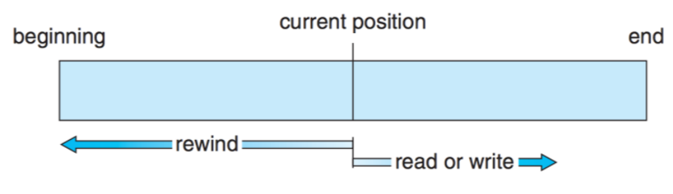

## 2.2 Direct Access(직접 접근)

- **특정한 순서 없이** 빠르게 읽고 쓸 수 있도록 하는 고정된 길이의 논리 레코드 집합으로 정의
- **대용량 정보에 즉각적인 접근**에 용이 - **데이터베이스**가 이러한 유형에 속함
- 현재 위치를 가리키는 cp(current position) 변수만 유지하면 직접 접근 파일을 가지고 순차 파일 기능을 쉽게 구현이 가능

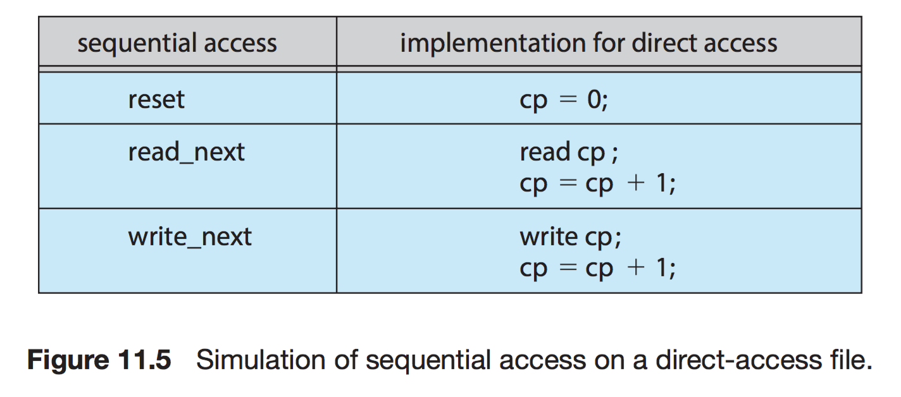

## 2.3 기타 접근

- **직접 접근 방법을 기반**으로 함, 일반적으로 **파일의 색인(index)을 사용**
- 파일에서 레코드를 찾기 위한 목적으로 색인을 먼저 찾고 이에 대응되는 포인터를 얻은 후, 이를 통해 파일에 직접 접근하여 원하는 레코드를 얻는 방식
- 대용량 파일의 경우에 색인 파일 그 자체도 매우 커져서 메모리에 상주할 수 있음, 해결책으로 색인 파일에 또 다른 색인을 생성

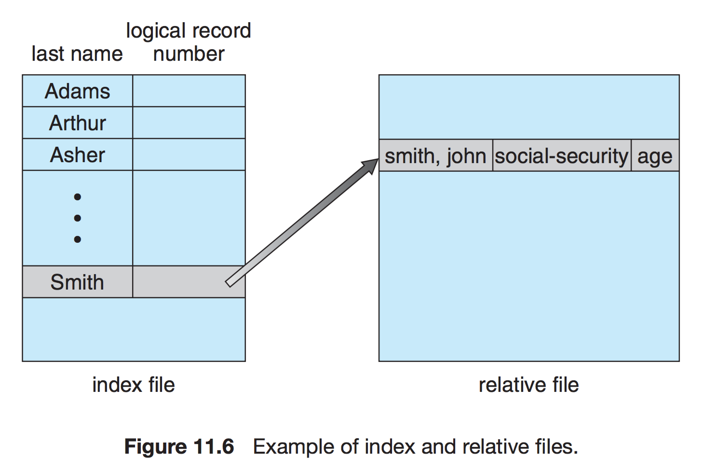

---

# 3. Directory

## 3.1 Single-Level Directory(1단계 디렉터리)

- 가장 단순한 디렉터리 구조, 모든 파일이 같은 디렉터리에 존재
- **파일의 수가 증가하거나 둘 이상의 사용자가 존재할 때 명확한 한계**를 가짐
- 각 파일들의 이름은 고유(Unique)해야 함

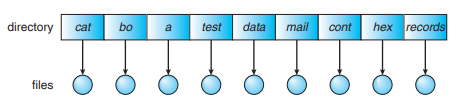

## 3.2 Two-Level Directory(2단계 디렉터리)

- 1단계 디렉터리의 한계를 보완하기 위해, **사용자들의 정보를 따로 저장한 MFD(Master-File Directory)**와 **각 사용자가 가진 파일의 정보를 저장한 UFD(User-File Directory)**의 2단계로 구분
- 이 구조부터 **경로(Path) 개념**이 등장 ex) 사용자 3의 a파일 → user3/a

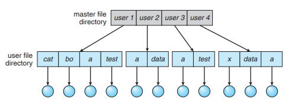

## 3.3 Tree-Structured Directories(트리 구조 디렉터리)

- 2단계 디렉터리를 확장한 것, **최상위 디렉터리인 root를 시작으로 트리 구조**를 이룸
- 이 구조에서 프로세스는 **현재 디렉터리(Current Driectory)**란 개념을 가짐 - 현재 디렉터리는 **프로세스가 사용하는 파일을 가장 많이 포함하는 디렉터리**를 말함
- 파일 참조가 발생할 때, **프로세스는 현재 디렉터리를 우선 탐색**
- **다른 디렉터리에 접근**하기 위해서는 그 **디렉터리에 대란 경로가 제공**되어야 함
- **절대 경로 - 트리의 root로부터의 경로** ex) C:\Program Files\Git
- **상대 경로 - 현재 디렉터리로부터의 경로** ex) ../../img/logo.jpg

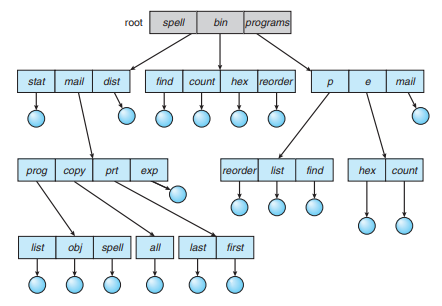

## 3.4 Acyclic Graph Directory(비순환 그래프 디렉터리)

- 디렉터리들이 **서브 디렉터리들과 파일들을 공유**할 수 있도록 허용하는 구조
- 파일을 **공유하는 방법**에는 **링크라 불리는 새로운 디렉터리 항목을 만드는 것**과 **디렉터리들이 동일한 항목 내용을 복사**해서 가지고 있는 방법이 있음
- **링크**의 경우는 다른 파일이나 서브 디렉터리를 가리키는 **포인터를 가지고 참조**, **복사해서 가지고 있는 방법은 일관성에 문제**가 발생함

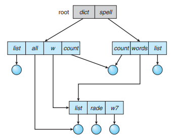

## 3.3 General Graph Directory(그래프 구조 디렉터리)

- 일반적인 그래프 구조 디렉터리는 **트리 구조에 링크를 첨가시켜 순환을 허용**하는 그래프 구조
- 탐색 알고리즘이 간단하며, 파일과 디렉터리를 액세스하기 쉬움
- **순환 검사를 수행하여 무한 반복되는 경로가 생성되는 것을 방지**해야 함

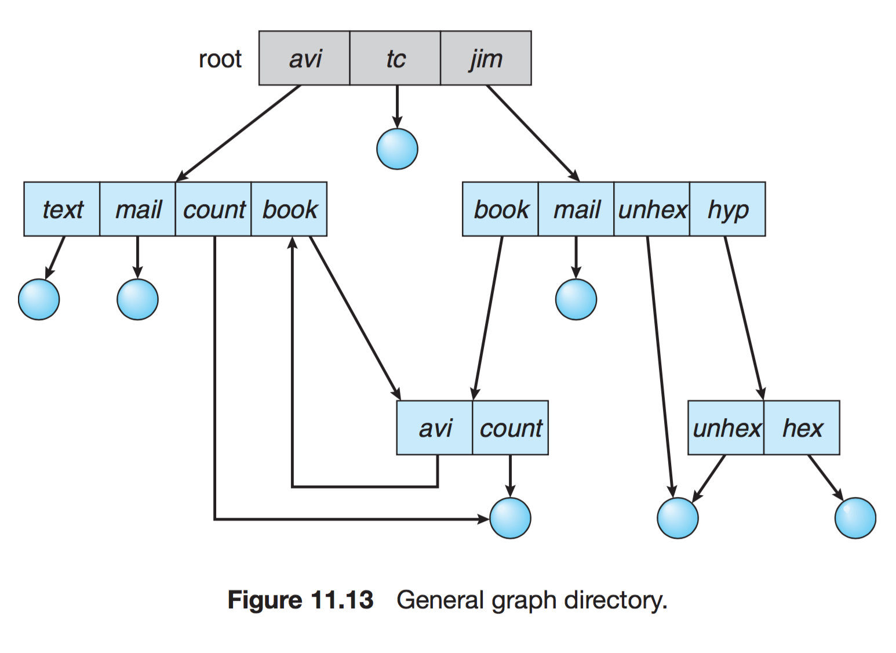

---

# 4. Allocation of File Data in Disk

## 4.1 Contiguous Allocation(연속 할당)

- **파일을 디스크에 연속되게 저장하는 방식**
- 디렉터리에는 파일 시작 부분의 위치와 파일의 길이에 대한 정보를 저장하면 전체를 탐색할 수 있음
- **접근 시간이 빠르고** 블록 간의 이동이 적기 때문에 **파일의 입출력 속도가 빠름**
- 파일의 크기를 변경할 경우에는 파일을 다시 저장해야 하기 때문에 **디스크의 공간 낭비가 발생할 수 있음**

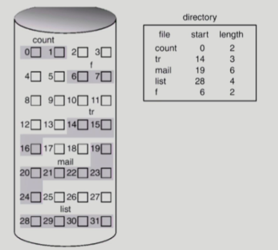

## 4.2 Linked Allocation(연결 할당)

- **파일을 디스크 상의 불연속된 블록에 저장하는 방식**
- 저장되는 블록은 **포인터로 연결**되어 있으며, 포인터를 따라가면 전체 파일을 구성하는 모든 블록을 찾을 수 있음
- **파일의 크기를 동적으로 조정**할 수 있으며 **디스크 공간을 효율적으로 사용**할 수 있음, **포인터 오버헤드로 인해 디스크 공간이 낭비**될 수 있음
- 블록간의 이동이 많기 때문에 **접근 시간이 느리고 입출력 속도가 느릴** 수 있음

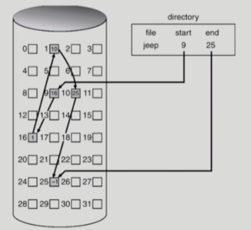

## 4.3 Indexed Allocation(색인 할당)

- **한 블록에 하나의 파일에 대한 데이터의 index들을 모두 저장하는 방식**
- 디렉터리에는 **해당 블록의 위치**만 담게 됨 - **외부 단편화가 발생하지 않음**
- 작은 파일인 경우 위치를 저장하는 블록의 공간 낭비가 생기고, 큰 파일인 경우엔 하나의 블록으로 파일의 index들을 모두 저장하기에 부족하게 되는 단점이 있음
- 파일의 크기가 변경될 때, **인덱스 블록만 수정하면 되기 때문에 파일 크기 변경 시간이 짧음**
- 인덱스 블록을 탐색해야 하기 때문에 **파일 접근 시간이 느림**, **인덱스 블록이 손상되면 해당 파일에 접근할 수 없는** 문제가 발생함
- 색인 할당 방식은 연속 할당과 연결 할당 방식보다는 **적은 사용량**을 보임

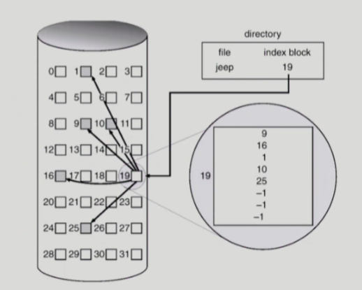
