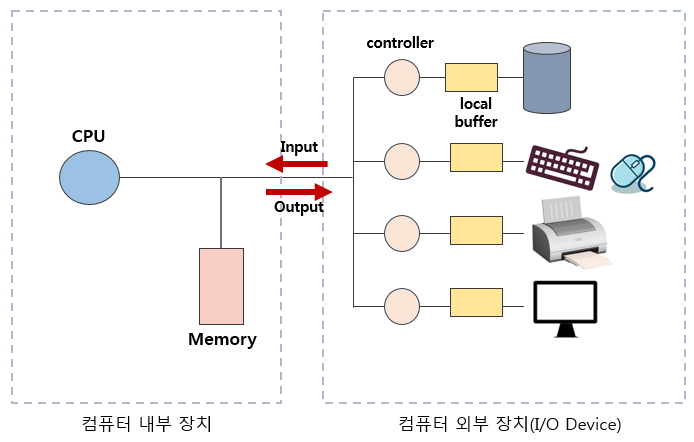
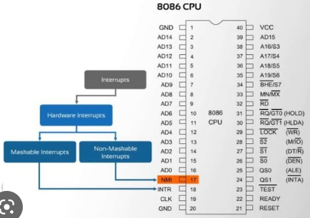
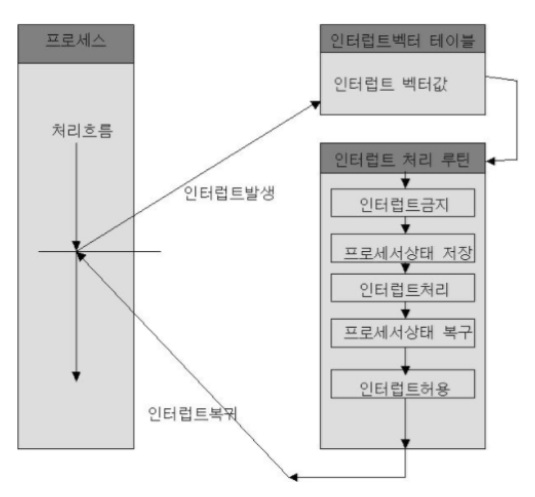
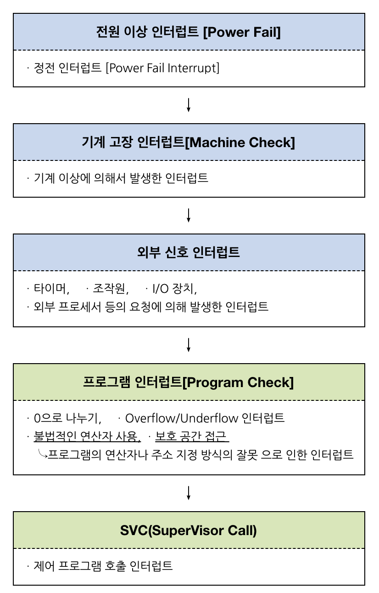

# Interrupt

날짜: 2023년 4월 13일
사람: 이성민

# 1. Interrupt의 개념

## 1.1 Interrupt

<aside>
💡 CPU가 프로그램을 실행하고 있을 때, 입출력 하드웨어 등의 장치에 **예외 상황이 발생하여 처리가 필요한 경우에 마이크로프로세서에게 알려 처리할 수 있도록 하는 것**을 말함. 우선적으로 처리해야 할 일이 발생하였을 때 그것을 처리하고 원래 동작으로 돌아옴.

</aside>

---

# 2. Interrupt의 종류

## 2.1. HW Interrupt(비동기적)

### 2.1.1 분류

- **Maskable Interrupt** - Interrupt Mask가 가능한 인터럽트, CPU에서 INTR pin으로 신호가 들어옴
- **Non-Maskable Interrupt** - Interrupt Mask가 불가능한 인터럽트(무시 될 수 없는 인터럽트), CPU에서 NMI pin으로 신호가 들어

### 2.1.2 종류

- **입출력 인터럽트(I/O Interrupt)** - 입출력 작업의 종료나 입출력 오류에 의해 CPU의 기능이 요청됨
- **정전, 전원 이상 인터럽트(Power Fail Interrupt)** - 전원 공급의 이상
- **기계 착오 인터럽트(Machine Check Interrupt)** - CPU의 기능적인 오류
- **외부 신호 인터럽트(External Interrupt)** - TImer나 Operator에 의해 의도적으로 프로그램이 중단된 경

## 2.2 SW Interrupt(동기적)

### 2.2.1 개념

- Trap 또는 Exception이라고도 함
- 프로그램의 오류에 의해 생기는 인터럽트
- CPU 내부에서 자신이 실행한 명령이나 CPU의 명령 실행에 관련된 모듈이 변화하는 경우 발

### 2.2.2 종류

- **Program Check Interrupt**
    - 0으로 나누는 경우
    - Overflow/Underflow
    - 페이지 부재
    - 부당한 기억 장소의 참조
    - etc..
- **SVC(Supervisor Call) Interrupt** - OS를 호출하는 동작을 수행하는 경우

---

# 3. Interrupt 동작 순서

## 3.1 인터럽트 처리 과정

- **요청 → 중단 → 보관 → 처리 → 재개**
- **처리 과정**
    
    <aside>
    💡 **1. 인터럽트 요청**
    
    **2. 프로그램 실행 중단**
    → 현재 실행 중이던 Micro Operation까지 수행
    
    **3. 현재 실행 중인 프로그램 상태 보관**
    → Interrupt Vector를 읽어 ISR 주소값을 얻음
    → ISR로 점프
    → 현재 진행 중인 프로그램의 레지스터를 대피함
    
    **4. 인터럽트 서비스 루틴 처리**
    → 인터럽트 원인을 파악하고 실질적인 작업 수행
    → 서비스 루틴 수행 중, 우선순위가 더 높은 인터럽트가 발생하면 재귀적으로 1 ~ 5 과정 수행
    
    **5. 상태 복구**
    → 해당 작업을 다 처리하면, 대피시킨 레지스터 복원
    → ISR 끝에 RETI 명령어에 의해 인터럽트 해제
    → 명령어가 실행되면, PC 값을 복원하여 이전 실행 위치로 복원
    
    </aside>
    

## 3.2 Interrupt Handler(Interrupt Service Routine, ISR)

- CPU에서 Interrupt가 접수되면, 해당 Interrupt Handler의 코드의 위치를 찾고 실행에 옮김
- 실행 중이던 레지스터와 PC를 보관함으로써 CPU의 상태를 보존

## 3.3 Interrupt Vector

- 여러 종류의 Interrupt에 대한 ISR의 시작 주소
- **Interrupt Vector Table** - 주기억장치의 특정 영역에 여러 개의 Interrupt에 대한 Interrupt Vector를 모아 놓은 영역

---

# 4. Interrupt 우선순위

