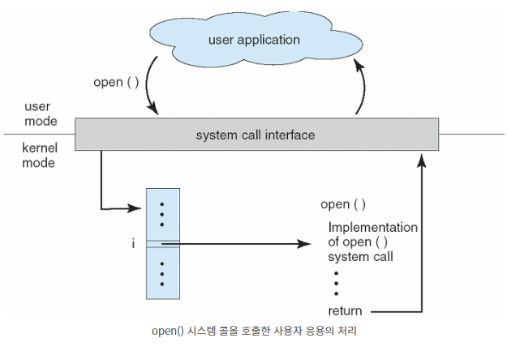
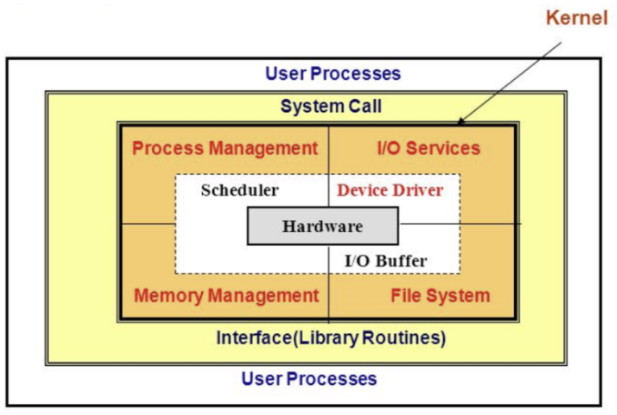

# System Call

날짜: 2023년 4월 13일
사람: 태훈 김

## 커널 모드 Kernel Mode

`모든 자원`(Driver, Memory, CPU 등)에 `접근`, `명령`을 할 수 있는 `모드`

하드웨어와 관련된 모든 작업을 수행할 수 있는 모드

## 유저 모드 User Mode

`유저가 접근할 수 있는 영역을 제한`적으로 두고, 프로그램의 자원에 함부로 침범하지 못하도록 제한하는 모드

개발자는 유저 모드에서 코드를 작성하고 프로세스를 실행하는 등의 행동을 할 수 있다.

유저 어플리케이션 코드가 유저 모드에서 실행된다.

## 장치 드라이버 Device Driver

모든 `I/O 장치`와 `컴퓨터(OS)`가 서로 알아들을 수 있게 `통역`해주는 역할을 수행

`하드웨어`와 `커널` 사이에서 `명령이나 데이터를 전달`해주는 역할을 수행

---

## 정의

운영체제는 크게 Kernel Mode와 User Mode로 나뉘어 구동된다.

Kernel Mode에서는 OS가 하드웨어를 직접적으로 관리하는데 사용되는 함수들을 실행할 수 있다.

User Mode에서는 Kernel Mode가 하드웨어 관련 기능을 API를 통해 제공받는다.

OS의 kernel이 제공하는 서비스에 대해, 응용 프로그램의 요청에 따라 kernel에 접근하기 위한 인터페이스이다.





유저 어플리케이션 코드가 실행되다가 system call을 요청하게 되면, 요청을 받은 kernel이 그 요청에 대한 일을 하고 결과값을 system call의 return값으로 전해준다.

Kernel Mode의 기능들을 System Call을 통해 User Mode가 사용 가능하게 해준다.

프로세스가 하드웨어에 직접 접근해서 필요한 기능을 사용할 수 있게 해준다.

```
👉🏻 예시 1
1. 프로세스가 fopen() 함수 실행
2. fopen() 함수 내부에서 system call인 open을 호출하면서 kerenl mode로 넘어가게 됨
3. open에 대한 입력값이 커널로 전달됨
4. open 함수 수행을 완료하고 kernel에서 return을 해주면서 user mode로 넘어가게 됨
```

```
👉🏻 예시 2
1. 유저 어플리케이션에서 system call이나 라이브러리 함수를 통해서 I/O 요청 발생
2. 커널 모드로 전환한 후, 커널의 I/O 관리자가 장치 드라이버에게 요청함
3. 장치 드라이버에서 키보드나 모니터에서 받은 return 값을 커널에 return함
4. 커널은 return 받은 값을 유저 어플리케이션에 return함
5. 유저 모드로 전환함
```

```
👉🏻 예시 3
1. 유저 모드에서 malloc을 통해서 메모리 할당을 받기 위해 system call 수행
2. 커널 모드로 전환된 후, 메모리 return값을 유저 어플리케이션으로 전달
3. 유저모드로 전환됨
```

---

## System Call 수행 시 매개변수 전달 방법

1. `Call By Value` ❌
    
    ⇒ CPU `레지스터` 내에 전달한다.
    
2. `Call By Reference` ⭕
    
    ⇒ 매개변수를 `메모리(Block, Table)에 저장`하고 `저장된 주소를 레지스터에 변수`로 넘겨준다.
    
3. `스택`에 변수 저장 ⭕

❌ 1번 방식은 매개변수의 개수가 CPU 내의 총 레지스터 개수보다 많을 수도 있다.

⭕ 2, 3번 방법은 매개변수의 개수나 길이에 제한이 없기 때문에 OS에서 선호하는 방식이다. 

---

## System Call 종류

1. 프로세스 제어(Process Control)
    - 끝내기(exit), 중지(abort)
    - 적재(load), 실행(execute)
    - 프로세스 생성(fork)
    - 프로세스 속성 획득과 속성 설정
    - 시간 대기(wait time)
    - 사건 대기(wait event)
    - 사건을 알림(signal event)
    - 메모리 할당 및 해제
    
2. 파일 조작(File Manipulation)
    - 파일 생성(create), 삭제(delete)
    - 열기(open), 닫기(close), 읽기(read), 쓰기(write)
    - 위치 변경(reposition)
    - 파일 속성 획득 및 설정(get file attribute, set file attribute)

1. 장치 관리(Device Manipulation)
    - 하드웨어의 제어와 상태 정보를 얻음(ioctl)
    - 장치를 요구(request device), 장치를 방출(release device)
    - 읽기(read), 쓰기(write), 위치 변경
    - 장치 속성 획득 및 설정
    - 장치의 논리적 부착 및 분리

1. 정보 유지
    - getpid(), alarm(), sleep()
    - 시간과 날짜의 설정과 획득(time)
    - 시스템 데이터의 설정과 획득(date)
    - 프로세스 파일, 장치 속성의 획득 및 설정

1. 통신
    - pipe(), shm_open(), mmap()
    - 통신 연결의 생성, 제거
    - 메시지의 송신, 수신
    - 상태 정보 전달
    - 원격 장치의 부착 및 분리

1. 보호
    - chmod()
    - umask()
    - chown()
