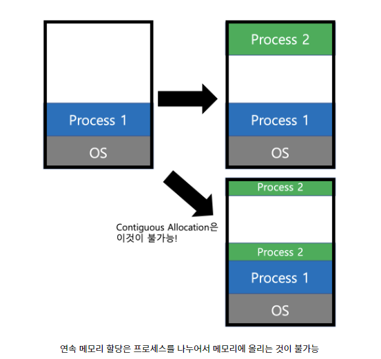
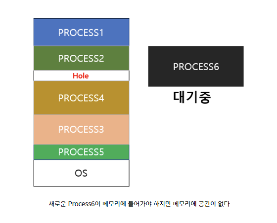
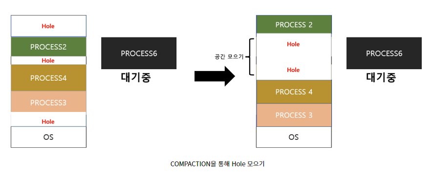
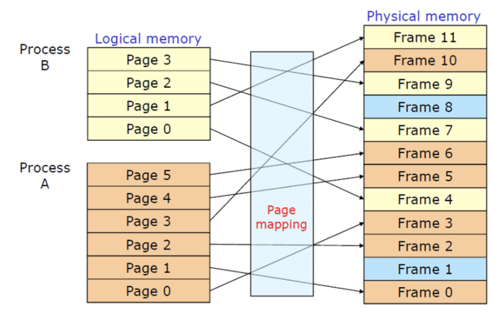
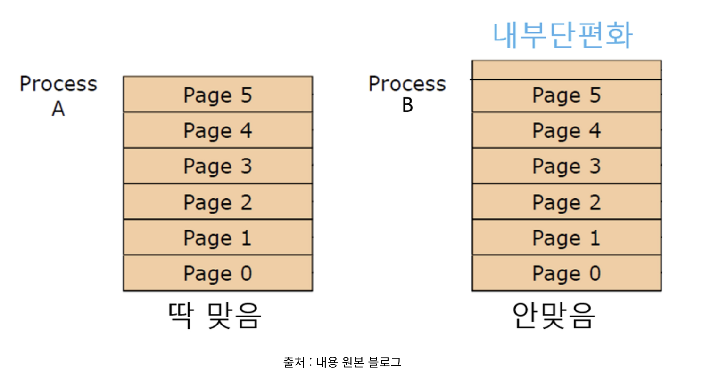

# 메모리

날짜: 2023년 4월 27일
사람: 성재 김

[https://techblog-history-younghunjo1.tistory.com/511](https://techblog-history-younghunjo1.tistory.com/511)

# 운영체제에서의 메모리

- 주기억장치를 다루며, 주기억 장치를 효율적으로 관리하여 프로세스들이 공정하게 메모리를 사용할 수 있도록 하자.
- OS는 프로세스가 실행되는 동안 필요한 메모리를 할당, 실행이 완료시 해제
    1. 메모리 공간 할당 
        - 프로세스에 필요한 메모리 공간 할당, 물리적인 주소 공간에 매핑
    2. 메모리 보호
        - 프로세스가 할당받은 공간에 대해 침범 할 수 없도록
    3. 메모리 공유
        - 메모리 공유할 수 있는 프로세스들 관리, 공유메모리 효율적 사용
    4. 메모리 해제
        - 실행 완료된 프로세스의 메모리 공간 해제

<aside>
💡 **`메모리 효율적 관리`**
- 사용자들이 쉽게 메모리를 사용할 수 있도록 해준다
- OS가 메모리를 관리해준다.
- 메모리를 보호한다.

</aside>

# 메모리 구성요소

- 가상 메모리(Virtual Memory)
    - 실제 물리적인 메모리(RAM)보다 **`더 큰 용량의 메모리를 사용하게`** 해주자.
        - 넘치는 메모리에 대해서는 보조기억장치에 두었다가 **`스와핑` 하는 등.**
    - 전체 메모리 공간 가상적으로 분할하여 **`필요한 부분만 물리적인 메모리에 적재`**하는 방식

<aside>
💡

가상 메모리를 사용하는 이유 중 하나는, 메모리 공간의 효율적인 관리를 위해서입니다. 운영체제는 실행 중인 프로세스들이 사용하는 메모리 공간을 가상 메모리라는 일정한 크기의 페이지 단위로 나누어 관리합니다. 이를 통해 운영체제는 메모리 공간을 보다 효율적으로 활용할 수 있습니다. 또한 가상 메모리를 사용하면, 한 프로세스에서 일부분만 사용되는 메모리 공간을 다른 프로세스에서 사용할 수 있도록 공유할 수 있습니다.

또 다른 이유는, 가상 메모리를 사용하여 하드디스크 등의 보조기억장치를 메모리처럼 사용할 수 있기 때문입니다. 가상 메모리를 사용하면 프로그램이 요구하는 메모리 용량이 실제 메모리 용량을 초과하더라도 일부 페이지를 하드디스크 등의 보조기억장치에 두어서 메모리 공간을 확보할 수 있습니다. 이를 통해 물리적인 메모리 용량을 초과하지 않고도, 대용량의 데이터나 프로그램을 실행할 수 있습니다.

</aside>

- 페이지(Page)
    - 메모리를 가상화하여 관리할 때 사용하는 **`일정한 크기`**의 블록
    - 가상 메모리의 최소 단위
    - 논리적인 주소와 물리적인 주소 매핑을 위해 사용
        - 논리적인 주소 공간 페이지 분할 → 각 페이지를 물리적 메모리에 매핑
    - **`각 페이지를 독립적`**으로 관리 : 효율적인 메모리 관리 가능
        - 일부 페이지만 사용되고 사용되지 않는 것은 메모리 해제하여 다른 프로세스가 사용하는 등

- 페이지 테이블(Page Table)
    - **`논리적 주소와 물리적 주소를 매핑`**하기 위한 데이터 구조
    - 각 페이지의 시작 주소와 길이, 페이지가 메모리에 적재되어 있는지 여부 등의 정보를 담고 있음
        - **`MMU(Memory Management Unit)`**에 의해 사용
        
        <aside>
        💡 **`MMU`**
        - 메모리 사이에서 메모리 접근을 관리하는 장치
        - 가상 주소를 물리 주소로 변환하는 역할
        - 페이지 폴트(Page Fault) 예외 상황 처리
        
        </aside>
        
- 스와핑(Swapping)
    - 메모리가 부족한 상황에서, 메모리에 적재되어 있는 프로세스 중 일부나 전체를 보조기억장치로 이동시켜 **`메모리 공간을 확보`**하는 기술
    - 스왑 아웃(Swap Out)
        - 현재 메모리 적재되어 있는 프로세스 일부나 전체를 보조기억장치로 이동
    - 스왑 인(Swap In)
        - 보조기억장치에서 스왑 아웃된 프로세스를 다시 메모리에 적재.
    - 메모리 공간 확보 장점, But 성능 저하 문제 발생.
        - 스와핑 할 때마다 I/O 작업 필요하기 때문

# Address Binding

- 프로세스의 주소
    - 논리적 주소(Logical address)
        - 프로세스마다 독립적으로 가지는 주소 공간, 프로세스 내부에서 사용하며 0부터 시작
    - 물리적 주소(Physical address)
        - 프로세스가 실행되기 위해 실제로 **`메모리(RAM)에 올라가는 위치`**

- Address Binding은 어떤 프로그램이 메모리의 어느 위치에, 즉 어떤 물리적 주소에 load 될지를 결정하는 과정
    - Compile Time : 프로세스의 물리적 주소가 컴파일 시 정해진다.
        - 컴파일러가 절대 주소, **`고정된 주소`**를 생성
        - 이 때의 주소 할당은 **`논리적 주소와 물리적 주소가 동일`**
        - 주소가 고정되어 있어 **`메모리 상에 빈 공간`**이 많이 발생할 수 있음
        - **`로드하려는 위치에 이미 다른 프로세스 존재 가능성`** 있다
        - 메모리 동적 할당 및 관리 불가
    
    - Load Time : Loader가 **`프로세스를 메모리에 load하는 시점`**에 물리적 주소를 결정.
        - 논리적 주소와 물리적 주소 다름
        - 메모리에 로딩시 성능 오버헤드 우려
            - **`프로그램이 실행 되기 전에`** 모든 메모리가 할당된다.
            - 메모리 로딩할 때 시간은 오래 걸림. 주소 변환해서 올리니까.
    
    - Execution Time (Runtime)
        - **`프로세스가 수행이 시작된 이후`**에 프로세스가 실행될 때 메모리 주소를 변경
        - **`실행할 때마다 한다`** :  동적 할당, 제거, 메모리 주소 공간 재구성
        - **`Runtime때 물리적 주소가 결정`**되며 실행 도중에 바뀔 수 있다.
        - **`address mapping table`**을 이용하여 binding 점검
            - 가상 주소와 물리 주소 간의 매핑 정보를 저장
            - 각각의 프로세스마다 별도로 유지
        - 실행할 때마다 해야 되니.. 시간 오래 걸린다.
        - 논리적 주소 → 물리적 주소 변환할 때 연산 작업 : **`MMU`**
        
        <aside>
        💡 현대에서 선호하는 방식 : **`Excecution Time`**
        
        개념적으로 생각하면 실행 타임 방식이 로드 타임 방식보다 로딩할 때를 제외하고는 시간도 적게 걸리고, 프로그램 실행되기 전에 모든 메모리가 할당되어 메모리 관리도 쉬워 더 좋다고 생각할 수 있는 듯.
        
        **`그러나 실행 타임 방식을 선호한다고 합니다.`**
        
        **`실행 타임 방식에서의 성능 저하가 무시할 수 있을 정도로 작다.`**
        
        실행 타임 방식은 로드 타임 방식보다 조금 더 많은 시간이 소요될 수 있습니다. 이는 실행 중인 프로그램이 메모리에 적재되어 있는 상태에서도 새로운 코드나 데이터를 동적으로 할당하거나 제거하기 위해 메모리 주소 공간을 재구성해야하기 때문입니다. 따라서 실행 타임 방식에서는 적재된 코드나 데이터의 베이스 주소를 다시 계산하고 다시 참조해야 할 수도 있습니다.
        
        하지만 현대의 컴퓨터 시스템은 매우 빠른 하드웨어와 최적화된 소프트웨어를 사용하므로, 실행 타임 방식에서의 성능 저하는 대부분 무시할 수 있을 정도로 작습니다. 또한 실행 타임 방식은 메모리의 동적 할당과 해제가 가능하므로, 유연성과 효율성 면에서 우수합니다.
        
        </aside>
        
    

# External Fragmentation

- MMU는 **`연속적 메모리 할당 방식`** 사용
    - MMU는 memory protection 등의 기능도 지원.
    - Base Address
    - **`연속적 메모리 할당 방식은 External Fragmentation 발생시켜 안쓴다`**
        - 즉 하나의 프로세스를 두 가지로 분할해서 메모리에 올리는 것이 불가능

- 메모리 가용 공간 : Hole
- 만약 PROCESS5와 PROCEE1이 둘 다 종료되서 공간이 생겼어도, 못들어간다.
- 즉, **`파편적으로 생겨서`** PROCESS6이 들어갈 하나의 공간이 부족하다는 것.
- 총 Hole 공간이 프로세스가 들어갈 크기는 되나, 연속적이지 않아서 새로운 프로세스를 메모리에 올리지 못한다 = **`External Fragmentation`**
    - Compaction : 가능한 Hole을 연속적인 공간으로 모아 메모리 올라가있는 프로세스들 다 양쪽으로 밀어버리기~
        
        
        
        - 비효율적입니다.
    

# Paging

- 메모리에 **`프로세스 크기 별`**로 메로리를 할당
    - 할당한 프로세스 크기가 개별적으로 다르므로 **`‘가변 분할’`**이라고 함

- External Fragmentation 문제를 해결하기 위해 메모리를 고정된 크기로 분할
- **`Paging`**이라는 단위를 통해 메모리를 고정적인 크기로 분할 = **`‘고정 분할’`**
    
    
    

- **`내부단편화`** 문제 발생 : 아래 그림, 페이징이 프로세스를 딱 맞아떨어지지 않게 쪼개지지 않는 문제
    
    
    

<aside>
💡 외부단편화보다 훨씬 **`메모리공간 낭비 줄어드므로`** 페이징을 사용하는 것이 이득

</aside>

# Page Mapping Table

- 페이지 매핑 : 가상 메모리의 **`페이지`**를 물리적 메모리 **`프레임`**에 매핑하는 것
- 페이지 매핑 테이블
    - 매핑 테이블은 각 프로세스마다 독립적으로 관리
    - 대응 되는 페이지와 프레임을 매핑
        - 페이지 번호 : 고정 분할하였을 때 붙는 일종의 순번
        - 페이지 크기 : 논리 주소를 저장할 수 있는 크기
        - 페이지 오프셋 : 페이지 크기 내에 들어가는 주소?
    - **`논리 주소에서 물리 주소로의 변환을 담당`**
    - CPU의 MMU에 저장된다

- **`프로세스의 연속적 실행`**을 보장 = 논리 주소를 기반으로 프레임에 접근해서.

# TLB (Translation Lookaside Buffer)

- 자주 사용하는 페이지를 기억해두자 ( 캐싱 )
- Page Mapping Table이 많아지면 **`부하`**
