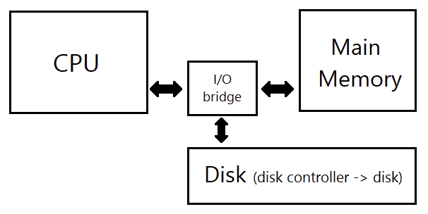
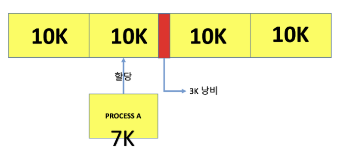
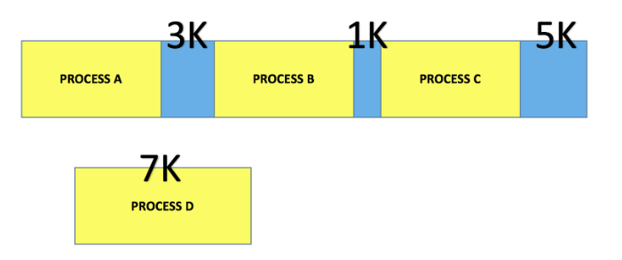
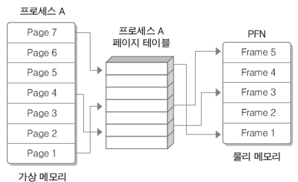
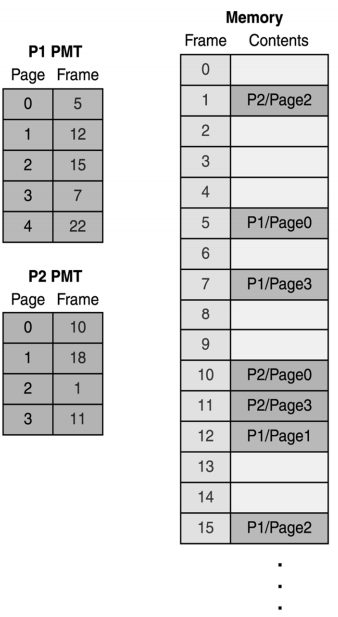
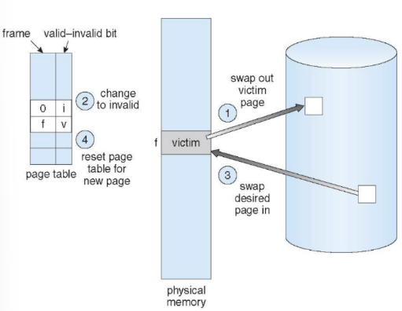

# 페이징 & 세그먼테이션 + 페이지 교체

날짜: 2023년 4월 27일
사람: 태훈 김

# 페이징 & 세그먼테이션

### Main Memory (물리적 메모리)

`CPU가 직접 접근`할 수 있는 기억 장치

프로세스가 실행되려면 프로그램 코드를 메인 메모리에 적재해야 한다.

만약 프로그램 코드가 메인 메모리 용량보다 크다면? → 물리적 메모리만으로는 감당이 안된다.

### Virtual Memory (논리적 메모리)

`물리 메모리`는 `용량이 한정적`이기 때문에 사용자에게 더 많은 메모리를 제공하기 위해 `가상 주소`를 사용한다.

메모리 관리 장치: `가상 주소` → `물리 메모리 주소` 변환

가상 주소 공간: 하나의 프로세스가 메모리에 저장되는 논리적인 모습을 가상 메모리에 구현한 공간

가상 주소: 가상 주소 공간을 가리키는 주소

장점

전체 프로그램이 물리 메모리에 올라와 있지 않아도 된다.

프로그램 용량이 실제 메모리보다 커도 된다.

더 많은 프로그램을 동시에 실행할 수 있다.

⇒ 다중 프로그래밍을 실현하기 위해 물리 메모리의 제약을 보완하고 프로세스 전체를 메모리에 올리지 않고도 실행할 수 있도록 해 준다.

### 구현

물리적 제약을 가지고 있는 주기억장치를 보조하기 위해 디스크를 보조기억장치로 사용한다.

즉, 메인메모리(주기억장치)와 디스크의 페이징 스페이스(보조기억장치)를 묶어 하나의 메모리처럼 동작시켜 가상메모리를 구현한다.

## Swapping

CPU 할당시간이 끝난 프로세스의 메모리를 보조기억장치로 내보내고(swap-out) 다른 프로세스의 메모리를 불러오는 작업을 Swap이라고 한다. 이러한 Swap 작업은 디스크 전송 시간이 들기 때문에 메모리 공간이 부족할 때만 발생한다.

## 메모리 관리

다중 프로그래밍 시스템에 여러 프로세스를 수용하기 위해 주기억장치(RAM)를 동적 분할하는 메모리 관리 작업이 필요하다. 즉, 하드디스크에 있는 프로그램을 어떻게 메인메모리에 적재할 것인지 판단해야 한다.

## 연속 메모리 관리

프로그램 전체가 하나의 커다란 공간에 연속적으로 할당되어야 한다.

- 고정 분할 기법: 주기억장치가 고정된 파티션으로 분할 → 내부 단편화 발생
- 동적 분할 기법: 파티션들이 동적 생성되며 자신의 크기와 같은 파티션에 적재 → 외부 단편화 발생

연속 메모리 관리 기법을 사용하면 단편화 현상이 발생한다.

## 단편화 (Fragmentation)

### 내부 단편화

프로세스가 사용하는 메모리 공간에 남는 부분

프로세스가 요청한 양보다 더 많은 메모리를 할당할 때 발생한다.

`세그먼테이션` 기법으로 해결 가능하다.

### 외부 단편화

메모리 공간 중 사용하지 못하게 되는 부분

메모리 할당 및 해제 작업의 반복으로 작은 메모리가 중간중간 존재할 수 있다. 이렇게 사용하지 않는 메모리가 존재해서 총 메모리 공간은 충분하지만 실제로 할당할 수 없는 상황이다.

외부 단편화를 해결하기 위해 압축을 이용하여 프로세스가 사용하는 공간을 한쪽으로 몰 수 있지만, 작업 효율이 나빠진다.

`페이징` 기법으로 해결 가능하다.

## Paging (페이징)

프로세스를 일정한 크기의 페이지로 분할해서 메모리에 적재하는 방식이다.

하나의 프로세스가 사용하는 메모리 공간이 연속적이어야 한다는 제약을 없애는 메모리 관리 방법이다.

페이지: 고정 사이즈의 가상 메모리 내 프로세스 조각

프레임: 페이지 크기와 같은 주기억장치의 메모리 조각

### Paging Table (페이징 테이블)

모든 프로세스는 하나의 페이징 테이블을 가지고 있다.

메인 메모리에 적재되어 있는 `페이징 번호`와 해당 페이지가 위치한 `메인 메모리의 시작 주소`가 있다.

하나의 프로세스를 나눈 가상 메모리 페이지들이 실제 메인 메모리의 어디 프레임에 적재되어 있는지 알아낼  수 있다.

### 장점

외부 단편화가 생기지 않는다.

### 단점

내부 단편화 문제가 발생할 수 있다.

페이징 단위를 작게 하면 해결할 수 있지만, 페이지 매핑 과정이 복잡해져 오히려 비효율적이다.

## Segmentation (세그먼테이션)

가상 메모리를 서로 크기가 다른 논리적 단위로 분할하는 것을 의미한다.

프로세스를 논리적 단위인 세그먼트로 분할해서 메모리에 적재하는 방식이다.

### 세그먼트 테이블

분할 방식을 제외하면 페이징과 세그먼테이션이 동일하기 떄문에 매핑 테이블의 동작 방식도 동일하다.

메인 메모리에 적재되어 있는 `세그먼트 번호`와 해당 세그먼트가 위치한 `메인 메모리의 시작 주소`가 있다.

### 장점

내부 단편화 문제가 해소된다.

보호와 공유 기능을 수행할 수 있다.

중요한 부분과 중요하지 않은 부분을 분리하여 저장할 수 있다.

같은 코드 영역을 한번에 저장할 수 있다.

### 단점

외부 단편화 문제가 발생할 수 있다.

---

# 페이지 교체

## 페이지 교체 필요성

메모리 과할당 발생시 메인 메모리에 가용 프레임이 부족하므로 페이지 교체가 필요하다.

## Page Replacement (페이지 교체)

1. 보조저장장치(Disk)에서 필요한 페이지의 위치를 알아낸다.
2. 주기억장치(Main Memory)에서 빈 페이지 프레임을 찾는다.
    1. 비어있는 프레임이 있다면 그것을 사용한다.
    2. 비어있는 프레임이 없다면 희생될(victim) 프레임을 페이지 교체 알고리즘을 통해 선정한다.
    3. 희생될 페이지를 보조저장장치(Disk)에 기록하고, 관련 테이블을 수정한다.
3. 프레임에 새 페이지를 읽어오고 테이블을 수정한다.
    
    ⇒ 변경비트(modify bit)를 사용해 페이지의 변경 여부를 표시해 보조저장장치(Disk)에 기록 여부를 판단한다.
    
4. 페이지 폴트가 발생한 지점에서부터 프로세스를 계속한다.

## 페이지 교체 알고리즘

### FIFO(First-In-First-Out) Algorithm

메모리에 올라온지 가장 오래된 페이지를 victim으로 선정한다.

이해하기도 쉽고 구현도 쉬우나, 성능이 좋지 않다.

### Optimal Algorithm

앞으로 가장 오랫동안 사용되지 않을 페이지를 victim으로 선정한다.

가장 낮은 페이지 폴트율을 보장한다.

실제 구현은 어렵다. 미래를 예측해야 하기 때문이다.

### LRU(Least Recently Used) Algorithm

가장 오랜 기간동안 사용되지 않은 페이지를 victim으로 선정한다.

페이지마다 마지막 사용 시간을 유지한다.

미래 대신 과거 시간에 대해 적용한 최적 교체 정책

### LRU Approximation Algorithm

- Second-chance Algorithm
    
    순환 큐를 이용해서 구현하고, 참조 비트(reference bit)를 사용한다.
    
    포인터가 0 값의 참조 비트를 가진 페이지를 발견할 때까지 큐를 탐색한다.
    
    포인터가 돌아가면서 참조 비트 값들이 1인 것을 0으로 바꾼다.
    
- Enhanced Second-chance Algorithm
    
    참조 비트(reference bit)와 변경 비트(modify bit)를 사용한다.
    
    네 가지 등급
    
    1. (0, 0) ⇒ 사용되지도 변경되지도 않은 경우 → 교체하기 가장 좋은 페이지
    2. (0, 1) ⇒ 사용되지는 않았지만 변경된 경우 → 페이지 교체 시 디스크에 내용을 기록해야 하므로 좋지 않다.
    3. (1, 0) ⇒ 사용은 되었지만 변경되지 않은 경우 → 페이지가 곧 다시 사용될 가능성이 높다.
    4. (1, 1) ⇒ 사용도 되었고 변경도 된 경우 → 곧 다시 사용될 것이며 교체 시 디스크에 내용을 기록해야 한다.
    
    페이지가 어떤 등급에 속하는지 확인해서 가장 낮은 등급을 가지면서 처음 만난 페이지를 교체한다.
    

### 계수 알고리즘

참조할 때마다 계수를 표시해 그 값으로 판단한다.

잘 사용되지 않는다.
