# 프로세스 / 스레드

날짜: 2023년 4월 13일
사람: 성재 김

### [프로그램]

- 컴퓨터에서 실행할 수 있는 파일 : **아직 파일을 실행하지 않은 상태** —> 정적 프로그램

### [프로세스]

- 프로그램을 실행시켜 정적인 프로그램 → 동적 : 프로그램이 돌아가고 있는 상태, **즉 컴퓨터에서 작업 중인 프로그램**

### **[프로그램과 프로세스 차이]**

### [스레드]

- 프로세스 하나만으로 작업 : 프로세스 **하나의 사용이 끝날 때 까지 기다려야 되기 때문에 한계**
- 위와 같은 이유로 **스레드(Thread)** 등장
    - **하나의 프로세스 내에서 동시에 진행되는 작업 갈래, 흐름의 단위,**
    - 이런 일련의 작업 흐름들(스레드)이 여러 개 있다 : **멀티 스레드**
        - 하나의 프로세스 내에 여러개의 스레드
        - 파일 다운 받으며 웹 서핑~
- **프로세스의 자원을 `공유`**

### [프로세스와 스레드 간략정리]

### **[프로세스 자원 구조]**

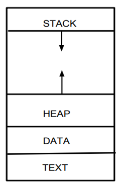

- 코드 영역(Code / Text) : 프로그래머가 작성한 함수들의 코드가 CPU가 해석 가능한 기계어 형태로 저장되어 있는 곳
- 데이터 영역(Data) : 코드가 실행되면서 사용하는 전역 변수 / 각종 데이터들이 위치하는 공간
    - .data : 전역 변수 또는 static 변수 등 프로그램이 사용하는 데이터
    - .BSS : 초기값 없는 전역 변수, static 변수 저장
    - .rodata : const같은 상수 키워드 선언된 변수나 문자열 상수가 저장
- 스택 영역(Stack) : 지역 변수, 파라미터가 위치하는 공간. 함수의 호출과 함께 할당, 함수  종료시 소멸
- 힙 영역(Heap) : 동적 할당되는 데이터를 위한 영역 (생성자, 인스턴스 등 ..)
    
    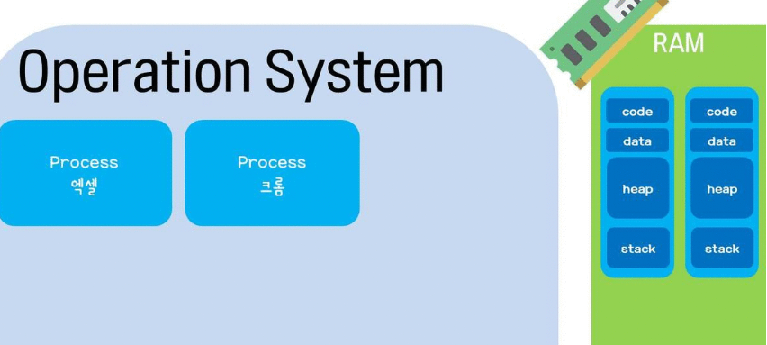
    

`※ 스택 영역과 힙 영역은 **동적 영역(**호출에 의해 크기가 늘어났다 줄어났다 하는 곳)`

<aside>
💡 프로세스는 다른 프로세스의 메모리에 **`직접`** 접근할 수 없음
그래서 다른 방법으로 접근해야함 (IPC, LPC …)

</aside>

### [프로세스 자원 공유]

- IPC(Inter-Process-Communication)
- LPC(Local inter-Process Communication)
- 별도의 공유 메모리를 만들어 정보를 주고 받도록 설정 등..

- CPU 레지스터, RAM, CPU사이 캐시 메모리까지 초기화 필요
    - 자원 부담이 너무 커요~
    - 그래서 다중 작업은 스레드 이용이 훨씬 효율.
    - 다중 프로세싱을 지원하나 다중 스레딩을 기본으로 한다.
    - Shared Memory : 공유메모리 설명이므로 일단 생략..

### [ 병렬성(Parallelism) / 동시성(Concurrency) ]

- 병렬성 ( 얘가 진짜 동시 )
    - **`여러개의 코어`**에 맞춰
    - 여러개의 프로세스, 스레드를 **`‘병렬`**’로 작업한다
    - 듀얼 코어, 쿼드 코어 등. 멀티코어 프로세서에서 가능
    - 여기서 말하는 스레드는 물리적 스레드(하드웨어적 스레드)

<aside>
💡 소프트웨어 스레드가 100개가 있다고 하더라도 **`동시에 실행될 수 있는 스레드는 하드웨어 스레드 갯수`**와 같다. 
2코어 4스레드 라고 하면 동시에 네개의 스레드가 실행이 가능

[https://kldp.org/node/154708](https://kldp.org/node/154708) 
하드웨어 스레드 & 소프트웨어 스레드 차이 .

</aside>

- 동시성 ( 얘는 동시 처럼 보임 )
    - 1개의 코어, 4개의 작업이 있다고 가정하면
    - 1개의 코어가 4개의 작업을 계속 번갈아가며 처리하는 것
    - 너무 빨라서 동시에 돌아가는 것처럼 보이는 것. (아주 잘게 나누어 조금씩 작업을 수행)
    - A → B → C → D 각각으로 작업을 전환할 때 **`Context Switching`** 발생

- 동시성이 필요한 이유
    - **`하드웨어적 한계`** : 코어를 수십개를 넣을 수 없다.
    - **`논리적 효율`**을 위해
        - 어떤 작업이 계속 대기하는 일이 없도록
        - 작업을 아주 잘게 나눠 번갈아 가면서 처리
    
    <aside>
    💡 결론 : **`적절히 병렬성과 동시성을 섞어`** 동시에 돌리게 되게 된다.
    
    </aside>
    

[프로세스 상태 등..은 유영]

### [프로세스 컨텍스트 스위칭]

- 여러 개의 프로세스를 번갈아가며 실행하기 위해 필요
- 프로세스의 상태(Context) 보관
    - 어디까지 작업했는지에 대한 정보를 기록하고
    - 대기 → 실행 상태 들어갈 때 다시 복구해서 작업하겠다.
- 컨텍스트 스위칭의 주체 : **`스케줄러`**

### [PCB]

- 운영체제에서 프로세스를 관리하기 위해 **`프로세스의 상태정보`**를 담고 있는 자료구조
- 컨텍스트 스위칭시 기존 프로세스의 상태는 PCB에 저장되어 있다
- 프로세스 스케줄링을 위해 프로세스에 관한 정보를 저장하는 **`임시 저장소`**

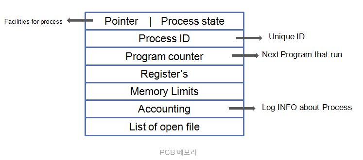

- 포인터 : 프로세스의 현재 위치 저장
- 프로세스 상태(state) : 생성, 준비, 실행, 대기, 종료 ..
- 프로세스 아이디 : 프로세스 식별자
- 프로그램 카운터 : 프로세스를 위해 실행될 다음 명령어의 주소 저장
- 레지스터 : 누산기, 베이스, 레지스터 및 범용 레지스터를 포함하는 CPU 레지스터에 있는 정보
- 메모리 제한 : 운영체제에서 사용하는 메모리 관리 시스템에 대한 정보
- 열린 파일 목록 : 프로세스를 위해 열린 파일 목록

### [Context Switching 과정 (프로세스) ]

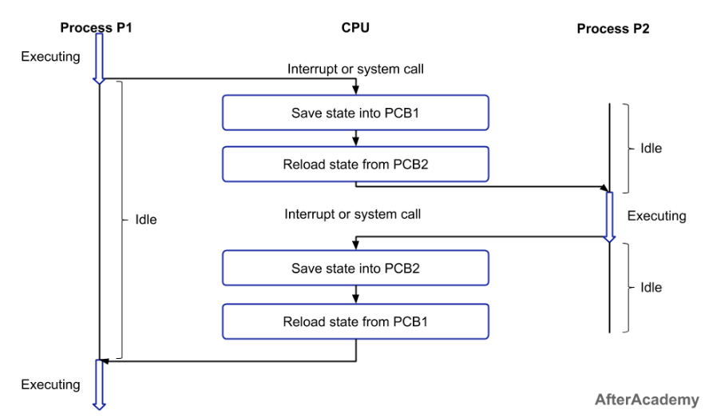

- 실행되는 프로세스의 변경 과정에서 프로세스의 상태, 레지스터 값 등이 저장되고 불러오는 등의 작업 : 시스템에 부담
- 위의 컨텍스트 스위칭 과정에서 idle 상태 이후 Excecuting된다
    - 이 **`간극`**이 **`컨텍스트 스위칭 오버헤드`**
        - PCB 저장하고 복원하는데 비용 발생
        - 프로세스 자체가 교체되는 것이니 CPU의 캐시메모리에 저장된 데이터 무효화, 그만큼 메모리 접근 시간이 늘어나고 성능저하 발생

### [스레드 스케줄링]

- 운영체제에서 다중 스레드를 관리, CPU를 사용할 수 있는 스레드 선택, 할당
- 스케쥴링에 다양한 알고리즘 존재 : Round Robin, Prority-based …
- 스레드 간의 상호작용과 동기화 문제를 고려해야함.

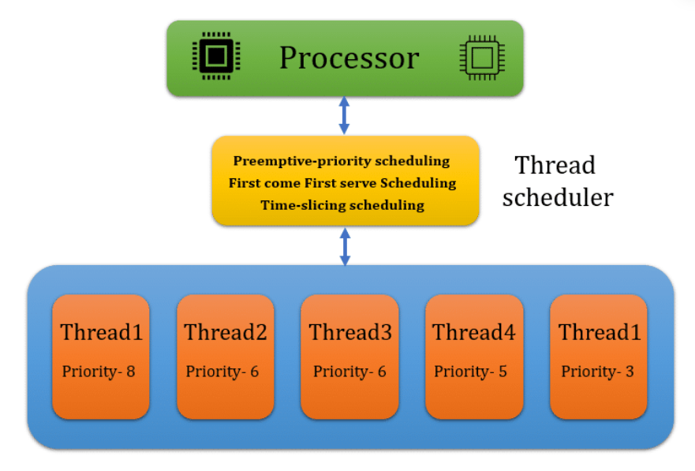

### [스레드 상태]

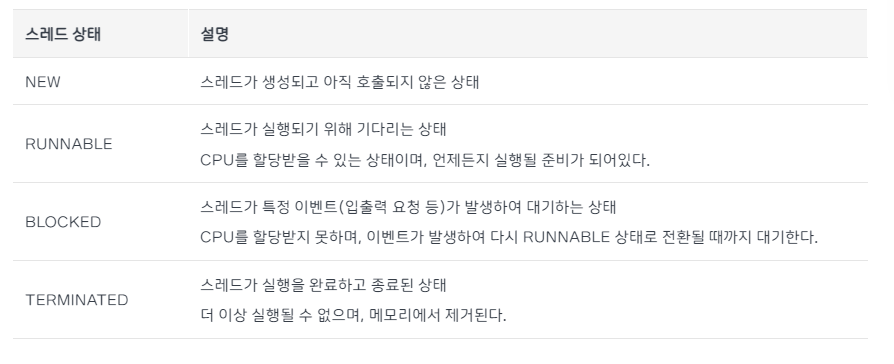

### [스레드 자원공유]

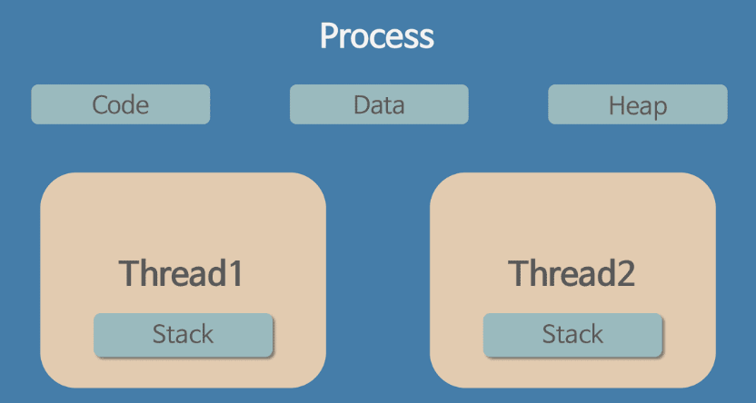

- 한 개의 프로세스 내에 여러개의 스레드
- 스레드는 **`Stack만 할당`**받아 복사, Code Data Heap 영역은 다른 스레드와 공유
- 스레드는 프로세스의 4가지 영역 중 Stack만 복사, 나머지는 다른 스레드와 공유
- 스레드 각각이 독립적인 스택을 가짐

<aside>
💡 스레드 각자가 독립적인 스택을 가졌다?

- 독립적인 스택을 가졌기 때문에 **`독립적인 함수 호출`**이 가능.
- **`독립적인 실행 흐름`**이 추가
- 각자가 Stack을 가져서 **`독립적인 실행 흐름이 가능`**한 것
</aside>

※ ***자원의 생성과 관리의 중복성을 최소화하여 수행 능력을 올림***

### [스레드 context switching]

- 하나의 프로세스 내의 스레드들을 교환

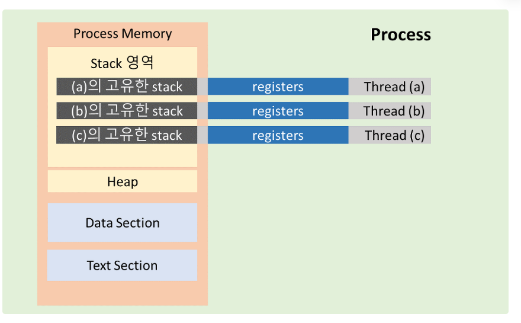

- TCB(Thread Control Block)
    - PCB 안에 들어있다.
    - 스레드의 상태 정보, 스레드 ID, 스레드 우선순위, 스케줄링 정보 등 다양한 정보를 저장
    
    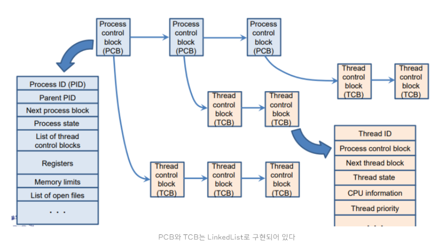
    

### [**프로세스 컨텍스트 스위칭 vs 스레드 컨텍스트 스위칭]**

- TCB가 PCB보다 가볍다
    - 스레드들은 text, data, heap 영역 메모리 공유하므로 stack 및 register 포인터 정보만을 저장

- 캐시메모리 초기화
    - 프로세스 컨텍스트 스위칭 : 프로세스 자체를 바꾸는 것이라 CPU 캐시 메모리 초기화 필요
    - 스레드 : 프로세스 내에서 변경되기 때문에 CPU 캐시 메모리 초기화 X
        - 다른 CPU 코어에서 실행 : 초기화 될 수 있다. 해당 코어의 캐시 메모리에 정보가 로드되어야 하므로.
    
- 자원 동기화 문제
    - 어떤 스레드가 공유 데이터에 접근 → 이전 스레드가 공유자원을 사용하고 있는 경우
        - 두 개의 스레드가 동시에 하나의 변수 수정 등 일어날 수 있음
    - 경쟁 조건(race condition)
        
        <aside>
        💡 [https://iredays.tistory.com/125](https://iredays.tistory.com/125)   
        (Race Condion과 예방할 방법(세마포어, 뮤텍스)
        
        </aside>
        
    

### [멀티 스레드]

- 하나의 프로세스 안에 여러개의 스레드
- 하나의 프로그램에서 두가지 이상의 동작을 동시에  처리

- 장점
    - 스레드는 프로세스보다 용량이 가볍다 : 멀티 프로세스 < 멀티 스레드
    
    - 자원의 효율성
        - 스레드는 스택 영역을 제외한 프로세스의 자원을 공유해서 효율적인 활용이 가능, 시스템 자원 소모를 줄임
        
        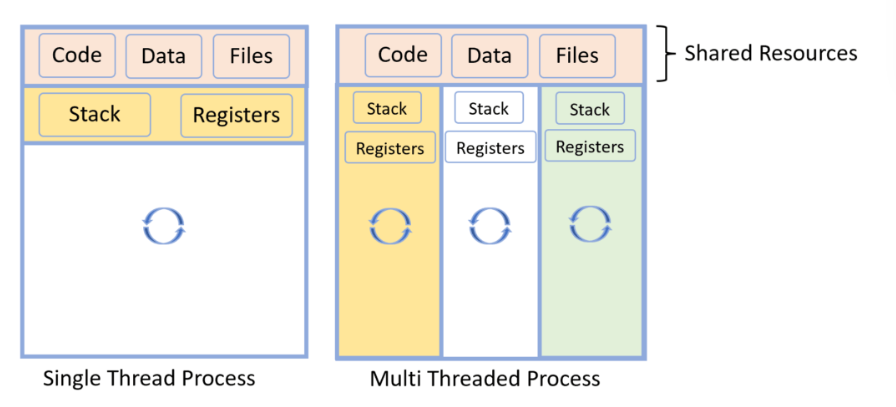
        
    - Context Switching 비용 감소

- 단점
    - 안정성
        - 멀티 프로세스 : 각 프로세스가 독립적으로 동작하여 다른 프로세스는 영향 X
        - 그러나 스레드 모델에서는 영향을 받을 수 있다
    - 동기화 문제
        - 동시 자원 접근 문제 : 동기화 작업 필요
            - 동기화 작업 : 여러 스레드들의 자원에 대한 접근 통제.
                - 얘도 병목 현상을 일으켜 성능이 저하될 가능성이 있음
                    - **`임계영역(Critical Section), 뮤텍스(mutex), 세마포어(Semaphore`**
                    
                    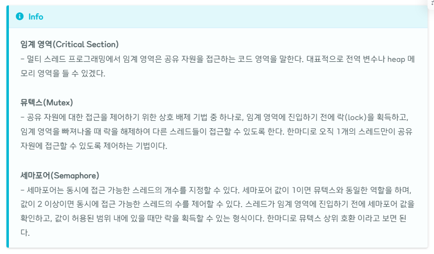
                    
    - 데드락(교착 상태) // 멀티스레드만의 문제는 아님.
        - 다수의 프로세스나 스레드가 서로 자원을 점유하고, 다른 프로세스나 스렏가 점유한 자원을 기다리는 상황에서 발생하는 교착상태
    - **`Context Switching Overhead`**
        - 멀티 프로세스보다는 덜 하나 없는건 아니다! 많으면 당연히 많이 발생.
        - **`스레드를 많이 쓸수록 성능이 좋아질까?` 라는 의문을 가지고 있어야 한다.**
