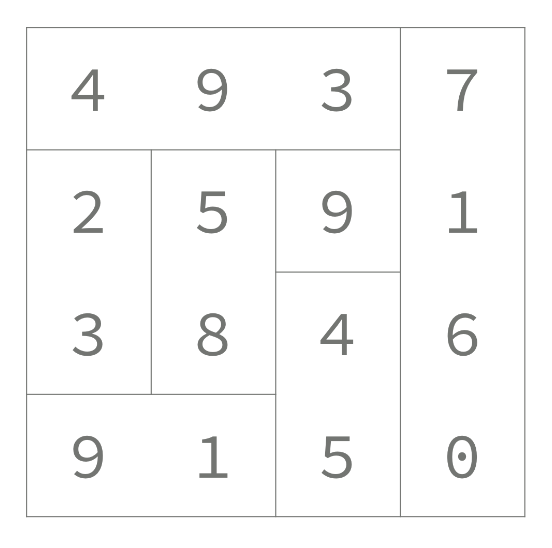
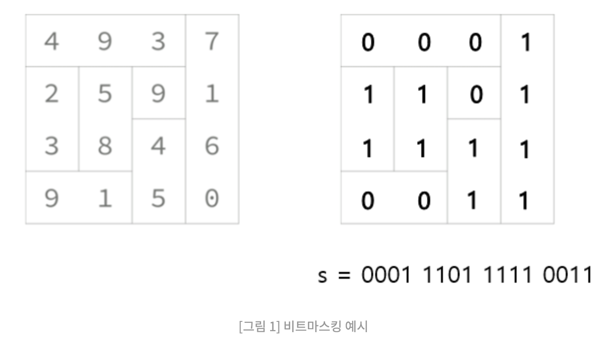

# BOJ14391 - 종이조각

태그: 06/04, dfs, 비트마스킹

[14391번: 종이 조각](https://www.acmicpc.net/problem/14391)

- 종이는 1 x 1 크기의 사각형으로 나누어져 있고, 숫자는  각 칸에 1개씩 써져 있다.
- 길이가 N인 조각은 N자리 수로 나눌 수 있다.
- 행렬의 크기는 **`최대 4x4`**

각 조각의 합은 493 + 7160 + 23 + 58 + 9 + 45 + 91 = 7879 이다.

종이를 적절히 잘라서 **`조각의 합을 최대로 하는`** 프로그램을 작성하시오.

- 생각해낸 포인트
    - 행렬의 크기는 4x4이므로 **`완전탐색하는데 문제 없다.`**
        - 각 종이는 가로인지 세로인지만을 선택할 수 있어서 최대 2^16, 충분히 범위안에 들어와있는 수
    - **`경우의 수를 나누는 로직`**을 계산하기만 하면 된다.
        - 재귀방식으로 접근하면 쉽게 풀릴 거다.
        - 모든 경우의 수를 구하는 것은 결국 부분집합식의 문제다.

- 생각하지 못한 포인트
    - 가로들과 세로들을 **`나눈다`**.
        - `최종적인 합을 구할 때 **가로와 세로의 합을 따로 구할 생각을 못했음.**`
        - 어떻게 가로와 세로를 번갈아가며 더할까 생각했는데 ***아주 어려운 생각이었음***
    
    - **`방문 배열을 이용해서`** 가로와 세로를 체크한다
        - 방문 배열에서 연속성을 이용하면 된다.
        
- 보완해야할 점
    - 경우의 수를 어떠한 방식으로 나눌지를 더 깊게 고민해야함
        - 연습이 답이다. 이러한 풀이 방식이 있다는 것을 **`기억해두자`**
    
    # 비트마스킹 풀이
    
- 비트가 0이면 해당 숫자는 가로
- 비트가 1이면 해당 숫자는 세로
    
    
    
- 0000 0000 0000 0000 ~ 1111 1111 1111 1111 의 경우의 수를 구하는 문제이다.
- [https://code-lab1.tistory.com/101](https://code-lab1.tistory.com/101)
- 이 방식은 싸피에서 제공한 비트마스킹 방식 강의를 다시 듣고오고 나서 푼다.
