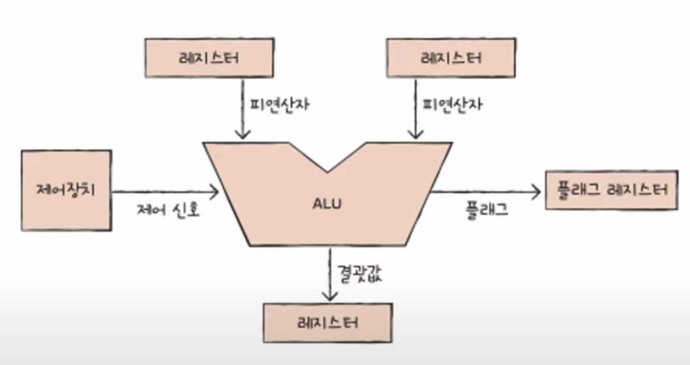
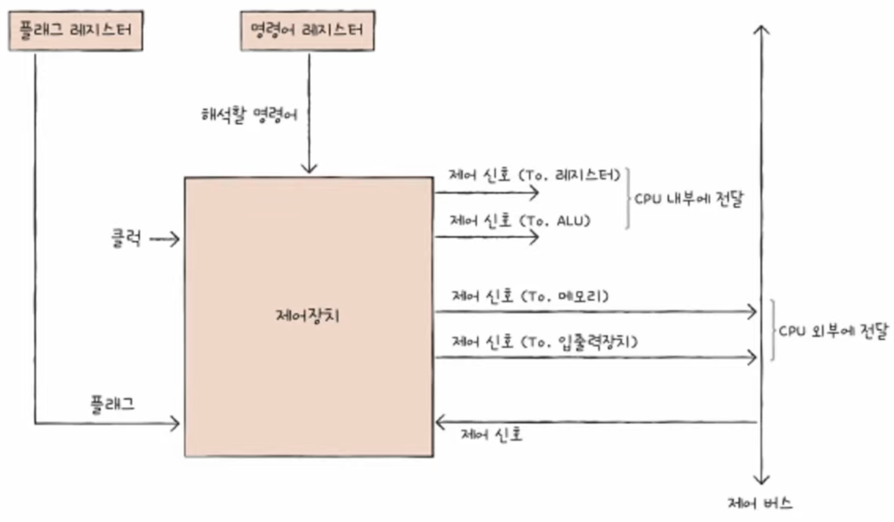
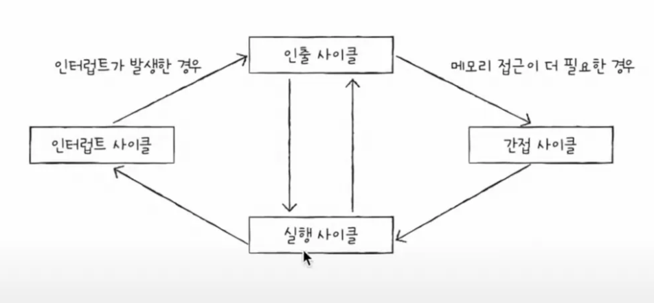
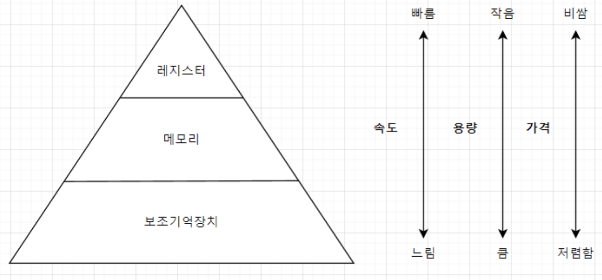
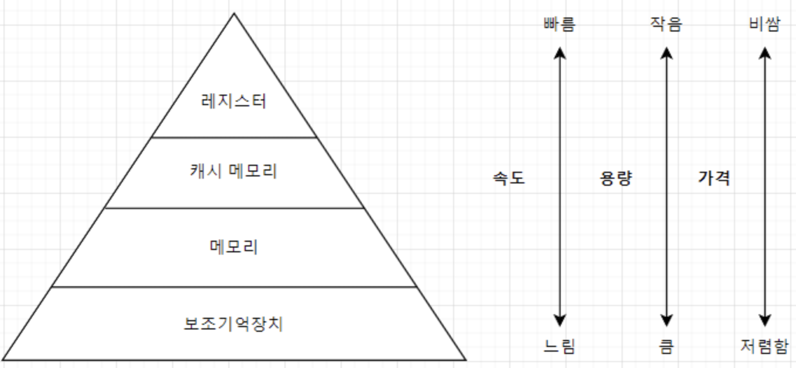

# 컴퓨터구조

# 이야기 형식으로 정리한 글.

# 명령어의 구조

명령어는 연산 코드와 오퍼랜드로 구성되어 있다. 명령어가 수행할 연산을 연산 코드라 하고, 연산에 사용할 데이터 또는 연산에 사용할 데이터가 저장된 위치를 오퍼랜드라고 한다. 연산 코드는 연산자, 오퍼랜드는 피연산자라고 부른다.

## 오퍼랜드

연산에 사용할 데이터 또는 연산에 사용할 데이터가 저장된 위치라고 했다. 다만 오퍼랜드 필드에는 많은 경우에 사용할 데이터가 저장된 위치, 즉 메모리 주소나 레지스터 이름이 담긴다. 하여 오퍼랜드 필드를 **주소 필드**라고 부르기도 한다.

왜 굳이 위치를 쓰는가 하면, 명령어 내에서 표현할 수 있는 크기가 제한되어 있기 때문이다. 주소의 위치를 사용한다면, 크기에 제한을 적게 받고 효율적으로 사용할 수 있다. 연산에 사용될 데이터가 저장된 위치는 유효 주소라고 표현한다.

오퍼랜드가 하나도 없는 명령어를 0-주소 명령어라고 하고, 한 개인 경우 1, 두 개인 경우 2.. 라고 한다.

오퍼랜드는 하나도 없을 수도, 여러개일 수도 있다.

## 연산 코드

명령어가 수행할 연산을 의미한다고 했다. 크게 4가지가 있는데, 흐름대로 생각하면 된다.

[데이터 전송, 산술/논리 연산, 제어 흐름 변경, 입출력 제어]

## 명령어 주소 지정 방식

오퍼랜드 필드에 데이터가 저장된 위치를 명시할 때, 연산에 사용할 데이터 위치를 찾는 방법을 주소 지정 방식이라고 한다. 다시 말해서, 연산에 사용될 데이터 저장 위치 = 유효 주소, 즉 유효 주소를 찾는 방법이다.

방식에 따라 여러가지로 구분할 수 있으나, 생략.

쉽게 말해 데이터를 직접 명시하거나, 유효 주소를 명시하거나, 유효 주소의 주소를 명시하거나, 레지스터 자체를 명시하거나… 이다.

# ALU와 제어장치

ALU가 계산을 하기 위해서는 피연산자와 수행할 연산이 필요하다. 피연산자는 1,2 등의 데이터 형태이고 연산은 +,- 같은 형태이다. 즉 ALU는 레지스터를 통해 피연산자를 받아들이고, 제어장치로부터 수행할 연산을 알려주는 제어 신호를 받아들인다. 이러한 것들을 통해 다양한 연산을 수행하게 된다.

ALU는 연산을 수행한 결과를 내보내야 한다. 이 결과는 숫자, 문자, 메모리 주소가 될 수도 있다. 이 결과값은 바로 메모리에 저장되지 않고 일시적으로 레지스터에 저장하게 된다. 바로 메모리에 저장한다면 CPU가 메모리에 자주 접근하는 상황이고, 비효율적이기 때문이다.

ALU는 추가로 플래그를 내보낸다. 플래그는 연산 결과에 대한 추가적인 상태 정보인데, 부호 플래그나 제로, 캐리, 오버플로우, 인터럽트, 슈퍼바이저 등이 있다. 이런 플래그는 CPU가 프로그램을 실행할 때 반드시 알아야 하는 참고 정보이다. 이런 플래그들은 플래그 레지스터라는 곳에 저장되는데, 플래그 레지스터를 통해 연산 결과에 대한 추가적인 정보를 얻게 된다.

## 제어장치

제어 장치는 제어 신호를 내보내고, 명령어를 해석하는 부품이다. 제어 신호는 컴퓨터 부품들을 관리하고 작동시키기 위한 일종의 전기 신호이다.

제어 장치는 클럭 신호를 받아들인다. 클럭의 주기에 맞춰 연산이 수행되거나, 다른 레지스터로 이동하거나, 메모리에 저장된 명령어를 읽어들인다. 

다음으로 해석해야 할 명령어를 받아들인다. CPU가 해석해야할 명령어는 명령어 레지스터에 위치하며, 명령어 레지스터에서 받은 명령어를 해석하고 제어 신호를 발생시켜 주변 장치에 알려주게 된다.

또한 플래그 레지스터에 있는 값을 참고하여 제어 신호를 발생시킨다.

제어 장치는 시스템 버스, 즉 제어 버스로 전달된 제어 신호를 받아들이는데 이는 CPU 내부이거나 외부일 수 있으며 필요에 따라 보내거나 받게 된다.

# 레지스터

CPU 내부의 작은 임시 저장장치로 프로그램 속 명령어와 데이터는 실행 전후로 레지스터에 저장된다. 레지스터에 저장된 값을 잘 관찰하면, 프로그램의 실행 흐름을 파악할 수 있다. CPU 내부에는 다양한 레지스터들이 존재한다.

## 반드시 알아야 할 레지스터

### 프로그램 카운터

메모리에서 가져올 명령어의 주소를 저장한다. 메모리에서 읽어 들일 명령어의 주소를 저장하는 것이다.

### 명령어 레지스터

방금 메모리에서 읽어 들인 명령어를 저장하는 레지스터이다. 제어장치는 명령어 레지스터 속의 명령어를 받아들이고 해석한 뒤 제어신호를 보내게 된다.

### 메모리 주소 레지스터

메모리의 주소를 저장하는 레지스터이다. CPU는 읽고자 하는 주소 값을 주소 버스로 보낼 때 메모리 주소 레지스터를 거치게 된다.

### 메모리 버퍼 레지스터

메모리와 주고받을 값을 저장하는 레지스터이다. 메모리에 쓰고 싶은 값이나 메모리로부터 전달받은 값은 메모리 버퍼 레지스터를 거친다.

우선 4개의 레지스터를 가지고 위 과정들의 실행 순서를 대략적으로 정리하면 아래와 같다. 예시로 메모리에 있는 1000 ~ 1500번지에 있는 데이터를 읽어들어야 한다고 하자.

1. 프로그램 카운터에는 1000이 저장되어 있다. CPU는 읽고자 하는 주소 값을 주소 버스로 보낼 때, 메모리 주소 레지스터를 거쳐야 한다. 즉, 프로그램 카운터의 1000은 메모리 주소 레지스터에 저장되게 된다.
2. 제어 장치는 메모리 읽기 제어 신호를 보낸다. 이 때 메모리 주소 레지스터에 저장되어 있는 1000은 주소 버스를 통해 보내지며, 메모리 읽기 제어 신호는 제어 버스를 통해 보내진다.
3. 메모리 1000번지에 해당하는 데이터를 읽었을 것이다. 이제 데이터 값이 저장되어야 하는데, 메모리 버퍼 레지스터는 메모리와 주고받을 값을 저장하는 레지스터이다. 그러므로 이 값은 메모리 버퍼 레지스터에 저장된다. 참고로 메모리 버퍼 레지스터로 데이터가 이동되었다면, 프로그램 카운터는 다음 연산의 주소를 알고 있어야 한다. 즉, 프로그램 카운터는 자동으로 증가하게 된다.
4. 메모리 버퍼 레지스터에 있는 값은 연산이 이루어져야 한다. 명령어 레지스터에서는 메모리에서 읽어 들인 명령어를 받아들이고 해석한 뒤 제어신호를 보낸다. 즉, 메모리 버퍼 레지스터에 있는 값이 명령어 레지스터로 이동하게 되며 명령어 레지스터가 이를 해석하고 제어 신호를 발생시키게 된다.
5. 프로그램 카운터 값은 최초 3번의 과정에서 증가했다. 1000번지의 데이터에 해당하는 명령어 처리가 끝났다면, CPU는 다음 명령어를 읽어들여야 하고 이 과정이 계속해서 반복하게 된다.

참고로 프로그램 카운터는 반드시 순차적으로 증가하는 것은 아니다. 가령 알 수 없는 오류나, JUMP 등 메모리 주소의 흐름을 제어하는 명령을 실행했을 때이다. 또한, 인터럽트 발생 시에도 실행 흐름은 끊길 수 있다.

### 플래그 레지스터

연산 결과 또는 CPU 상태에 대한 부가적인 정보를 저장하는 레지스터이다.

### 범용 레지스터

다양하고 일반적인 상황에서 자유롭게 사용할 수 있는 레지스터이다.

### 스택 포인터 레지스터

스택 주소 지정 박식이라는 주소 지정 방식에 사용된다. 스택과 스택 포인터를 이용한 주소 지정 방식으로, 특성은 스택의 성질을 그대로 이용한다. 즉 스택 포인터의 위치에 따라 가리키고 있는 데이터의 위치를 확인할 수 있다. 스택은 메모리 안에 있으며, 메모리 안에는 스택처럼 사용할 영역이 정해져 있고 이를 스택 영역이라 한다.

### 베이스 레지스터

변위 주소 지정 박식에 사용된다. 명령어는 연산 코드와 오퍼랜드로 이루어져 있다.  변위 주소 지정 방식은 오퍼랜드 필드의 값과 특정 레지스터의 값을 더하여 유효 주소를 얻어내는 주소 지정 방식이다.

변위 주소 지정 방식을 사용하는 명령어는 연산 코드, 레지스터, 오퍼랜드 3가지 부분으로 나뉘어지며 상대 주소 지정 방식, 베이스 레지스터 주소 지정 방식으로 구분할 수 있다.

### 상대 주소 지정 방식

오퍼랜드와 프로그램 카운터의 값을 더하여 유효 주소를 얻는 방식이다. 오퍼랜드가 음수라면 읽어들이기로 한 명령어로부터 -번째로 이동하여 접근한다. 가령 프로그램 카운터가 1000이고 오퍼랜드가 -2였다면 998번지를 접근하게 될 것이다. 오퍼랜드가 +2이면 10002번째이다.

### 베이스 레지스터 주소 지정 박식

오퍼랜드와 베이스 레지스터의 값을 더하여 유효 주소를 얻는 방식이다. 베이스 레지스터는 기준 주소가 되며, 오퍼랜드는 기준 주소로부터 떨어진 거리가 된다. 베이스 레지스터가 200, 오퍼랜드가 10이라 하자. 그렇다면 기준 주소인 200 + 오퍼랜드(10) 하여 210번지에 접근하게 되는 것이다.

# 명령어 사이클과 인터럽트

CPU가 하나의 명령어를 처리하는 정형화된 흐름을 명령어 사이클이라 한다. 그러나 항상 정해진 흐름으로 처리할 수 있는 것은 아니다. 이 흐름이 끊어지는 상황이 발생하는데, 이를 인터럽트라 한다.

## 명령어 사이클

프로그램은 많은 명령어로 이루어져 있고, CPU는 명령어를 하나씩 수행해야 한다. 프로그램 속의 명령어들은 일정한 주기가 반복되어 실행되는데, 이 주기가 **명령어 사이클**이다.

메모리에 저장된 명령어 하나를 실행한다고 하면, 우선 메모리에 있는 명령어를 CPU로 가져와야 한다. 가져오는 단계를 **인출 사이클**이라고 하며, 가져온 명령어는 실행되어야 한다. 즉 실행하는 단계가 **실행 사이클**이다. 즉 실행 사이클은 제어장치가 명령어 레지스터에 담긴 값을 해석하고 제어 신호를 발생시키는 단계를 말한다.

결국 프로그램의 명령어는 **인출 사이클과 실행 사이클의 반복**으로 실행된다.

## 인터럽트

CPU가 수행 중인 작업은 중간에 잠깐 중단될 수 있다. 중간에 방해하는 신호를 **인터럽트**라고 한다. 인터럽트의 종류에는 크게 동기 인터럽트와 비동기 인터럽트가 있다.

1. 동기 인터럽트

CPU에 의해 발생하는 인터럽트로, 명령어들을 수행하다가 예상치 못한 상황에 마주쳤을때를 말한다. 예외(exception)이라고도 한다.

1. 비동기 인터럽트

주로 입출력장치에 의해 발생하는 인터럽트다. 하드웨어 인터럽트라고 불리기도 한다.

## 하드웨어 인터럽트

알림과 같은 인터럽트로, CPU는 입출력 작업 도중에도 효율적으로 명령어를 처리하기 위해 하드웨어 인터럽트를 사용한다. 입출력장치는 CPU보다 속도가 현저히 느리므로 CPU는 입출력 작업의 결과를 바로 받아볼 수 없다. 만약 바로 받아보려고 입출력장치에 작업이 끝났는지 직접 확인하는 경우가 계속해서 발생하기 때문에 속도가 느려진다. 그러므로 하드웨어 인터럽트를 이용하여 CPU가 완료 여부를 확인할 필요 없이 인터럽트를 받을 때 까지 다른 작업을 처리하게 하는 것이다.

### 하드웨어 인터럽트 처리 순서

1. 입출력장치는 CPU에 인터럽트 요청 신호를 보낸다.
2. CPU는 실행 사이클이 끝나고 명령어를 인출하기 전 인터럽트 여부를 확인한다.
3. CPU는 인터럽트 요청을 확인하고 인터럽트 플래그를 통해 인터럽트를 처리할 수 있는지 여부를 확인한다.
4. 인터럽트를 처리할 수 있다면 CPU는 현재까지의 작업을 백업한다.
5. CPU는 인터럽트 벡터(인터럽트의 시작 주소)를 참고하여 인터럽트 서비스 루틴을 실행한다.
6. 서비스 루틴이 종료되면 백업했던 작업을 복구하여 실행을 재개한다.

인터럽트 플래그는 하드웨어 인터럽트를 받아들일지 말지를 결정하는 플래그다. 불가능이면 받아들일 수 없고, 가능이면 받아들이는 개념이다. 인터럽트 서비스 루틴은 인터럽트를 처리하기 위한 프로그램으로, 인터럽트를 어떻게 처리하고 작동해야 할지에 대한 정보로 이루어진 프로그램이다. 인터럽트 벡터는 인터럽트 서비스 루틴을 식별하기 위한 정보로, 서비스 루틴의 시작 주소를 확인하여 처음부터 실행하게 된다.

즉, CPU가 인터럽트를 처리한다는 것은 인터럽트 서비스 루틴을 실행하고 본래 수행하던 작업으로 다시 되돌아오는 것을 의미한다. 

# 빠른 CPU를 위한 설계 기법

## 클럭

컴퓨터 부품들은 클럭 신호에 맞춰서 움직인다.

CPU는 명령어 사이클이라는 정해진 흐름에 맞춰 명령어들을 실행한다.

클럭 신호가 빠르게 반복되면 CPU를 비롯한 컴퓨터 부품들은 더 빠르게 움직일 수 있다. 클럭 속도가 높은 CPU는 일반적으로 성능이 더 좋다. 

클럭 속도는 Hz단위로 측정하는데, 1초에 클럭이 몇 번 움직이는지를 말한다. 가령 2.5GHz라면 1초에 클럭이 25억번 반복된다는 것을 의미한다. 참고로 클럭 속도는 일정하지 않는데, 클럭 속도는 기본 속도와 최대 클럭 속도로 나뉘어지며 고성능을 요하는 순간에는 순간적으로 클럭 속도를 높이기도 한다. 최대 클럭 속도를 강제로 끌어올린다면, 그것이 **오버클럭킹**이 된다.

## 코어와 멀티코어

CPU는 명령어를 실행하는 부품이다. 오늘날 명령어를 실행하는 부품은 코어(Core)라는 말로 대체된다. CPU는, 명령어를 실행하는 부품을 여러개 포함하는 부품으로 다시 말하면 코어를 여러개 포함하는 부품이 된다.

코어를 여러 개 포함하는 것이 멀티코어 CPU, 멀티코어 프로세서라고 부른다. 

코어가 많으면 일반적으로 속도가 빠르겠지만, 항상은 아니다. 가령 4인분의 음식을 준비하는데 요리사가 10명 있는 상황과, 100명 있는 상황은 크게 속도 개선을 주지 못하는 것과 같다. 즉, 코어마다 처리할 명령어들을 얼마나 적절하게 분배하느냐가 연산 속도를 좌우한다.

## 스레드와 멀티스레드

스레드에는 하드웨어적 스레드와 소프트웨어적 스레드로 나뉘어진다.

1. 하드웨어적 스레드

하나의 코어가 동시에 처리하는 명령어 단위를 의미한다. CPU가 1코어 1스레드라면 한 번에 하나씩의 명령어를 처리한다. 2코어 4스레드라면, 한 번에 네 개의 명령어를 처리할 수 있는 것이다. 하나의 코어로 여러 명령어를 동시에 처리하는 CPU를 멀티스레드 프로세서, 멀티스레드 CPU라고 한다.

1. 소프트웨어적 스레드

하나의 프로그램에서 독립적으로 실행되는 단위를 의미한다. 하나의 프로그램은 실행되는 과정에서 어떤 한 부분만 실행될 수 있지만, 여러 부분이 동시에 실행될 수도 있다. 여러 부분을 동시에 실행하기 위해, 어떤 부분에 해당하는 곳을 각각의 스레드로 만들어 작동시키게 하면 동시에 실행할 수 있게 된다.

## 멀티스레드 프로세서

하나의 코어로 여러 명령어를 동시에 처리하도록 만들려면 필요한 레지스터를 여러개 가지고 있으면 된다(물론 다른 부품들도 있어야 하지만 레지스터가 중요). 하드웨어 스레드를 이용해서 하나의 코어로 여러 명령어를 동시에 처리할 수 있다고 했고 그것이 멀티스레드 프로세서이다. 근데 프로그램 입장에서는 한 번에 하나의 명령어를 처리하는 CPU가 여러개 있는 것처럼 보이는데, 이와 같은 현상 때문에 하드웨어 스레드를 논리 프로세서라고 부르기도 한다.

# 명령어 병렬 처리 기법

빠른 CPU를 만들려면 클럭 속도를 향상시키고, 멀티코어 & 멀티스레드를 지원하는 CPU를 이용하는 것도 중요하지만 CPU가 적절하게 작동하게 만드는 것도 중요하다. 이런 방법에는 명령어를 동시에 처리하여 CPU를 쉬지 않게 작동하는 방법인 **명령어 병렬 처리** 기법이 있다. 여기에는 명령어 파이프라이닝, 슈퍼스칼라, 비순차적 명령어 처리가 있다.

## 명령어 파이프라인

명령어 처리 과정을 클럭 단위로 나누면 4단계로 구분할 수 있다.

1. 명령어 인출
2. 명령어 해석
3. 명령어 실행
4. 결과 저장

같은 단계가 겹치지 않는다면 CPU는 각 단계를 동시에 실행할 수 있다. 한 명이 인출하는 동안, 다른 한명은 해석할 수 있고, 실행할 수 있고, 저장할 수 있는 원리이다. 명령어를 겹쳐서 수행한다면, 효율적으로 처리할 수 있다. 이와 같이 명령어 파이프라인에 명령어들을 넣고 동시에 처리하는 기법을 명령어 파이프라이닝이라 한다.

파이프라이닝은 성능 향상을 가지고 오지만, 특정 상황에 성능 향상에 실패하는 경우도 있다. 이러한 위험을 파이프라인 위험이라 부르고 종류에는 데이터 위험, 제어 위험, 구조적 위험이 있다.

### 데이터 위험

명령어 간 **데이터 의존성**에 의해 발생한다. 아래와 같은 예시가 될 수 있다.

1. R1에 R2와 R3을 더한 값을 저장하라
2. R4에 R1과 R5을 더한 값을 저장하라.

2번 연산 결과에서 필요로 하는 것은 R1인데 R1은 1번 연산이 반드시 끝나야만 실행할 수 있다. 하여 의존이 발생하고 동시에 실행하려 하면 데이터 위험이 발생한다.

### 제어 위험

프로그램 카운터의 각잡스러운 변화에 의해 발생한다. 기본적으로 프로그램 카운터(PC)는 순차적인 주소로 증가하기 마련인데, 갑자기 실행 흐름이 바뀌어 프로그램 카운터값이 변화가 생기는 것이다. 이를 제어 위험이라 한다.

### 구조적 위험

명령어들을 겹쳐 실행하는 과정에서 서로 다른 명령어가 같은 부품을 사용하려 할 때 발생한다. 구조적 위험은 자원 위험이라고 부르기도 한다.

## 슈퍼스칼라

CPU 내부에 여러 개의 명령어 파이프라인을 포함한 구조를 슈퍼스칼라라고 한다. 슈퍼스칼라 구조로 명령어 처리가 가능한 CPU를 슈퍼스칼라 프로세서, 슈퍼스칼라 CPU라고 한다.

## 비순차적 명령어 처리

Out-of-order execution으로 명령어를 순차적으로 실행하지 않는 기법으로, 합법적인 명령어 새치기라고 볼 수 있다. 명령어를 순차적으로 실행하지 않고 순서를 바꾸어 명령어를 실행하도 명령어 파이프라인이 멈추는 것을 방지하는 기법이 비순차적 명령어 처리 기법이다. 이런 기법이 가능하려면 명령어들이 어떤 명령여와 데이터 의존성을 가지고 있는지, 순서를 바꿔 실행할 수 있는 명령어는 무엇인지 판단할 수 있어야 한다.

# CISC와 RISC

명령어 파이프라이닝과 슈퍼스칼라 기법을 CPU에 적용하려면 명령어가 파이프라이닝에 최적화되어 있어야 한다. 이와 관련해 CPU의 언어인 ISA와 각기 다른 성격의 ISA를 기반으로 설계된 CISC와 RISC가 있다.

## 명령어 집합

CPU는 CPU마다 이해하고 실행하는 명령어가 다르다. CPU가 이해할 수 있는 명령어들의 모음을 명령어 집합 또는 명령어 집합 구조(Instruction Set Architecture)라고 하며, 다시 말하지만 CPU마다 ISA는 다를 수 있다.

ISA가 다르다는 것은 CPU가 이해하는 명령어가 다르다는 것이고, 명령어가 다르면 어셈블리어도 달라진다. 같은 소스코드로 어떤 프로그램을 만들었다고 하더라고 ISA가 다르다면 명령어도, 어셈블리어도 다르다는 것이다.

## CISC(Complex Instruction Set Computer)

복잡한 명령어 집합을 활용하는 컴퓨터다. 말 그대로 복잡한 만큼 다양한 기능의 명령어 집합을 활용한다고 이해하자. 명령어의 형태와 크기도 다양하기 때문에 **가변 길이 명령어**를 활용한다. 이런 특징 덕분에 상대적으로 적은 수의 명령어로도 프로그램을 실행할 수 있다. 적은 수의 명령어로 프로그램을 동작시킬 수 있다는 것은, 메모리 공간의 효율성으로도 이어진다.

하지만 단점이 있는데, 활용하는 명령어가 복잡하고 다양하기 때문에 명령어의 크기와 실행되기까지의 시간이 일정하지 않다. 또한 복잡한 명령어가 여러 클럭 주기를 필요로 하기도 한다. 

이런 단점은 명령어 파이프라인을 구현하는데 걸림돌이 된다.

## RISC(Reduced Instruction Set Computer)

CISC에 비해 명령어의 종류가 적으며, 짧고 규격화된 명령어 및 대부분 1클럭 내외로 실행되는 명령어를 지향한다. 또한 **고정 길이 명령어**를 사용한다. 명령어가 규격화되어 있고 1클럭 내외로 실행되기 때문에 RISC 명령어 집합은 명령어 파이프라이닝에 최적화되어 있다. RISC를 load-store 구조라고 부르기도 하는데, 메모리에 직접 접근하는 명령어가 load와 store밖에 없기 때문이다.

메모리 접근을 최소화하는 대신 레지스터를 적극적으로 활용한다.

# RAM의 특징과 종류

주기억장치에는 RAM과 ROM이 있다. 일반적으로 메모리는 RAM을 뜻한다.

## RAM

실행할 프로그램의 명령어와 데이터가 저장된다. RAM은 휘발성이어서, 전원이 꺼지면 명령어와 데이터가 모두 날아간다. 쉽게 말해 컴퓨터를 끄면 실행중인 게임을 다시 켜야되는 것과 똑같다. 하여 휘발성 저장 장치라고 한다.

CPU가 실행하고 싶은 프로그램이 보조기억장치(HDD 등)에 있다면 이를 실행하기 위해 메모리(RAM)으로 가지고 와야 한다. RAM의 용량이 적으면 보조기억장치에 자주 접근하여 가져와야 하는데, RAM의 용량이 충분히 크다면 한 번 가져오고 계속 실행할 수 있을 것이다. 하여 RAM 용량이 크면 많은 프로그램들을 동시에 실행할 수 있게 된다. 그러나 무작정 빠른 것은 아니다. 이미 RAM의 용량이 충분한 상태에서 용량을 더 늘린다고 한들 크게 상관이 없는 경우도 있기 때문이다.

### DRAM

Dynamic RAM의 준말로, 저장된 데이터가 동적(Dynamic)으로 변하는 RAM을 의미한다. 시간이 지나면 저장된 데이터가 점점 사라진다. 그러므로 DRAM은 데이터의 소멸을 막기 위해 일정 주기로 데이터를 재활성화한다. 이런 단점이 있지만, DRAM은 소비 전력이 낮고 저렴하며 대용량으로 설계하기가 용이하기 때문에 일반적으로 RAM에 사용된다.

### SRAM

Static RAM의 준말로 저장된 데이터가 변하지 않는 RAM을 말한다. 변하지 않기 때문에 주기적으로 데이터를 재활성화할 필요도 없고 DRAM에 비해 속도도 빠르다. 그러나 DRAM의 특성과 정반대로 소비 전력이 높고 비싸고 대용량 설계가 어렵기 때문에 RAM에 사용는 경우는 많지 않고 **캐시 메모리**에 사용된다.

### SDRAM

Synchronus Dynamic RAM이라고 불리며 클럭 신호와 동기화된 발전된 형태의 DRAM이다. 클럭 타이밍에 맞춰 CPU와 정보를 주고 받는 것을 의미한다.

### DDR SDRAM

흔히 사용되는 RAM이며 대역폭를 넓혀 속도를 빠르게 만든 SDRAM이다. 대역폭은 데이터를 주고받는 길의 너비를 의미한다. DDR2 SDRAM은 DDR SDRAM보다 2배, DDR3은 4배, DDR4는 8배가 빠르고 최종적으로 SDRAM에 비해서는 4, 8, 16배가 빠른 셈이다.

# 메모리의 주소 공간

주소에는 물리 주소와 논리 주소가 있다. 물리 주소는 메모리 하드웨어가 사용하는 주소이고, 논리 주는 CPU와 실행 중인 프로그램이 사용하는 주소이다. CPU와 실행 중인 프로그램은 현재 메모리의 몇 번지에 무엇이 저장되어 있는지 모른다. 이유는 메모리에 있는 정보가 계속해서 변하기 때문이다. 우리가 A라는 프로그램을 실행했다가 종료하고 B라는 프로그램을 실행했다면, 메모리에 올라와있는 정보들은 A가 아닌 B에 대한 정보들이다. 다른 프로그램이 되었기 때문에 주소 또한 달라질 수밖에 없다. 또한 같은 프로그램이더라도 실행될 때마다 주소가 달라질 수 있다. 이런 상황에서는 CPU가 메모리에 무엇이 저장되어 있는지 다 알고 있을 수가 없다.

메모리가 사용하는 주소는 물리주소로, 데이터가 실제로 저장되어 있는 위치를 의미한다. 즉 하드웨어 상의 실제 주소를 의미하고 논리 주소는 실행 중인 프로그램 각각에게 부여된 0번지부터 시작된 주소를 의미한다.

위에서 설명한 논리에 의해 실행되는 프로그램, 실행되지 않는 프로그램은 언제든 바뀔 수 있기 때문에 프로그램 별로 자신만을 위한 논리 주소를 가지게 했다고 이해하자. 이제 문제는 CPU의 논리주소와 메모리의 물리 주소가 어떻게 상호작용하여 데이터를 가져오는지 알아야 한다.

결론적으로 논리주소는 적절한 물리주소로 변환되어야 한다. 데이터에 실제로 접근해야 하기 때문이다. 이 때 사용되는 것이 CPU와 주소 버스 사이에 위치한 **메모리 관리 장치(Memory Management Unit), MMU**이다.

MMU는 CPU가 발생시킨 논리 주소 + 베이스 레지스터 값을 더하여 논리 주소를 물리주소로 변환한다. 논리 주소가 100이고 베이스 레지스터에 1200이 있었다고 하면 MMU를 통해 1300으로 변환되는 것이다.

즉 베이스 레지스터는 프로그램의 가장 작은 물리 주소(프로그램의 첫 번째 물리 주소)를 저장하고, 논리 주소는 베이스 레지스터로부터 떨어진 거리를 저장하고 있는 것이다.

## 메모리 보호 기법

A 프로그램의 물리 주소가 1000 ~ 1999번지,  B가 2000 ~ 2999라고 하자. A 프로그램에 어떤 명령어를 수행하고 싶은데, 명령어의 형태가 논리주소 1200에 숫자 100을 저장하라고 했다고 하면 안전한가?

만약 베이스 레지스터가 1000이었다고 하면, 1000 + 1200 → 2200, 즉 B 프로그램에 실행시키는 꼴이 되어 절대 안전하지 않다. 다른 프로그램에 침범해버린 셈이다.

다른 프로그램의 영역을 침범할 가능성을 배제하기 위해 보호할 방법이 필요한데, 이는 한계 레지스터가 담당한다.

베이스 레지스터가 실행 프로그램의 가장 작은 주소를 저장하면, 한계 레지스터는 논리 주소의 최대 크기를 저장한다. 그러므로 프로그램의 물리 주소 범위는 베이스 레지스터 값 이상, 베이스 레지스터 값 + 한계 레지스터 값 미만이 된다. CPU가 접근하려는 논리주소가 한계 레지스터가 저장한 값보다 작게 설정하여 다른 영역으로의 침범을 방지하는 것이다.

# 캐시 메모리

CPU는 프로그램을 실행하는 과정에서 메모리에 있는 값을 계속해서 읽고, 쓰는 등의 작업을 해야한다. 즉 계속해서 메모리에 접근해야 한다. 이를 위해 CPU가 메모리로 접근해야 하는 상황은 불가피한데, 메모리에 접근하는 시간은 CPU의 연산 속도보다 느리다. CPU의 연산 속도가 아무리 빠르다 하더라도 메모리에 접근하는 시간이 느리면 연산속도의 빠름은 크게 효과를 보지 못한다. 이를 극복하기 위해 캐시 메모리가 등장한다.

## 저장 장치 계층 구조

‘빠른 저장장치’와 ‘용량이 큰 저장장치’는 양립하기 어렵다. 일반적으로 다음과 같은 명제를 따른다.

1. CPU와 가장 가까운 저장장치는 빠르고, 멀리 있는 저장 장치는 느리다.
2. 속도가 빠른 저장장치는 용량이 작고, 가격이 비싸다.

CPU와 가장 가까운 저장 장치는 레지스터이다. 레지스터는 RAM보다 용량이 적지만 속도는 훨씬 빠르다. RAM은 다른 저장장치(HDD) 등에 비해 훨씬 빠르지만, HDD 등에 비해 용량이 적다. 이런 논리를 계속해서 가지고 있기 때문에 일반적으로 컴퓨터는 다양한 저장장치를 사용하게 된다.

저장 장치들은 CPU와 얼마나 가까이 있는가를 기준으로 저장장치 계층 구조(memory hierarchy)를 표현할 수 있다.

## 캐시 메모리

CPU와 메모리는 계속해서 접근해야 하는 관계다. 둘 차이의 속도를 개선하기 위해, 중간 계층에 캐시 메묄가 등장한다. 캐시 메모리는 CPU와 메모리 사이에 위치하여 레지스터보다 용량이 크고 메모리보다 빠른 SRAM 기반의 저장장치다. 캐시 메모리를 반영하여 그림을 다시 재구성하면 아래와 같다.

컴퓨터 내부에는 여러 개의 캐시 메모리가 있는데, 캐시 메모리들은 CPU(코어)와 가까운 순서대로 계층을 구성하게 된다. 코어와 가장 가까운 캐시는 L1 캐시, 그 다음은 L2, 그 다음은 L3 캐시가 된다.

## 참조 지역성 원리

캐시 메모리는 메모리보다 용량이 작다. 캐시 메모리는 메모리의 속도를 개선하기 위해 등장했다고 했다. 자연스러운 논리로 캐시 메모리는 메모리에 있는 내용을 가지고 있어야 한다. 그렇다면, 자주 사용되는 데이터가 위치하는 것이 유리하다. 자주 사용될 것으로 예측한 데이터가 실제로 맞아서 캐시 메모리 내 데이터가 CPU에 활용될 경우를 **캐시 히트(Cache hit)**라고 한다. 반대로 맞지 않는 다면 **캐시 미스(Cache miss)**가 된다. 그리 하여 캐시가 히트되는 비율을 캐시 적중률이라 하며, 캐시 히트 횟수 / (캐시 히트 횟수 + 캐시 미스 횟수)로 계산할 수 있다.

캐시 메모리는 참조 지역성 원리에 따라 메모리로부터 가져올 데이터를 가져오는데, 아래의 원리를 따르게 된다.

1. CPU는 최근에 접근했던 메모리 공간에 다시 접근하려는 경향이 있다. (시간 지역성)
2. CPU는 접근한 메모리 공간 근처를 접근하려는 경향이 있다. (공간 지역성)

# 보조기억장치

## 하드 디스크

자기적인 방식으로 데이터를 저장하는 보조기억장치로, 자기 디스크의 일종으로 지칭하기도 한다. 하드 디스크에서 실질적으로 데이터가 저장되는 곳은 원판 형태인 **플래터**라고 한다. 플래터는 수많은 N극과 S극을 저장하며, 각각 0과 1의 역할을 수행한다.

플래터를 회전시키는 구성 요소는 스핀들이라고 하며, 스핀들이 플래터를 돌리는 속도는 분당 회전수를 나타내는 RPM이라는 단위로 표현한다. RPM이 15,000이면 1분에 15,000바퀴를 회전하는 하드디스크다.

플래터를 대상으로 데이터를 읽고 쓰는 구성 요소는 **헤드(HEAD)**이다. 헤드는 원하는 위치로 헤드를 이동시키는 디스크 암에 부착되어 있다.

플래터는 트랙과 섹터라는 단위로 데이터를 저장하는데, 플래터를 동심원으로 나누었을 때 하나의 원이 트랙이 되고 트랙을 여러 조각처럼 나눈 조각들이 섹터가 되며 섹터는 하드 디스크의 가장 작은 전송 단위이다.

여러 겹의 플래터가 사용될 수 있는데, 여러 겹의 플래터 상에서 같은 트랙이 위치한 곳을 모아 연결한 논리적 단위를 실린더라고 한다.

하드디스크가 저장된 데이터에 접근하는 시간은 크게 탐색 시간, 회전 지연, 전송 시간으로 나뉜다.

1. 탐색 시간

접근하려는 데이터가 저장된 트랙까지 헤드를 이동시키는 시간을 의미한다.

1. 회전 지연

헤드가 있는 곳으로 플래터를 회전시키는 시간을 의미한다.

1. 전송 시간

하드 디스크와 컴퓨터 간에 데이터를 전송하는 시간을 의미한다.

## 플래시 메모리

SSD, USB, SD카드 등이 해당된다. 전기적으로 데이터를 읽고 쓸 수 있는 반도체 기반 저장장치이다. 플래시 메모리는 셀(cell)이라는 단위가 있는데, 플래시 메모리에서 데이터를 저장하는 가장 작은 단위이다. 셀이 모여 MB, GB, TB의 용량을 갖는 저장장치가 된다. 한 셀에 1비트 저장을 하는 플래시 메모리를 SLC, 2비트를 MLC, 3비트를 TLC… 라고 한다.

### SLC(Single Level Cell)

한 셀로 두 개의 정보를 표현할 수 있다. SLC 타입은 MLC 이상의 타입에 비해 비트의 빠른 입출력이 가능하다. 하지만 용량 대비 가격이 높은데, 이는 사람이 혼자 살면 감당해야 할 주거 비용이 늘어나는 것과 비슷한 논리이다. 읽기 쓰기가 매우 많이 반복되며 고성능의 빠른 저장장치가 필요한 경우 사용된다.

### MLC(Multiple)

한 셀로 네 개의 정보를 표현할 수 있으며, SLC보다 속도와 수명은 떨어지지만 더 많은 정보를 저장하기 때문에 대용량에 유리하다. 

### TLC(Triple)

한 셀당 여덟 개의 정보를 표현

## 단위

셀들이 모여 만들어진 단위가 페이지, 페이지가 모여 만들어진 단위가 블록, 블록이 모여 플레인, 플레인이 모여 다이가 된다.

플래시 메모리에서 읽기와 쓰기는 페이지 단위로 이루어지며, 삭제는 블록 단위로 이루어진다. 읽기/쓰기 단위와 삭제 단위가 다르다는 것이 플래시 메모리의 특징 중 하나이다.

페이지는 세 개의 상태를 가질 수 있는데, 각각 Free와 Valid, Invalid이다.

1. Free

어떠한 데이터도 저장하고 있지 않아 새로운 데이터를 저장할 수 있음

1. Valid

이미 유효한 데이터를 저장하고 있음

1. Invalid

유효하지 않은 데이터를 저장하고 있음

플래시 메모리는 하드디스크와 달리 덮어쓰기가 불가능하여 Valid상태에서는 새 데이터를 저장할 수 없다. 하여 새로운 데이터를 저장하기 위해서는 기존 데이터가 InValid상태가 되고 새로운 데이터를 저장한다. 사용하지 않는 데이터들은 GC(가비지 컬렉션)의 대상으로 만든다. 

GC는 유효한 페이지들만을 새로운 블록으로 복사하고, 기존의 블록을 삭제한다.

# RAID의 정의와 종류

1TB 하드디스크 4개와 4TB 하드디스크 1개를 비교했을 때, 1TB 4개를 사용하는 것이 4TB 한 개의 성능과 안정성을 능가할 수 있다. 이는 RAID를 이용한다.

## RAID의 정의

보조기억장치에도 수명이 있다. RAID는 하드 디스크와 SSD를 사용하는 기술로, 데이터의 안정성 혹은 높은 성능을 위해 여러 개의 물리적 보조기억장치를 하나의 논리적 보조기억장치처럼 사용하는 기술을 의미한다. RAID를 구성하는 방법은 여러가지가 있고 RAID 0, 1, 2, 3, 4, 5, 6 … 등으로 표현된다.

### RAID 0

데이터를 디스크 여러개에 분산 저장하는 방법. 분산되어 저장된 데이터를 스트라입(stripe)이라 부르며 분산하여 저장하는 것을 스트라이핑(striping)이라 한다. 분산시켜 저장함으로써 여러 디스크에 동시에 쓰기, 읽기가 가능하다. 그러나 만약 한 개의 디스크가 고장나면 다른 디스크의 정보를 읽는데 문제가 발생할 수 있다.

### RAID 1

복사본을 만들어 저장하는 방법, 2TB 저장을 위해 2TB의 복사하는 곳이 필요하다.

### RAID 4

오류를 검출하고 복구하기 위한 정보를 저장한 장치를 두는 구성 방식이며, 이 정보들을 이용해 다른 장치들의 오류를 검출하고 오류가 있다면 복구하게 된다.

### RAID 5

RAID 4의 방식이나 오류 검출, 복구 정보를 디스크에 분산시켜서 저장하는 방식으로 병목 현상을 완화한다.

### RAID 6

서로 다른 두개의 패리티(오류 검출, 복구 정보)를 두는 방식으로 데이터를 더 안전하게 보관하고 싶을 때 사용

# 장치 컨트롤러와 장치 드라이버

입출력 장치는 종류가 많고, 일반적으로 CPU와 메모리에 비해 데이터 전송률이 낮다. 이런 이유로 입출력장치는 컴퓨터에 직접 연결되지 않고 장치 컨트롤러라는 하드웨어를 통해 연결된다. 장치 컨트롤러는 입출력 제어기, 입출력 모듈 등으로 불리기도 하며, 다음과 같은 문제들을 해결한다.

1. CPU와 입출력장치 간의 통신 중개
2. 오류 검출
3. 데이터 버퍼링

## 장치 컨트롤러의 내부

크게 3가지를 기억한다. 데이터 레지스터, 상태 레지스터, 제어 레지스터.

데이터 레지스터는 CPU와 입출력장치 사이에 주고받을 데이터가 담기는 레지스터다. 이는 데이터 버퍼링으로 전송률 차이를 완화해주는 역할을 해준다.

상태 레지스터는 입출력 작업의 준비, 완료, 오류등은 없는지에 대한 상태 저보를 저장한다.

제어 레지스터는 입출력장치가 수행할 내용에 대한 제어 정보와 명령을 저장한다.

## 장치 드라이버

컨트롤러의 동작을 감지하고 제어함으로써 장치 컨트롤러가 컴퓨터 내부와 정보를 주고받을 수 있게하는 프로그램이다. 프로그램이라고 하였으므로 소프트웨어적인 통로이다. 즉, 장치 컨트롤러는 하드웨어적인 통로이고 장치 드라이버가 소프트웨어적인 통로이다. 가령 어떤 프린터를 사용하기 위해서 컴퓨터에는 해당 프린터와 호환이 되는 드라이버를 설치해야하는 것과 같다.

# 다양한 입출력 방법

1. 프로그램 입출력
2. 인터럽트 기반 입출력
3. DMA 입출력

## 프로그램 입출력

프로그램 속 명령어로 입출력 장치를 제어하는 방법이다. CPU가 프로그램 속 명령어를 실행하는 과정에서 입출력 명령어를 만나면 CPU는 입출력장치에 연결된 장치 컨트롤러와 상호작용하며 입출력 잡업을 수행한다.

## 메모리 맵 입출력

메모리에 접근하기 위한 주소 공간과 입출력장치에 접근하기 위한 주소 공간을 하나의 주소 공간으로 간주하는 방법이다. 1024개의 주소를 512, 512로 나누었다고 생각해보자. 이런 메모리 맵 입출력 방식에서는 CPU가 메모리의 주소들이나 장치 컨트롤러의 레지스터들이나 똑같이 메모리 주소를 대하듯 할 수 있다.

## 고립형 입출력

메모리를 위한 주소 공간과 입출력장치를 위한 주소 공간을 분리한 것이다. 1024개가 2개 있다고 생각하자. CPU는 메모리 읽기/쓰기 작업에 대해서는 메모리에 접근하고, 입출력장치 읽기/쓰기 작업에 대해서는 장치 컨트롤러에 접근하게 된다.

## 인터럽트 기반 입출력

CPU가 입출력장치에 처리할 내용을 명령하면 입출력장치가 명령어를 수행하는 동안 CPU는 다른 작업을 할 수 있다. 그러나 인터럽트 요청을 받으면 CPU는 인터럽트 서비스 루틴을 실행하고 다시 작업을 수행한다. 입출력 장치에 의한 인터럽트는 장치 컨트롤러에 의해 발생하는데, 인터럽트를 기반으로 하는 입출력을 인터럽트 기반 입출력이라고 한다.

인터럽트가 동시다발적으로 발생한 경우를 가정해보자. CPU가 플래그 레지스터 속 인터럽트 비트를 비활성화한 경우 순차적인 처리가 가능하다. 하지만 인터럽트의 우선순위 등의 이유로 순차적으로 처리되지 않는 경우도 있다. 무시할 수 없는 인터럽트는 NMI(Non-Maskable Interrupt)라고도 하는데, 우선적으로 처리된다.

우선 순위를 이용해서 다중 인터럽트를 처리하는 방법 중 하나로 프로그래머블 인터럽트 컨트롤러(PIC)라는 하드웨어를 사용한다. PIC는 여러 장치컨트롤러에 연결되어 있어 우선순위를 판별한 뒤 CPU에 보내게 된다. 순서는 아래와 같이 정리할 수 있다.

1. PIC가 장치 컨트롤러들에서 인터럽트 요청 신호를 받는다
2. 우선순위를 판별한 후 CPU에 보낸다
3. CPU는 PIC에 인터럽트 확이 신호를 보낸다
4. PIC는 데이터 버스를 통해 CPU에 인터럽트 벡터를 보낸다
5. CPU는 인터럽트 벡터 정보를 통해 요청 주체를 알고 인터럽트 서비스 루틴을 실행한다.

## DMA(Direct Memory Access)  입출력

입출력장치와 메모리가 CPU를 거치지 않고도 상호작용할 수 있는 방식이다. 직접 메모리에 접근할 수 있는 입출력 기능으로, 시스템 버스에 연결된 DMA 컨트롤러라는 하드웨어가 필요하다.

1. CPU는 DMA 컨트롤러에 입출력장치의 주소, 수행할 연산, 메모리 주소 등과 같은 정보로 입출력 작업을 명령
2. DMA 컨트롤러는 CPU 대신 장치 컨트롤러와 상호작용하여 입출력 수행
3. 입출력 작업이 종료되면 CPU에 인터럽트로 작업이 끝났음을 알림

이렇게 함으로써 CPU는 시작과 끝에만 관여할 수 있다.

## 입출력 버스

DMA 컨트롤러와 장치컨트롤러들을 입출력 버스라는 별도의 버스에 연결한다. 시스템 버스는 1명만 사용할 수 있는데, DMA와 장치컨트롤러들은 다른 버스(입출력 버스)를 이용하게 함으로써 시스템 버스의 사용빈도를 줄이게 할 수 있다.
