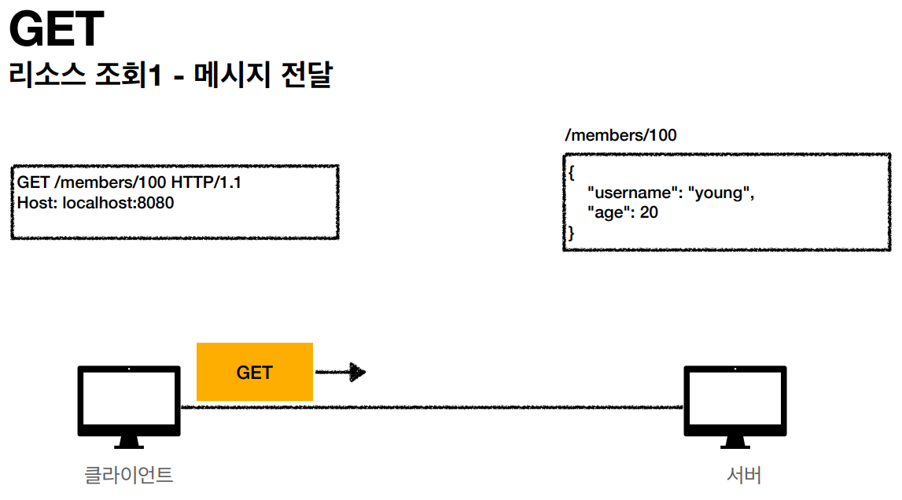
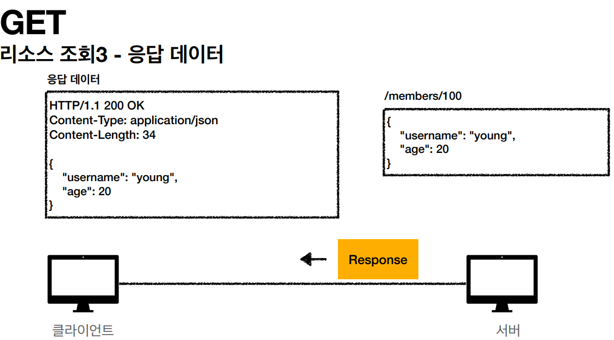
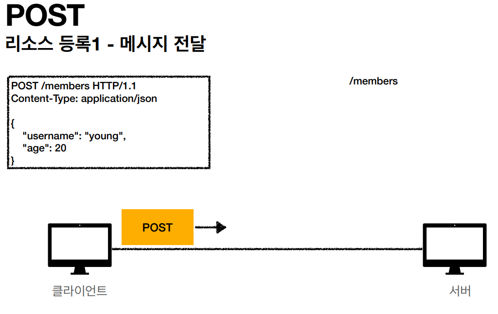
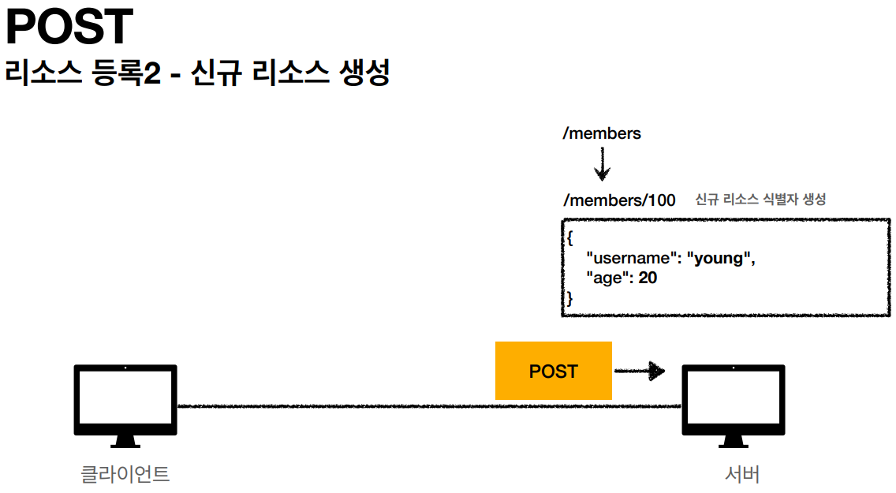
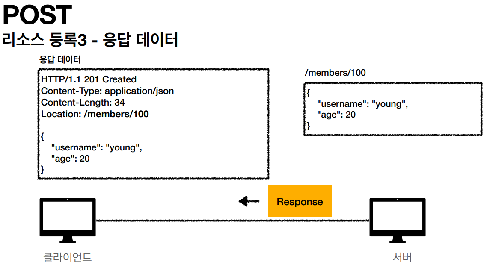

# HTTP 메서드

# GET

- 리소스 조회
- 서버에 전달하고 싶은 데이터는 query parameter, query string으로 전달
- 예시
    
    
    
    
    

# POST

- 요청 데이터 처리, 주로 **등록**에 사용
- 메시지 바디를 통해 서버로 요청 데이터를 전달
- 서버는 요청 데이터를 처리
    - 메시지 바디를 통해 들어온 데이터를 처리
- 리소스 URI에 요청이 온다 → 어떠한 식으로 처리할지 리소스마다 정의
- 예시
    
    
    
    
    
    
    

# PUT

- 리소스를 **완전히 대체**, 해당 리소스가 없다면 생성
- **클라이언트가 리소스를 식별**
    - 클라이언트가 리소스의 위치를 알고 URI 지정

# PATCH

- 리소스 **부분** 변경

# DELETE

- 리소스 삭제

## 기타

- HEAD
    - GET과 동일하지만 메시지 부분을 제외하고, 상태 줄과 헤더만 반환
- OPTIONS
    - 대상 리소스에 대한 통신 가능 옵션(메서드)를 설명
- CONNECT
    - 대상 자원으로 식별되는 서버에 대한 터널을 설정
- TRACE
    - 대상 리소스에 대한 경로를 따라 메시지 루프백 테스트를 수행
    

# 속성

- 안전(safe)
    - 호출해도 리소스가 변경되지 않다. (GET)
- 멱등
    - 한 번 호출하든, 두 번 호출하든 결과가 똑같다.
    - GET
    - PUT
    - DELETE
    - 언제 활용하는가?
        - 서버가 TIMEOUT 등으로 정상 응답을 주지 못했을 때, 클라이언트가 재요청해도 되는가의 근거

- 캐시 가능
    - 응답 결과 리소스를 캐시해도 되는가?
    - 실제로 GET, HEAD 정도만 사용
        - POST, PATCH는 본문 내용을 고려해야 해서 쉽지 않다.
