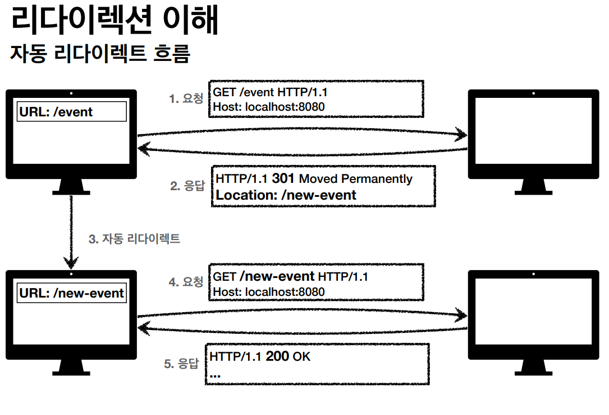
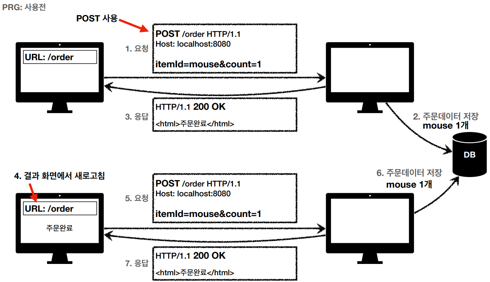
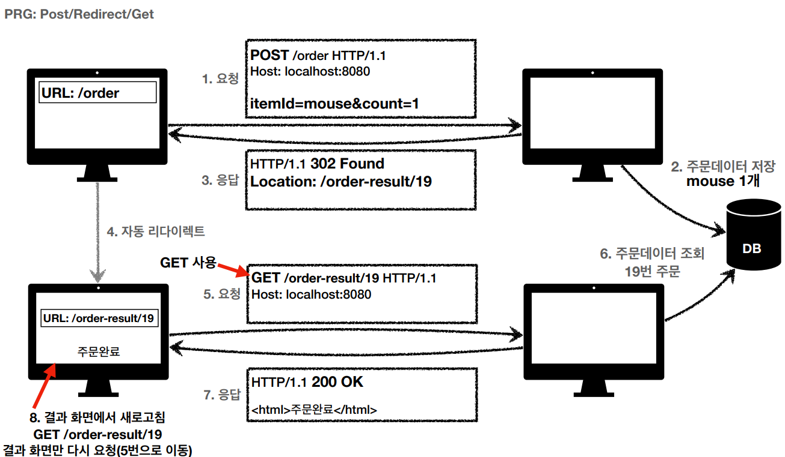

# HTTP 상태 코드

# 2xx - 성공

- 200 OK
    - 요청 성공
- 201 Created
    - 요청 성공해서 새로운 리소스가 생성됨
- 202 Accepted
    - 요청이 접수되었으나 처리가 되지 않았음
    - 배치 처리 같은 곳에서 사용
- 204 No Content
    - 요청을 성공적으로 수행했지만 응답 페이로드 본문에 보낼 데이터가 없음

# 3xx - 리다이렉션

- 요청을 완료하기 위해 유저 에이전트의 추가 조치 필요

### 리다이렉션 이해

- 웹 브라우저는 3xx의 응답의 결과에 Location 헤더가 있으면, Location 위치로 자동 이동

- 영구 리다이렉션
    - 특정 리소스의 URI가 영구적으로
        - /members → /users
- 일시 리다이렉션
    - Post / Redirect / Get
- 캐시 리다이렉션
    - 결과 대신 캐시를 사용

### 영구 리다이렉션

- 301, 308
- 301 Moved Permanently
    - 리다이렉트시 요청 메서드가 GET으로 변하고, 본문이 제거될 수 있다.
- 308 Permanent Redirect
    - 리다이렉트 요청 메서드와 본문을 유지(POST였다면 POST)

### 일시적 리다이렉션

- 302, 303, 307
- 302 FOUND
    - 리다이렉트시 요청 메서드가 GET으로 변할 수 있고, 본문이 제거될 수 있다.
- 307 Temporary Redirect
    - 302와 기능은 같다.
    - 리다이렉트시 요청 메서드와 본문을 유지, (POST였다면 POST, 본문 유지)
- 303
    - 리다이렉스티 요청 메서드가 **반드시 GET으로 변한다(보장)**

### 기타 리다이렉션

- 304 Not Modified
    - 캐시를 목적으로 사용
    - 클라이언트에게 리소스가 수정되지 않음을 알림. 클라이언트는 로컬 PC에 저장된 캐시를 재사용(캐시로 리다이렉트)

## PRG (POST - REDIRECT - GET)

- POST로 주문 후에 웹 브라우저를 새로고침하면?
- 새로고침은 다시 요청

<aside>
🧐 중복 주문이 될 수 있다.

</aside>

- 방지
    - POST로 주문 후에 결과 화면을 GET으로 리다이렉트
    - 새로고침해도 결과 화면을 GET으로 조회.

## 4xx - 클라이언트 오류

- 클라이언트의 요청에 잘못된 문법 등으로 서버가 요청을 수행할 수 없음
- 오류의 원인이 클라이언트
- 400
    - Bad Request
    - 요청 구문, 메시지 등등의 오류
- 401
    - Unauthorized
    - 인증 실패
- 403
    - Forbidden
    - 서버가 요청을 이해했지만 승인을 거부
- 404
    - Not Found
    - 요청 리소스가 서버에 없음

## 5xx - 서버 오류

- 서버 문제로 오류 발생
- 500
    - Internal Server Error
- 503
    - Service Unavailable
