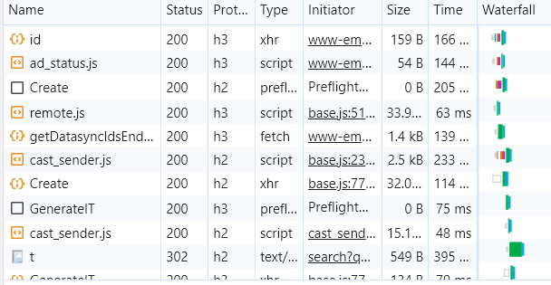
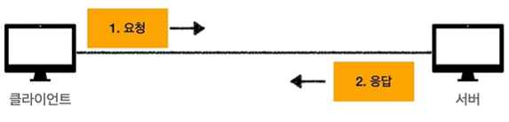
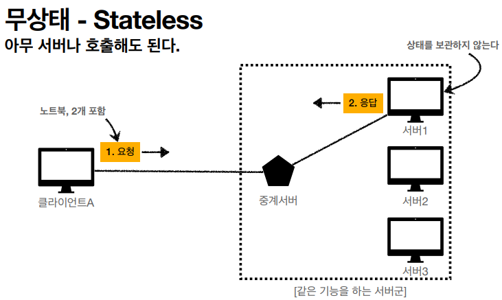
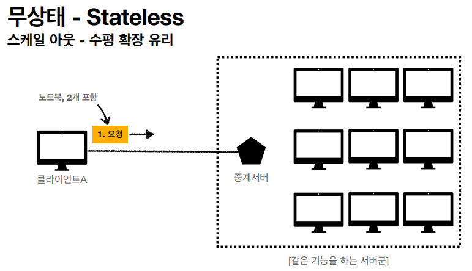
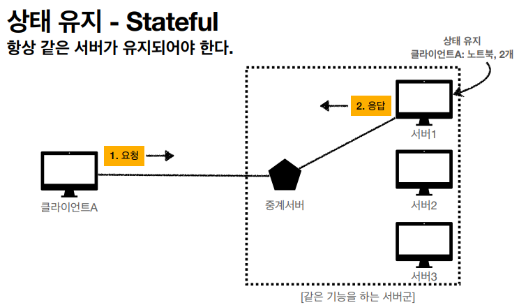
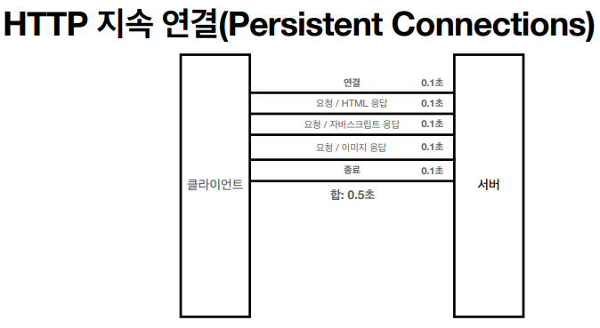
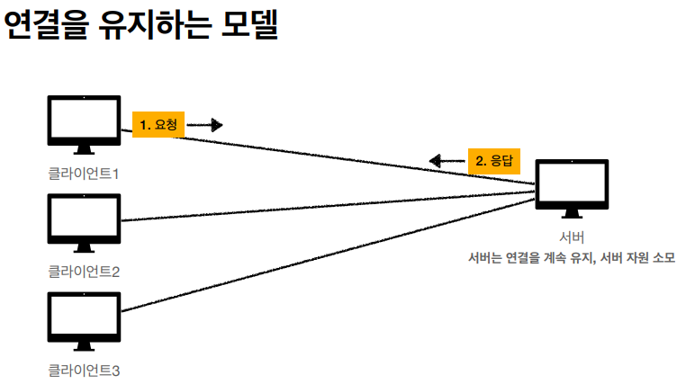
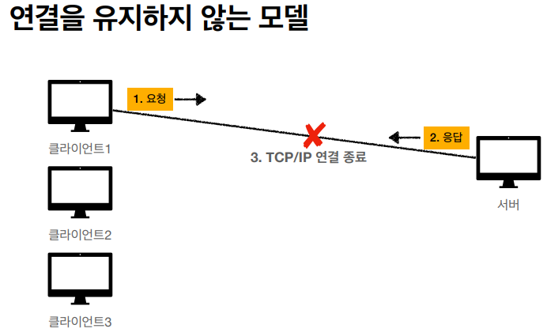
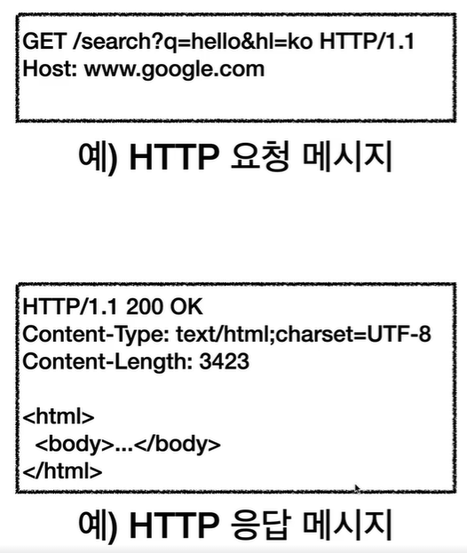
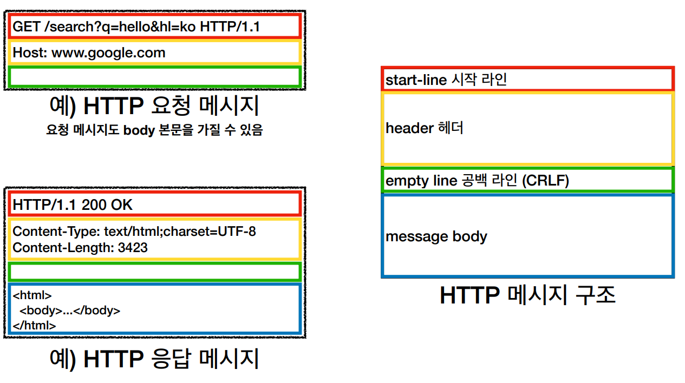

# HTTP

# HTTP(HyperText Transfer Protocol)

- 클라이언트 서버 구조
- Stateful, Stateless
- 비 연결성(connectionless)
- HTTP 메시지
- 단순함, 확장 가능

## 모든 것이 HTTP

- HTML,TEXT, IMAGE, 음성, 영상, 파일, JSON, XML …
- 거의 모든 형태의 데이터 전송 가능

## 기반 프로토콜

- TCP : HTTP/1.1, HTTP/2
- UDP : HTTP/3

## 클라이언트 서버 구조

- Request, Response 구조
- 클라이언트는 서버에 요청을 보내고 응답을 대기
- 서버가 요청에 대한 결과를 만들어서 응답한다.
    
    
    
- **`클라이언트와 서버의 분리`**
    - 비즈니스 로직, 데이터를 서버에
    - 클라이언트는 UI, 사용성에 집중
    
    <aside>
    🧐 양쪽이 **독립적으로** 발전할 수 있다.
    
    </aside>
    

## 무상태 프로토콜(Stateless)

- 서버가 클라이언트의 상태를 보존하지 않는다.
- 장점 : 확장성
    - 무상태는 **응답 서버를 쉽게 바꿀 수 있다**. → 무한한 서버 증설
    
    
    
- 응답 서버가 장애가 나도 대처가 쉽다.

- 한계
    - **상태 유지가 필요한 경우**
        - 상태 유지는 최소한만 사용한다.
    - 데이터를 너무 많이 보낸다.

### 상태 유지 - Stateful

- 항상 같은 서버가 유지되어야 한다.

## 비연결성(connectionless)

- 연결을 유지하지 않는 모델
- 일반적으로 초 단위 이하의 빠른 속도로 응답
- 1시간 동안 수천명이 서비스를 사용해도, 실제 서버에서 동시에 처리하는 요청은 수십개 이하
- 서버 자원을 효율적으로 사용할 수 있음

### 단점

- TCP/IP 연결을 새로 맺어야 한다 → 3-way handshake 시간 추가
- 웹 브라우저로 사이트를 요청하면 HTML, js, css… 등의 자원이 함께 다운로드된다
- 지금은 HTTP 지속 연결(Persistent Connections)로 문제 해결
    
    
    

### 차이

- 연결을 유지하는 모델
    
    
    
    - 서버에 대한 자원 낭비가 계속 발생
- 연결을 유지하지 않는 모델
    
    
    
    - 서버의 자원 낭비가 적다

## HTTP 메시지

- 형태
    
    
    
    - HTTP-message
        - start-line이 있고
        - * (hearer-fild CRLF) = 여러 개의 header가 있고
        - empty line이 있고
        - message body

### 시작 라인

- start-line = request-line / status line
- request-line
    - method request-target Http-version
- status-line
    - Http-version status-code

### HTTP 헤더

- HTTP 전송에 필요한 모든 정보
- field-name: field-value
    - field-name:은 띄어쓰기 허용 x, 뒤에는 허용(OWS)
    - 예시
        - Host: www.google.com
        - Content-Type:text/html;charset=UTF-8
        - Content-Length: 3423

### HTTP 바디

- 실제 전송할 데이터
- HTML 문서, 이미지, 영상 ….  byte로 표현할 수 있는 모든 데이터
