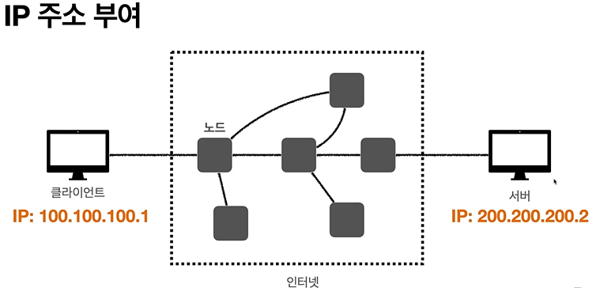
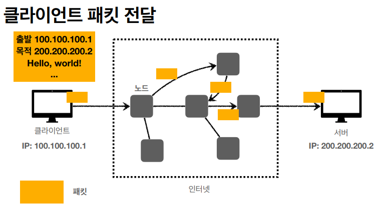
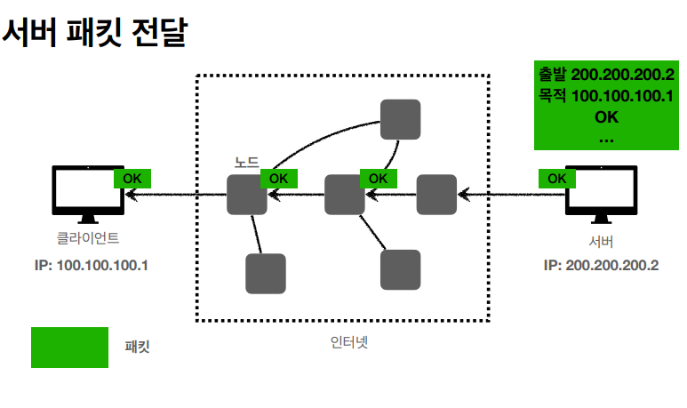
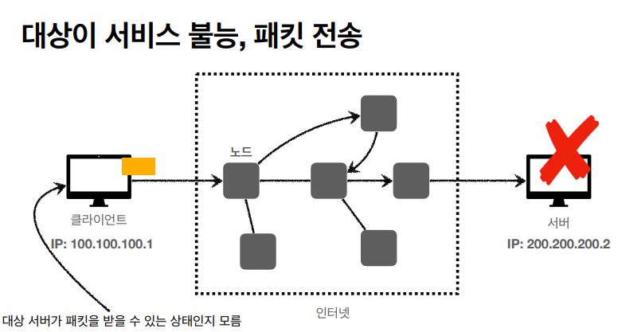
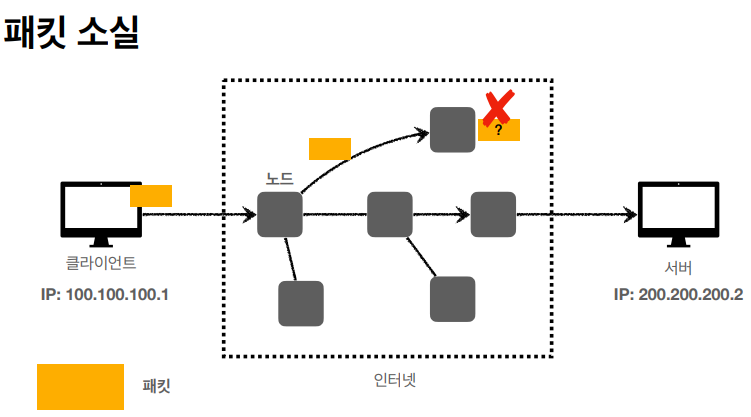
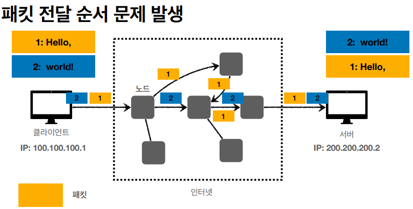

# IP(인터넷 프로토콜)

# 역할

- 지정한 IP 주소(IP Address)에 데이터 전달
- 패킷(Packet)이라는 통신 단위로 데이터 전달

### IP 패킷 정보

- 출발지 IP
- 목적지 IP
- 기타 …

# IP 프로토콜의 한계

- 비연결성
    - 패킷을 받을 대상이 없거나 서비스 불능 상태여도 패킷을 전송
- 비신뢰성
    - 중간에 패킷 손실
    - 패킷의 순서 보장
- 프로그램 구분
    - 같은 IP를 사용하는 서버에서 통신하는 애플리케이션이 둘 이상이면?

