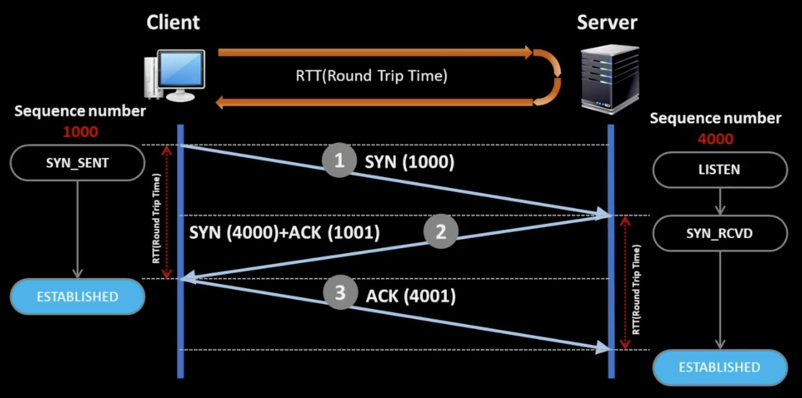
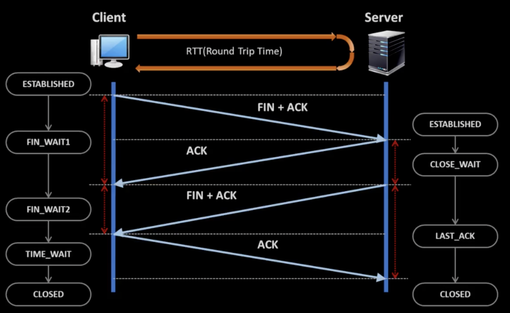

# TCP, UDP

## TCP

1. TCP에만 연결(Connection, Session) 개념이 있다.
2. 연결은 결과적으로 순서번호로 구현된다.
3. 연결은 상태(전이) 개념을 동반한다.

## 연결 과정 (3-way handshaking)

1. 클라이언트 Sequence number 생성(랜덤) 후 서버에 보냄
2. 서버도 Sequence number 생성(랜덤) 후 Client Syn + 1
3. 클라이언트가 서버에 서버 Sequence number + 1

정책을 교환(Sequence 번호를 교환, MTU size)한다.

## 연결 종료 과정(4-way handshaking)

클라이언트(Active) : 연결을 하는 것도 클라이언트, 끊는 것도 클라이언트다. (서버가 끊는 경우는 특수한 경우)

1. 클라이언트가 연결을 끊자고 FIN을 보낸다
2. 서버는 알겠다고 ACK를 한다. 
3. FIN_WAIT2로 가기 위해 FIN+ACK를 기다린다.
4. TIME_WAIT, 최종적으로 ACK로 끊음을 보낸다.
