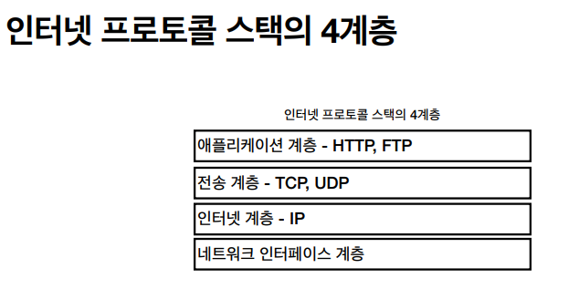
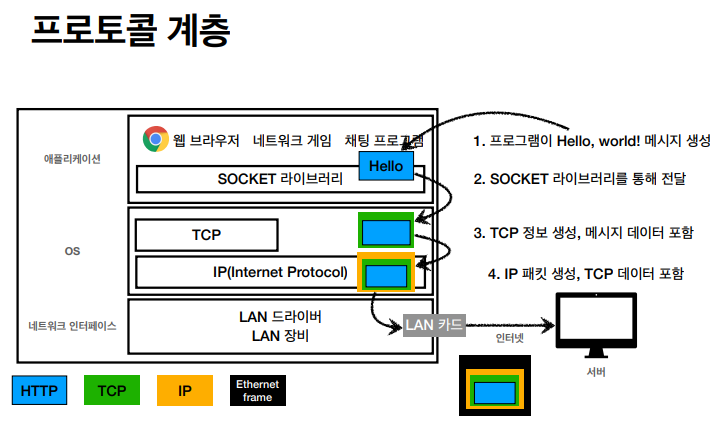
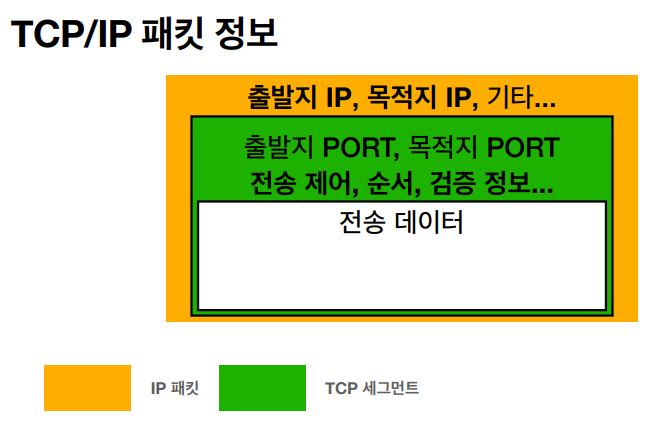
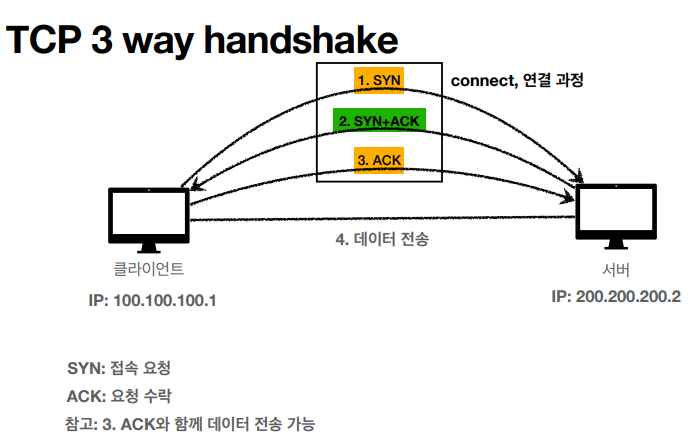
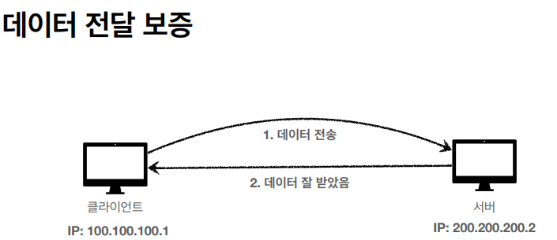
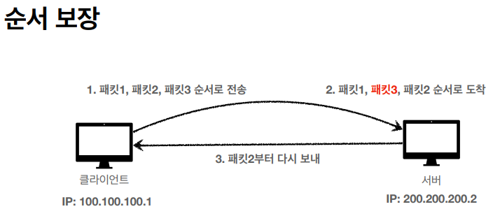

# TCP / UDP

- 해당 메시지가 SOCKET 라이브러리로 전달이 된다
- 거기에 TCP 관련한 정보들을 붙이고 IP로 전달
- IP 계층에서 IP 패킷에 대한 정보를 붙여서 LAN으로 보낸다

### IP만으로 해결이 안되는 문제점을 보완

# TCP 특징

- 전송 제어 프로토콜
- 연결 지향 (3-way handshake), **가상 연결**
- 데이터 전달 보증
- 순서 보장
- 신뢰할 수 있는 프로토콜

- 양쪽이 SYN과 ACK을 보내는 것임.
- SYN, SYN + ACK, ACK
- **연결이 되고 나야 데이터를 전송한다**

- 순서 보장이 되는 이유는
- TCP/IP 패킷 정보에 있기 때문

# UDP 특징

- 사용자 데이터그램 프로토콜
- 연결지향 X
- 데이터 전달, 순서 보증 X
- 단순하고 빠름
- IP와 거의 같다. + PORT
- 애플리케이션에서 추가 작업 필요
