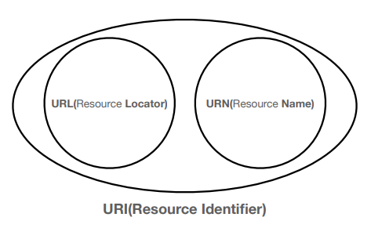
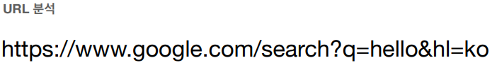
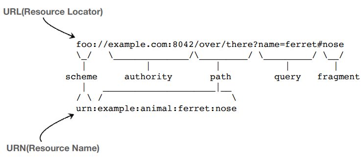

# URI

# URI와 웹 브라우저 요청 흐름

- URI
    - 로케이터, 이름 또는 둘 다 추가로 분류될 수 있다.
- UR**L** (Locator)
    - 
- UR**N** (Name)

## URI(Uniform Resource Identifier)

- Uniform : 리소스를 식별하는 통일된 방식
- Resource : 자원, URI로 식별할 수 있는 모든 것(제한 없음)
- Identifier : 다른 항목과 구분하는데 필요한 정보

## URL

- Locator : 리소스가 있는 **위치**를 지정

### 문법

- scheme://[userinfo@]host[:port][/path][?query][#fragment]
- **scheme**
    - 주로 프로토콜 사용
    - 프로토콜 : 어떤 방식으로 자원에 접근할 것인가 하는 약속 규칙
        - http, https, ftp
- **host**
    - www.google.com
    - 호스트명
    - 도메인명 또는 IP 주소를 직접 사용 가능
- port
    - 생략 가능
- path
    - 리소스 경로(path), 계층적 구조
        - /home/file1.jpg
        - /members
- query
    - key=value의 형태
    - ?로 시작, &로 추가 가능, keyA=valueA&keyB=valueB
    - query parameter, query string 등으로 불림
        - query string은 다 문자열로 넘어가기 때문에 부르기도 함
- fragment
    - html 내부 북마크

## URN

- Name : 리소스에 이름을 부여
    - ex) 어떤 책의 isbn
- 이름만으로 실제 리소스를 찾을 수 있는 방법이 보편화 되지 않음

### URL, URN 그림

