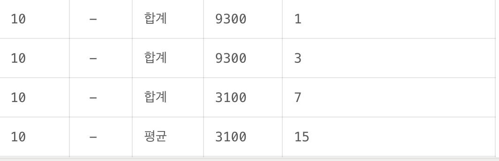
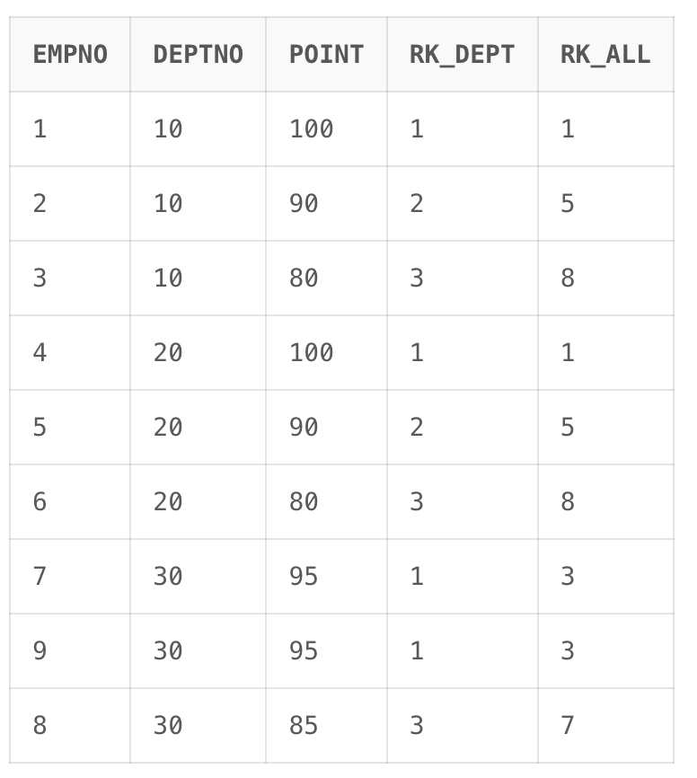
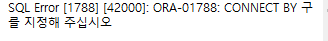

# 쿼리정리

- http://www.gurubee.net/lecture/2190
    
    ```sql
    SELECT CASE B.C_ID WHEN '001' THEN A.S_ID AS ID,
    CASE B.C_ID WHEN '001' THEN A.S_NM AS 성명,
    B.C_NM AS 스터디,
    MIN(CASE C.chasu WHEN 1 THEN O END) AS 1차,
    MIN(CASE C.chasu WHEN 2 THEN O END) AS 2차,
    MIN(CASE C.chasu WHEN 3 THEN O END) AS 3차,
    SUM(A.S_ID) AS 참여횟수
    FROM STUDENT A CROSS JOIN COURSE B
    LEFT OUTER JOIN STUDY C
    WHERE A.S_ID = C.S_ID
    AND B.C_ID = C.C_ID
    GROUP BY A.S_ID, A.S_NM, B.C_ID, B.C_NM
    ORDER BY A.S_ID, B.C_ID;
    ```
    
    사고 흐름 
    
    - 우선 join문을 작성한다.
    - GROUP BY, ORDER BY 서술
    - 추가적으로 사용되는 기법 처리
    
    문제에서 얻은 TIP
    
    **1.ANSI JOIN과 ORACLE JOIN을 동시에 사용 불가**
    
    ```sql
    FROM STUDENT A, COURSE B
    LEFT OUTER JOIN STUDY C
    ```
    
    라고 하면. A를 인식 못한다.
    
    **2.GROUP BY 절과 MIN, MAX를 사용해 컬럼 값을 하나의 row로 집어 넣을 수 있다.**
    

- http://www.gurubee.net/lecture/2191
    
    내 답.
    
    ```sql
    SELECT deptno, empno, NVL2(empno , min(ename), '합계') as ename, sum(sal) AS sal FROM emp
    GROUP BY deptno, ROLLUP(empno)
    UNION
    SELECT deptno, empno, NVL2(empno , min(ename), '평균') as ename, ROUND(avg(sal),2) AS sal FROM emp
    GROUP BY deptno, ROLLUP(empno);
    ```
    
    **실제 답1**
    
    ```sql
    SELECT deptno
         , empno
         , DECODE(GROUP_ID(), 0, NVL(ename,'합계'), '평균') ename 
         , DECODE(GROUP_ID(), 0, SUM(sal), ROUND(AVG(sal),2)) sal 
      FROM scott.emp
     GROUP BY deptno, ROLLUP(deptno, (empno, ename))
     ORDER BY deptno, GROUP_ID(), empno;
    ```
    
    **실제 답2**
    
    ```sql
    
    ```
    
    **핵심 1.**
    주 키 역할을 하는 항목과 함께 괄호로 묶어 따로 롤업 기능을 수행하지 못하게 하는 것(나는 MIN으로 처리)
    
    ```sql
    SELECT deptno, empno, ename, SUM(sal) sal
    FROM scott.emp
    GROUP BY ROLLUP((empno, ename));
    ```
    
    **핵심 2.**
    
    컬럼을 중복되게 활용하여 rollup 집계 결과를 중복해서 처리
    
    ```sql
    SELECT deptno, empno, ename, SUM(sal) sal
    FROM scott.emp
    GROUP BY deptno, ROLLUP(deptno, (empno, ename));
    
    참고로 아래와같이 하면 중복이 더생긴다.
    --GROUP BY deptno, ROLLUP(deptno, deptno, (empno, ename))
    
    ```
    
    - deptno로 group이 나뉘어 있는 것은 바꿀 수 없다. 이미 rollup 바깥에 있기 때문.
    - 따라서 해당 group에서 deptno와 (empno, ename) 두가지 모두를 대상으로 한 집계는 결국 특정 deptno에서의 집계이다.
    - 참고로 group by만 했다면 차이가 없다
        
        ```sql
        SELECT deptno, empno, ename, SUM(sal) sal
        FROM scott.emp
        GROUP BY deptno, deptno, (empno, ename));
        --GROUP BY deptno, (empno, ename)와 차이 없음.
        ```
        
    
    **핵심 3.**
    
    중복되어 나온 row를 group_id() 메서드를 사용해 처리
    
    https://gent.tistory.com/386
    
    - `grouping(column)`
        - column이 소계, 합계(`ROLLUP`, `CUBE`) 산출물에 의해 생성된 null 값이면 1, 아니면 0
    - `grouping_id(columnA, columnB, ...)`
        - `grouping(columnA) || grouping(columnB) || ...` 처리 후 해당 값을 이진수로 보고 십진수로 환산
    - `group_id()`
        - 지정된 group by 결과로부터 중복 그룹을 구별.
        - 해당 group 내에 중복 값이 몇개가 있는지 판정하는 것으로 보인다.
            - group 내의 중복 개수만큼 번호가 나옴.
        
        ```sql
        SELECT deptno, empno, ename, SUM(sal) sal
        FROM scott.emp
        GROUP BY deptno, ROLLUP(deptno, (empno, ename));
        
        참고로 아래와같이 하면 중복이 더생긴다.
        --GROUP BY deptno, ROLLUP(deptno, deptno, (empno, ename))
        
        ```
        
        - 아래처럼 deptno 컬럼을 ROLLUP에 하나씩 추가하면 group_id() 결과가 1씩 증가하는 것을 볼 수 있다.
    
    추가. 잡기술. 답안 2의 이해를 돕는 예시입니다.
    
    ```sql
    SELECT deptno
         , empno
         , DECODE(GROUPING(1), 0, NVL(ename,'합계'), '평균') ename 
         , DECODE(GROUPING(1), 0, SUM(sal), ROUND(AVG(sal),2)) sal
         , GROUPING_ID(1,2,3,empno)
      FROM scott.emp
     GROUP BY deptno, ROLLUP(1, 2, 3, (empno, ename));
    
    (1,2,3,(empno, ename))
    1,1,1,1
    
    0001
    (1,2,3,(empno, ename))
    1,1,1,null
        
    0011
    (1,2,3,(empno, ename))
    1,1,null,null    
        
    0111
    (1,2,3,(empno, ename))
    1,null,null,null
        
    1111
    (1,2,3,(empno, ename))
    null,null,null,null
    
    ```
    
    - GROUPING 안에 ROLLUP에서 쓴 상수값을 넣는 경우가 있는데, 가상의 컬럼명이라고 생각하면 된다.
        
        
        
    - 결과가 이렇게 나오는데
        - 합계가 3번 나오는 이유는
        
        ```sql
        (1,2,3,(empno, ename))
        (1,2,3)
        (1,2)
        (1)
        ```
        

- **http://www.gurubee.net/lecture/2192**
    
    1번 무식풀이(8.0에서 안된다)
    
    ```sql
    SELECT empno, deptno, point, 
        (SELECT count(1) + 1 FROM test_rank WHERE A.point<point) AS rk_all,
        (SELECT count(1) + 1 FROM test_rank WHERE A.deptno = deptno AND A.point<point) AS rk_dept FROM test_rank A
    ORDER BY deptno, rk_dept;
    ```
    
    2번 join풀이
    
    ```sql
    SELECT a.empno
         , a.deptno
         , a.point
         , COUNT(b.empno) + 1 rk_all
         , COUNT(DECODE(a.deptno,b.deptno,1)) + 1 rk_dept
      FROM test_rank a
         , test_rank b
     WHERE a.point < b.point(+)
     GROUP BY a.empno, a.deptno, a.point
     ORDER BY deptno, rk_dept, empno;  
    ```
    
    - outer join을 사용한 이유가 매우매우 핵심
        - 조인되지 않는 1등도 결과값에 존재해야한다.
    
    
    
    - 

- **http://www.gurubee.net/lecture/2194 (필수)**
    
    **1번 풀이 - rownum 풀이**
    
    ```sql
    SELECT NO, MIN(DT) AS FROM_DT, MAX(DT) AS TO_DT, COUNT(*)
    FROM
    (SELECT NO, DT FROM T ORDER BY NO, DT)
    GROUP BY NO, TO_DATE(DT, 'YYYYMMDD') - ROWNUM
    ORDER BY NO, FROM_DT;
    ```
    
    - 여기서 중요한 개념은 ROWNUM은 WHERE절 처리 과정에서 ROWNUM
    
    참고
    
    - TOP N query
        
        ```sql
        SELECT * FROM (SELECT *
        FROM A
        ORDER BY 1)
        WHERE ROWNUM < N;
        ```
        
    - tricky result
        
        ```sql
        SELECT *
        FROM A
        WHERE ROWNUM > 1;
        ```
        
        - 결과값은 없다.
        - 첫 row가 fetch될 때 번호가 1부터 시작되는데, WHERE절 조건이 1보다 큰 값이므로 해당되는 ROWNUM이 생성될 수 없다.
    - 정리해보면
        
        rownum은 메인 쿼리의 WHERE절에서 incremental하게 결정.
        
    
    https://docs.oracle.com/cd/B14117_01/server.101/b10759/pseudocolumns008.htm
    
    **2번 풀이 - window function 풀이**
    
    ```sql
    SELECT no
         , MIN(dt)  from_dt
         , MAX(dt)  to_dt
         , COUNT(*) cnt
      FROM ( -- 2단계 --
            SELECT no, dt
                 , SUM(flag) OVER(PARTITION BY no ORDER BY dt) grp
              FROM ( -- 1단계 --
                    SELECT no, dt
                         , DECODE(LAG(dt) OVER(PARTITION BY no ORDER BY dt)
                         , TO_CHAR(TO_DATE(dt, 'yyyymmdd') - 1, 'yyyymmdd')
                         , 0, 1) flag
                      FROM t
                    )
            )
     GROUP BY no, grp
     ORDER BY no, from_dt
    ;
     
    ```
    
    - 
    

- CONNECT BY PRIOR
    - 상위 계층과 하위계층의 관계
        - **`START WITH`**와 **`CONNECT BY`** 이용할 수 있음
    - **START WITH**
        - 계층 질의의 루트(부모행)으로 사용될 행을 지정
        - CONNECT BY를 지정하지 않으면 아래와 같은 오류
            
            
            
    - **CONNECT BY**
        - CONNECT BY PRIOR는 우에서 좌로 간다
        - 계층 질의에서 상위 계층(부모행) 하위 계층(자식행)의 관계 규정
        - CONNECT BY PRIOR 자식컬럼 = 부모컬럼 : 부모에서 자식으로 트리구성 (Top Down)
        - CONNECT BY PRIOR 부모컬럼 = 자식컬럼 : 자식에서 부모로 트리 구성 (Bottom Up)
        - CONNECT BY NOCYCLE PRIOR : NOCYCLE 파라미터를 이용하여 무한루프 방지
        
        <aside>
        💡
        
        이전 empno 값이 현재의 mgr이다
        **이전의 (컬럼1) 값이 현재의 (컬럼2)이다**
        
        </aside>
        
    - **LEVEL Pseudocolumn**
        - depth를 알려준다
    - CONNECT BY 실행 순서 **(WHERE보다 빠르게 돈다)**
        - START WITH
        - CONNECT BY
        - WHERE
    - (병선)의문점
        - CONNECT BY로 결과 다 뽑고 나서 WHERE 절을 거치는 건가?
    - PRIOR를 SELECT절에 이용할 수 있다.
        - (예상) START WITH ~ CONNECT BY PRIOR 절의 영향을 받는거 같다.
        - 결과를 보면 empno = mgr 순서대로 mgrname이 나오는 것 확인
        
        ```sql
        SELECT LEVEL, LPAD(' ', 4*(LEVEL-1)) || ename ename, 
               PRIOR ename mgrname,
               empno, mgr, job 
          FROM emp
         START WITH job='PRESIDENT'
        CONNECT BY PRIOR empno=mgr;
        
          LEVEL ENAME                MGRNAME         EMPNO        MGR JOB
        ------- -------------------- ---------- ---------- ---------- ---------
              1 KING                                  7839            PRESIDENT
              2     JONES            KING             7566       7839 MANAGER
              3         SCOTT        JONES            7788       7566 ANALYST
              4             ADAMS    SCOTT            7876       7788 CLERK
              3         FORD         JONES            7902       7566 ANALYST
              2     BLAKE            KING             7698       7839 MANAGER
              3         MARTIN       BLAKE            7654       7698 SALESMAN
              3         TURNER       BLAKE            7844       7698 SALESMAN
              3         JAMES        BLAKE            7900       7698 CLERK
              2     CLARK            KING             7782       7839 MANAGER
              3         MILLER       CLARK            7934       7782 CLERK
         
        ```
        
    - 실험 정리
        
        ```sql
        # 두 쿼리의 차이는 job_id
        
        SELECT LEVEL, LPAD(' ', 4 * (LEVEL -1)) || last_name LAST_NAME, job_id, MANAGER_ID 
        FROM (SELECT *
        FROM hr.employees e
        WHERE rownum <= 15) 
        START WITH job_id = 'AD_PRES'
        CONNECT BY PRIOR employee_id = manager_id
        # 부모 -> 자식간의 상관관계로 15개가 모두 출력 (start with job_id가 기준점이 되어)
        
        SELECT LEVEL, LPAD(' ', 4 * (LEVEL -1)) || last_name LAST_NAME, job_id, MANAGER_ID 
        FROM (SELECT *
        FROM hr.employees e
        WHERE rownum <= 15) 
        START WITH job_id = 'AD_PRES'
        CONNECT BY PRIOR manager_id = employee_id;
        # 자식 -> 부모간의 상관관계로 1개(king)만 출력 (start with job_id가 기준점으로 부모 x)
        
        ```
        

- http://www.gurubee.net/lecture/2196
    
    1번 풀이
    
    ```sql
    WITH test AS
    (
    SELECT 'A' code FROM dual
    UNION ALL SELECT 'B' FROM dual
    UNION ALL SELECT 'C' FROM dual
    )
    SELECT SUBSTR(SYS_CONNECT_BY_PATH(code, '-'), 2) code
    FROM test
    START WITH code = 'A'
    CONNECT BY NOCYCLE PRIOR code != code
    ORDER BY LEVEL, code
    ;
    
    ```
    
    ### 헷갈린 개념 정리
    
    1. **CONNECT BY는 START WITH에서부터 트리를 만든다. 다시말하면, 뷰 형태로 만든다.**
        
        ```sql
        SELECT empno
             , LEVEL lv
             , LPAD(' ', (LEVEL-1)*2, ' ') || ename AS ename
             , sal
             , (SELECT SUM(sal)
                  FROM emp
                 START WITH empno = a.empno
                 CONNECT BY PRIOR empno = mgr
                ) sum_sal
          FROM emp a
         START WITH mgr IS 7839
         CONNECT BY PRIOR empno = mgr 
        ;
        ```
        
    2. **PRIOR 해석**
        
        ```sql
         CONNECT BY PRIOR empno = mgr
         -- 이전, 즉 부모의 empno 값이 현재의 mgr.
         -- 이전 부모의 empno 값이 mgr과 동일한 데이터를 찾아라.
        ```
        
    3. **CONNECT BY는 인덱스를 안타나요?**
        
        탑니다. 중요합니다.
        
        1)START WITH  시작점 탐색 시 인덱스가 있어야 빠르다.
        
        2)Connect by절에서 자식을 탐색할 때 인덱스가 있어야 한다.
        
        - 아니면 찾을때마다 풀스캔을 하겠네.. 파티셔닝이든.
        
        ```sql
        SELECT empno
             , LEVEL lv
             , LPAD(' ', (LEVEL-1)*2, ' ') || ename AS ename
             , sal
             , (SELECT SUM(sal)
                  FROM emp
                 START WITH empno = a.empno
                 CONNECT BY PRIOR empno = mgr
                ) sum_sal
          FROM emp a
         START WITH mgr IS 7839 -- mgr에 index가 걸려 있어야 한다.
         CONNECT BY PRIOR empno = mgr -- MGR에 인덱스가 걸려 있어야 한다.
        ;
        ```
        
    - 실험은 다음주에 해봅시다~
