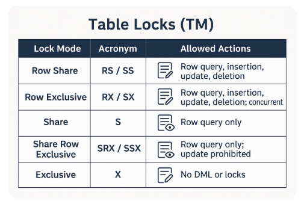

# 헷갈린 개념

# 문장 수준 읽기 일관성 vs 트랜잭션 수준 읽기 일관성

- 문장 수준
    - **`select 한 시점의 SCN`**을 보는 것
        - T1 시점 SELECT → 결과 50개
        - 이 사이에 누가 커밋해서 SELECT 테이블에 변화가 생김
        - T2 시점 SELECT → 결과 60개
    - 이렇게 문장의 실행 시점에 따라 읽기 일관성을 보장하는 것이 문장 수준 읽기 일관성
- 트랜잭션 수준
    - **`트랜잭션이 시작한 시점의 SCN`**을 보는 것
        - 트랜잭션 T1시점에 SELECT → 트랜잭션 시점의 SCN을 가져옴
        - 어떤 트랜잭션이 커밋에서 SELECT 테이블에 변화가 생김
        - 같은 트랜잭션에서 T2시점에 다시 SELECT → 최초 트랜잭션 시점의 SCN을 이용하여 감
    - 중간에 변경하였더라도 다른 트랜잭션에서 변경한 것이기 때문에 변화 없이 본다
    - Oracle은 기본적으로 트랜잭션 수준은 보장하지 않음
        - 격리 수준 Serializable은 트랜잭션 수준 일관성을 보장해준다고 보기는 어렵다
        - 얘는 트랜잭션 충돌을 제어하는 역할이기 때문에. 두 트랜잭션의 진입 자체를 막는 것.

# DML Lock (정확한 개념 잡기)

[Database Concepts](https://docs.oracle.com/en/database/oracle/oracle-database/19/cncpt/data-concurrency-and-consistency.html#GUID-6D4F7A79-A5F1-470A-ADEF-8888565DE84F)

- 여러 사용자가 동시에 접근하는 데이터의 무결성을 보장
- DML locks prevent destructive interference of simultaneous conflicting **`DML or DDL operations`**.
    - DML 락은 동시에 발생하는 충돌하는 DML 또는 DDL 작업으로 인한 간섭을 막는다
    - **즉 DML락은 DDL과 DML 충돌 모두를 제어해주고 있음**

### Row Locks (TX)

- INSERT / UPDATE / DELETE / MERGE / SELECT FOR UPDATE
- 트랜잭션 커밋 / 롤백 시까지 유지

### Table Locks (TM)

- INSERT / UPDATE / DELETE / MERGE / SELECT FOR UPDATE 또는 LOCK TABLE 문으로 수정할때 발생
- 즉 TX락을 획득한다면 TM 락도 획득하는 것
    - If a transaction obtains a lock for a row, then the transaction also acquires a lock for the table containing the row.

- (25. 08. 15)
    - RS와 RX의 차이를 정확히 이해하지 못하겠다. (어느정도 해결)
        - select for update로 두 세션이 동일한 시간에 접근
        - 두 세션 모두 RS락을 얻는다
        - 여기서 어떤 세션이 update를 실행했고 RX Lock을 얻음
            - **동일한 행이고 update를 하려는 다른 세션 RS를 가진 채로 대기해야 한다**
    

# DDL Locks(data dictionary lock)

- 진행 중인 DDL 작업이 객체에 대해 작업을 수행하거나 참조하는 동안 스키마 객체 정의를 보호
- 수정되거나 참조되는 개별 스키마 객체만 잠금되며 전체 데이터 딕셔너리를 잠그지 않음
- **사용자가 DDL 잠금을 명시적으로 요청할 수 없다**

### Exclusive DDL Locks

- 다른 세션이 DDL 또는 DML 잠금을 획득하지 못하도록 방지
- DROP TABLE과 ALTER RABLE이 동시에 실행되지 못하는 것과 같은 이치

### Share DDL Locks

- 자원에 대한 공유 DDL 잠금은 충돌하는 DDL 작업으로부터는 방지하지만 유사한 DDL 작업에 대해서는 데이터 동시성을 허용
- CRATE PROCEDURE를 동일 테이블에 서로 다른 세션이 작업할 수 있음

### Breakable Parse Locks(이해 못함)

- shared pool 안에서 sql 문이 파싱되는 시점에 획득하는데
- sql 실행 계획과 커서 정보를 Shared SQL Area에 저장하고
- 객체가 변경되면 공유 SQL 영역이 무효화 되도록 잠금을 유지?
- 이건 자세히 몰라도 될 듯.
