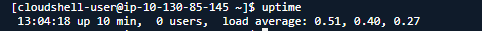
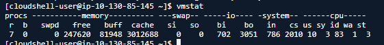
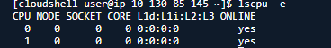
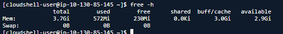

# 관측 가능성

# uptime - Load average

- 정의 : 프로세스의 여러 상태 중 R 또는 D 상태에 있는 프로세스들의 개수를 1 / 5 / 15분 단위로 표시
    - 서버가 받고 있는 **부하 평균**
        - 얼마나 일을 하고 있느냐?
        - 단위 시간(1분, 5분, 15분) 동안의 R과 D 상태의 프로세스 개수
    
    
    
- R (Running) / D (Uninterruptible sleep) → 보통 disk, network i/o를 대기중인.
- R이 몇개냐. D가 몇개냐.
    - 명령어 : vmstat
    - r = R / b = D
        - **`R은 cpu 위주의 작업, D는 I/O 위주의 작업`**
    
    
    
- 프로세스가 돌아가고 있는 개수.
    - CPU 개수에 상관없이 동일하다. 그래서 상대적인 관점
    - cpu 개수 아는 명령어 : lscpu - e
    
    
    
- CPU가 1개, 프로세스가 4개 : load average가 4
- CPU가 2개, 프로세스가 4개 : load average가 4.
- **`load average > CPU : 처리 가능한 수준에 비해 프로세스가 많이 존재한다.`**
    - 인프런 강의.
- 이 값을 어떻게 이용?
    - load average 값을 보고 r과 d의 개수를 확인하는데,
    - 부하가 있는 지점을 판단할 때 Running 상태가 많은 경우와 / Disk, 네트워크의 상태가 많은 경우에 따라 조치가 달라진다.
    - 전자는 프로세스 개수 조정? / 후자는 하드웨어 업그레이드 필요성 피력.

# free -h

- 정의 : 시스템의 메모리 정보를 출력



- free : 어느 누구도 사용하고 있지 않은 메모리, 시스템이 즉시 사용 가능한 메모리
- available : 애플리케이션에 실질적으로 할당 가능한 메모리, 필요 시 캐시로 사용 중인 메모리를 해제하여 확보 가능 (free 230Mi + 일부 buff/cache 3.0Gi ⇒ 2.9Gi)

```bash
---------의문점---------
1. Anonymous / Named
  - 파일이 유저의 눈에 보이려면 **탐색기나 파일관리자에서 디렉터리로 이동**해야 한다.
  - 경로(path) = directory + file name, 이 path는 외부 액세스 접점(interface)
  - 따라서 path가 존재하는 경우가 named file, 존재하지 않는 경우 anonymous file.
  - 외부에서 보이지 않으면 anonymous file이다? 이건 ls -**a**l을 제외하고 인 듯한데.
  - anonymous : 임시적인 lifetime / named : persistency 
2. 메모리에 확장시켜보자.
  - 프로그램 -> 프로세스 : 디스크의 파일을 메모리에 불러들인다(named)
  - heap memory : 동적할당. 사본을 불러오는게 아니라 필요할 때 쓰는 공간(anonymous)
  - stack 영역도 마찬가지다..
  - 즉, anonymous 영역이 늘어나는 경우는 heap memory나 stack이 증가했다는 것.
3. anonymous 영역에 추가 용량 할당을 해주는 메모리 영역이 어디인가
	(available 영역?, free 영역?)
4. anonymous(inactive)영역의 swap-in, swap-out이 무슨 뜻인가?(성재형 피셜)
  - 우선 anonymous는 메모리에만 존재하는 것(데이터가 SSD에 없다)
  - 다만, anonymous에 대한 메타데이터는 존재해야할 것이다.
  - 즉, **메타데이터를 swap-out하는 것** --> 메타데이터 swap이 맞는지.
  - swap-in, swap-out 할때 paging하는 것 처럼 진짜 임시로 Second Storage에
    데이터를 냅뒀다가 쓸 때 다시 돌려놓는? 그런 전략의 의미로 사용했을지도(병선)
	**- anonymous metadata 관련해서 추가 공부 필요
		 모든 data는 그 데이터를 관리하기 위한 meta data가 어딘가에 존재해야만 한다.
		 즉 anonymous도 metadata는 존재.
	- anonymous memory region은 메모리 공간 부족 시 swap space로 백업 저장시켜놓음.
	  이후 swap out 해둔 해당 region의 데이터를 필요로 할 때 page fault 일어나서 
	  swap space에 있는 데이터를 가져온다.
5**. VmallocTotal는 무슨 기준으로 저렇게 크게 할당할 수 있는가? - 실험 리눅스는 64비트
   - **VmallocTotal은 커널 자체가 운용 가능한 최대 Virtual Memory 사이즈다.**
   - 64비트 주소 지정 방식에 따라 2^64개의 주소 할당 가능 (18.4엑사바이트)
   - 커널은 모종의 이유로 Vmalloc 사이즈를 **34359738367 kB로** 제한한 것일 뿐.
   - 정리하면, 64비트 주소 지정 방식에 따라 가상 메모리를 할당하되 커널에서 성능등을 고려해
     Vmalloc 사이즈 32TB로 제한한 것이다.
   - 참고로 physical disk space가 우리가 쓸 수 있는 가상 메모리 사이즈의 한계치.
```

```bash
cat /proc/meminfo
MemTotal:        3919548 kB # **전체 --> total usable RAM**
MemFree:          247252 kB # 아무곳에서도 안쓰이는 메모리 --> free RAM
MemAvailable:    3088792 kB # 할당 가능한 메모리(정의 모호) - MemFree 포함하는 것으로 보임
Buffers:           83024 kB # Memory in buffer cache, relatively temporary storage for raw disk blocks
Cached:          2903508 kB # page cache size(tmpfs, shmem), Swapcached는 미포함.
SwapCached:            0 kB # 최근에 사용된 swap memory, I/O 향상
Active:           566120 kB # 최근에 사용되고 있는 메모리.
Inactive:        2817020 kB # 최근에 사용되지 않는 메모리. 
Active(anon):        872 kB # 익명메모리 사용중이라 swap out도 안되는 상태 (아직 미정리)
Inactive(anon):   396636 kB # 익명메모리 현재 사용 x여서 swap out이 가능한? (아직 미정리)
Active(file):     565248 kB # Pagecache memory that has been used more recently and usually not reclaimed until needed
Inactive(file):  2420384 kB # 페이지캐시에 올라온 것들 중 최근에 사용되지 않아, 스왑 가능한 대상
Unevictable:           0 kB
Mlocked:               0 kB
SwapTotal:             0 kB # total swap space
SwapFree:              0 kB # unused swap space
Zswap:                 0 kB
Zswapped:              0 kB
Dirty:             30040 kB # disk에 기록되야 하는 메모리. dirty page와 같은 원리인 듯  
Writeback:             0 kB
**AnonPages:**        396740 kB # Non-file backed pages mapped into userspace page tables
Mapped:           550668 kB
Shmem:               900 kB
KReclaimable:     120408 kB
Slab:             193632 kB
SReclaimable:     120408 kB
SUnreclaim:        73224 kB
KernelStack:        6424 kB
PageTables:         9188 kB
SecPageTables:         0 kB
NFS_Unstable:          0 kB
Bounce:                0 kB
WritebackTmp:          0 kB
CommitLimit:     1959772 kB
Committed_AS:    3703032 kB
**VmallocTotal:   34359738367 kB # (추측) 주소값의 크기의 최대값. 담을 수 있는 데이터의 양이 아니다?**
VmallocUsed:       18288 kB
VmallocChunk:          0 kB
Percpu:             1008 kB
HardwareCorrupted:     0 kB
AnonHugePages:         0 kB
ShmemHugePages:        0 kB
ShmemPmdMapped:        0 kB
FileHugePages:         0 kB
FilePmdMapped:         0 kB
HugePages_Total:       0
HugePages_Free:        0
HugePages_Rsvd:        0
HugePages_Surp:        0
Hugepagesize:       2048 kB
Hugetlb:               0 kB
DirectMap4k:      149936 kB
DirectMap2M:     3962880 kB
DirectMap1G:           0 kB
```

## 위 요약을 위한 잡다한 정리

https://brunch.co.kr/@dreaminz/2

- Buffer cache vs cache
    - cache = Page Cache + Slabs
    - page cache
        - 디스크 접근의 단점을 보완하는 I/O 성능향상 목적으로 사용
        - data block을 저장한다는건가?? 모르겟네
    - Buffer cache
        - 동일하게 I/O 성능 향상 목적
        - 차이는 page cache는 파일의 내용을 저장
        - Buffer cache는 UFS(Union File System) 기준으로 Super block과 inode block에 해당하는 메타데이터 저장.
    - Slab
        - 디렉터리 구조를 캐시하는 Dentry cache, 파일의 정보를 저장하고 있는 inode cache등 커널이 사용하는 메모리 영역
- buffer/cache는 어디에 포함되나?
    - used memory = total - free - buffers -cache
    - used에는 buffers, cache가 포함되지 않음.
- cached의 정의
    - memory used by the page cache and slabs(Cached and SReclaimable in /proc/meminfo)

# 참고자료

https://man.archlinux.org/man/proc_meminfo.5.en

https://www.baeldung.com/linux/proc-meminfo

https://access.redhat.com/solutions/406773

https://sunyzero.tistory.com/260 - **매우 중요(이건 꼭 읽기)**

https://stackoverflow.com/questions/48025550/pages-in-swap-space-or-page-file

https://www.oreilly.com/library/view/understanding-the-linux/0596005652/ch17s04.html

https://stackoverflow.com/questions/658411/entries-in-proc-meminfo

VMallocTotal — The total amount of memory, in kilobytes, of total allocated virtual address space

총 할당된 virtual address space의 메모리 총량..?

https://stackoverflow.com/questions/27937099/what-can-be-the-maximum-size-of-virtual-memory

# 12/10

- free에 관한 것 뜯어본다. (1순위), **9시부터 시작**
- 시간이 남으면 7장에 있었던 의문점들

-
