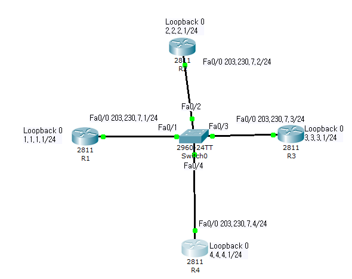
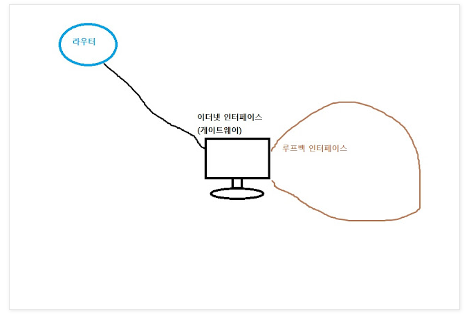
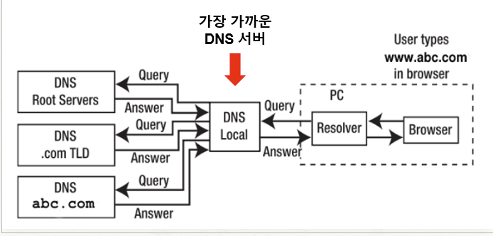
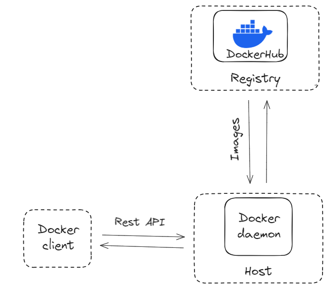
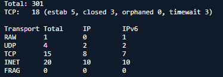
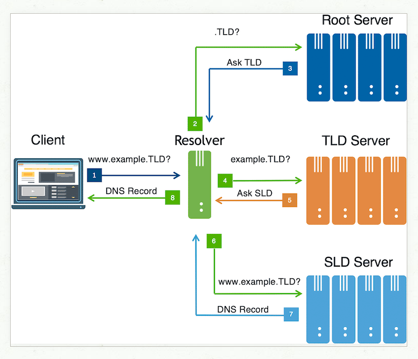

# 네트워킹

# 1. 루프백이란

- 라우터나 스위치에 설정하는 **가상의 인터페이스**
- **127.0.0.1**
- **내 컴퓨터에서 나간 신호가 다시 내 컴퓨터로 돌아오기 때문에** 붙여진 이름

사용하는 이유

1. **내 컴퓨터를 대상으로 실행하여 프로그램이 잘 작동하나 테스트 하고 싶을 때**
    1. 내 IP주소 외울 필요도 없이  루프백 인터페이스 주소로 많이 쓰이는 '**127.0.0.1'이란 숫자를 외우면**, 내 컴퓨터에 어떤 IP 주소가 할당돼 있나 **확인할 필요가 없다**
2. OSPF 라우팅 프로토콜에서 쓰인다.
    1. 대표 라우터(DR) 선출 시
        - 대표 라우터는 라우터의 우선순위와 / 루프백 주소(router-id)가 높은지로 판별한다.
        - BDR도 동일하게 판별(이때 DR은 과정에서 제외)
        - 선출 완료 후 신규장비가 추가 되더라도 DR / BDR 선출과정은 다시 수행되지 않습니다.
    - **DR(Designated Router)**
    - **BDR(Backup Designated Router)**
- 라우터 아이디는 OSPF를 통해 경로 정보를 주고받는 라우터들 중에서 해당하는 라우터를 나타내는 고유의 값으로 사용됩니다. 따라서 물리적 인터페이스 보다는 논리적 인터페이스인 루프백인터페이스를 주로 라우터 아이디로 선언합니다.왜냐하면 논리적 인터페이스는 라우터가 꺼지지 않는 이상 다운될 일이 없어 안정적이기 때문입니다.
    
    
    



https://12bme.tistory.com/356

https://www.reddit.com/r/ccna/comments/114fw5y/what_is_highest_and_what_is_lowest_about_to_go/?rdt=48868 → 
https://m.blog.naver.com/tog0403/80195484308

# 2. iptables가 뭐죠?

- 리눅스 방화벽 설정 도구
- 리눅스 커널의 네트워킹 스택에서 **패킷 필터링 훅(netfilter)**과 연계되어 동작한다.
    - netfilter 훅이라는게 5가지가 존재하는데, 패킷이 스택을 통해 들어오면 이 훅들을 이용해 등록된 커널 모듈을 트리거??
    - iptables 방화벽을 관리하기 위해서 또 테이블(방화벽 룰)을 쓴다. 이 테이블은 별도의 체인을 통해 연결
        - filter, nat, **`mangle, raw, security`**
- 넷필터 훅
    - NE_IP_PRE_ROUTING: 네트워킹 스택에 트래픽이 들어오면 해당 훅이 트리거 된다. 해당 훅은 트래픽이 어디로 갈지 정해지지 않은 상태에서 처리된다.
    - NF_IP_LOCAL_IN: 들어오는 패킷이 로컬 시스템으로 목적지가 결정된 경우에 해당 훅을 트리거 한다.
    - NF_IP_FORWARD: 들어오는 패킷이 다른 호스트 시스템으로 목적지가 결정된 경우에 해당 훅을 트리거 한다.
    - NF_IP_LOCAL_OUT: 로컬에서 생성된 트래픽이 밖으로 나가는 경우에 네트워킹 스택에 들어오는 즉시 해당 훅을 트리거 한다.
    - NF_IP_POST_ROUTING:
- iptables
    - PREROUTING: NF_IP_PRE_ROUTING 훅에 의해 트리거 된다.
    - INPUT: NF_IP_LOCAL_IN 훅에 의해 트리거 된다.
    - FORWARD: NF_IP_FORWARD 훅에 의해 트리거 된다.
    - OUTPUT: NF_IP_LOCAL_OUT 훅에 의해 트리거 된다.
    - POSTROUTING: NF_IP_POST_ROUTING 훅에 의해 트리거 된다.

https://hayz.tistory.com/entry/%EB%B2%88%EC%97%AD-Iptables-%EB%B0%8F-Netfilter-%EA%B5%AC%EC%A1%B0%EC%97%90-%EB%8C%80%ED%95%9C-%EC%8B%AC%EC%B8%B5%EB%B6%84%EC%84%9D

# 3. Border Gateway Protocol이란?

- 목적지까지 가는 방법을 결정하는 프로토콜
- DNS : 너 목적지가 여기임 / BGP : 목적지까지 이렇게 가셈

- 참고 : Facebook BGP problem
    - BGP 프로토콜은 다양한 속성을 활용해 최단경로를 찾는 프로토콜(HOP COUNT 뿐만 아니라 다른 속성도 활용한다)
    - 각자 다른 AS(Autonomous System)에 자신의 정보를 알린다(advertise)
- 네트워크에 변경사항이 있으면 BGP Update Message를 활용해 다른 AS에 알린다
- facebook은 ISP를 사용하지 않고 자신만의 AS를 가지고 있다.
- AS의 연결은 BGP 프로토콜에 의해 갱신 및 유지.
- facebook이 자신의 DNS prefix을 주변 노드에 알리는 것을 중단
    - 정리하면, facebook.com, instagram.com, [whatsapp.com](http://whatsapp.com) 에 대한 매핑 정보를 가지고 있는 그들의 Nameserver로 매핑할 수 없게 되었다.
- facebook DNS 이외의 다른 facebook 관련 IP는 모두 살아있지만, 당연히 DNS가 안되면 유저들이 활용할 수가 없음
    - 서비스 IP 하나하나 찾아서 들어갈 수가 없다.
- 15:40분 경에 BGP update가 엄청나게 일어나는 것을 확인할 수 있다.
- Whatsapp이랑 instagram 모두 다운이 된다.
- 이 파급현상으로 인해서



- DNS Root Server → `.com` 에 속한 도메인 탐색 → [facebook.com](http://facebook.com) 이 있는 TLD IP 찾는다.
    - DNS Resolver에서 또 찾는다.
    - 마지막으로 DNS Authoritative Name Server에서 풀네임 찾는다.
- 즉, Authoritative Name Server가 없어지면서 DNS [facebook.com](http://facebook.com)을 resolver가 찾을 수가 없게 된것
- BGP는 어떻게 IP주소를 찾아가지?
    - eBGP가 설정된 라우터에 디폴트

https://www.juniper.net/documentation/kr/ko/software/junos/bgp/topics/topic-map/bgp-overview.html

https://blog.cloudflare.com/october-2021-facebook-outage/

https://net-study.club/entry/Routing-Protocol-BGP-Border-Gateway-Protocol

# 4. Docker daemon(미완. 도커할 때 더)

- Docker는 Docker client와 서버인 Docker daemon으로 구성
    
    
    
    - dockerd는 docker client로부터 API 요청을 수신하고 이미지 빌드, 실행, 인스턴스 관리 등의 역할을 수행
- 컨테이너를 관리하는 지속적인 프로세스입니다.
- **Docker Daemon**은 Docker Engine API 요청을 처리하기 위해 다음 세 가지 소켓 유형을 통해 통신할 수 있습니다: **unix**, **tcp**, **fd**.
- 의문: 소켓 TLS, SSH 얘기가 Docker daemon과 다른 컨테이너 간의 통신을 할 때 사용하는 소켓얘기인지, Docker client와 Docker daemon의 소통간에 사용되는 소켓 얘기인지 잘 모르겠다.
    - (성재형) 후자는 아닌거같다.
    - https://docs.docker.com/engine/security/protect-access/ → 요 얘기

# 5. ss 명령 결과값 이해

- `ss -s` (p.204) 결과값
- TCP 소켓 수가 10개라는데 뭔말인지 모르겠습니다..
    - 맨위 tcp: 10 개
    - 세부 Total에 TCP 9개

해석

```yaml
TCP:   19 (estab 7, closed 2, orphaned 0, timewait 2)

-- 모든 tcp 커넥션 출력 및 라인카운트 명령어

$ ss -t -a | wc -l
결과값 : 20(맨 위 설명 1줄 제외하면 19)
아래는 output (19줄)
tcp                LISTEN                 0                   4096                                                                                                        127.0.0.1:40317                                            0.0.0.0:*
tcp                LISTEN                 0                   4096                                                                                                        127.0.0.1:trusted-web                                      0.0.0.0:*
tcp                LISTEN                 0                   4096                                                                                                        127.0.0.1:51679                                            0.0.0.0:*
tcp                TIME-WAIT              0                   0                                                                                                           127.0.0.1:38688                                          127.0.0.1:51678
tcp                ESTAB                  0                   160                                                                                                    10.140.124.220:49094                                         10.1.49.93:https
tcp                ESTAB                  0                   0                                                                                                      10.140.124.220:40422                                         10.0.51.18:https
tcp                ESTAB                  0                   0                                                                                                      10.140.124.220:41548                                        10.0.161.32:https
tcp                ESTAB                  0                   0                                                                                                      10.140.124.220:50772                                         10.1.13.92:https
tcp                ESTAB                  0                   0                                                                                                      10.140.124.220:43960                                       10.1.143.240:https
tcp                TIME-WAIT              0                   0                                                                                                           127.0.0.1:58856                                          127.0.0.1:51678
tcp                ESTAB                  0                   0                                                                                                      10.140.124.220:54592                                     44.213.130.129:https
tcp                ESTAB                  0                   0                                                                                                      10.140.124.220:42678                                         10.0.15.18:https
tcp                LISTEN                 0                   4096                                                                                                                *:esbroker                                               *:*
tcp                LISTEN                 0                   4096                                                                                                                *:naap                                                   *:*
tcp                LISTEN                 0                   4096                                                                                                                *:qubes                                                  *:*
tcp                LISTEN                 0                   4096                                                                                                                *:wmc-log-svc                                            *:*
tcp                LISTEN                 0                   4096                                                                                                                *:kjtsiteserver                                          *:*
tcp                LISTEN                 0                   4096                                                                                                                *:51678                                                  *:*
tcp                LISTEN                 0                   4096                                                                                                                *:gw                                                     *:*
```

- 맨위 TCP: 19 ( …) 부분에서 괄호안에 status들은 일부 생략되어 나오지 않음.
    - 추가적으로 closed와 같은 상태 값은 아래 ss -t -a 옵션에서 LISTEN 상태일 확률이 높다..

- 또한 `ss -s` 명령어를 사용했을 때 아래에 나오는 표는 전체 TCP 커넥션 수에서 closed 개수를 빼면 된다.



- 현 예시에서는 18개에서 closed 3개를 빼서 15개가 된다.

# 6. authoritative name server의 정의(P.206)

- name server와 authoritative name server의 정의가 모호합니다.
    - 네임스페이스에 대한 완전한 정보가 무엇을 의미하나요
    - [www.naver.com](http://www.naver.com) 모두 다 알아야하나?
    - 그러면 일반 name server는 [naver.com](http://naver.com) 이런 식으로 일부만 아는건가?

# 7. resolver가 뭔가요 (P.207)

- (성재) 클라이언트가 질문하면 네임서버에서 정보를 추출해고 답을 받는 용도다.
- `etc/resolv.conf` 에서 resolver 설정을 구성
    
    ```yaml
    cat /etc/resolv.conf
    search departmentA.org departmentB.org
    nameserver 8.8.8.8
    ```
    
- 뭐 이런식으로 설정해서 어디다가 물어볼지 결정하고 가져온다.
- DHCP가 설치되면 사용하지 않는다..
- 어디서 얘 규약이 안만들어져있어서 환경별로 다르다고 했는데 모르겠다(병선)

https://www.baeldung.com/linux/etc-resolv-conf-file



- 참고 : https://velog.io/@zinukk/9kpyzbdt

# 8. SRV 레코드가 뭔지 모르겠습니다(P.208) - 미완
