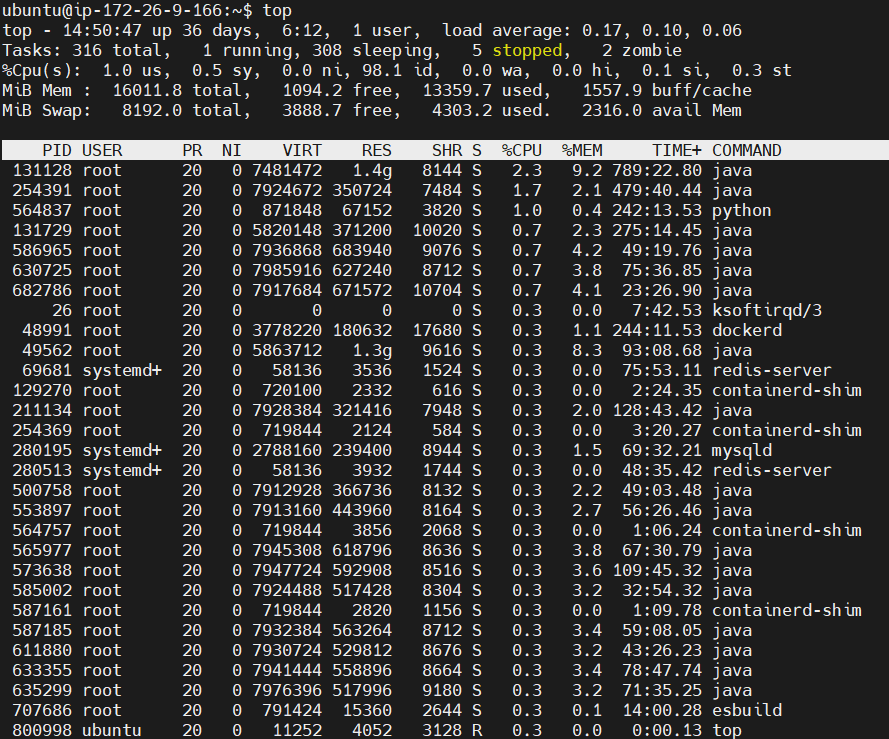
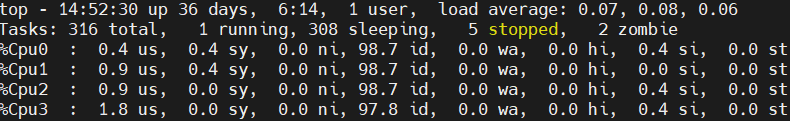
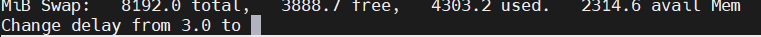
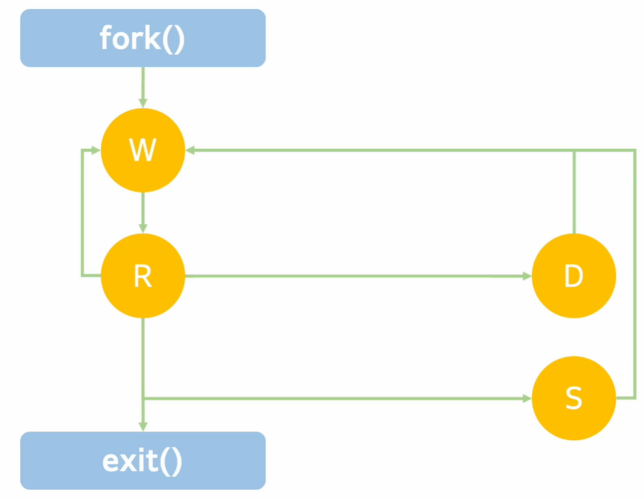
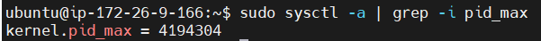
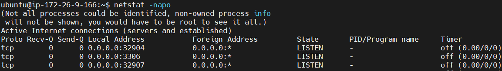
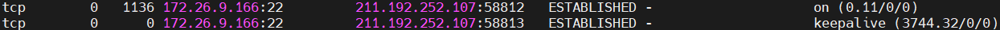
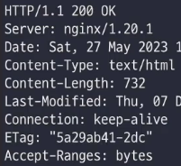
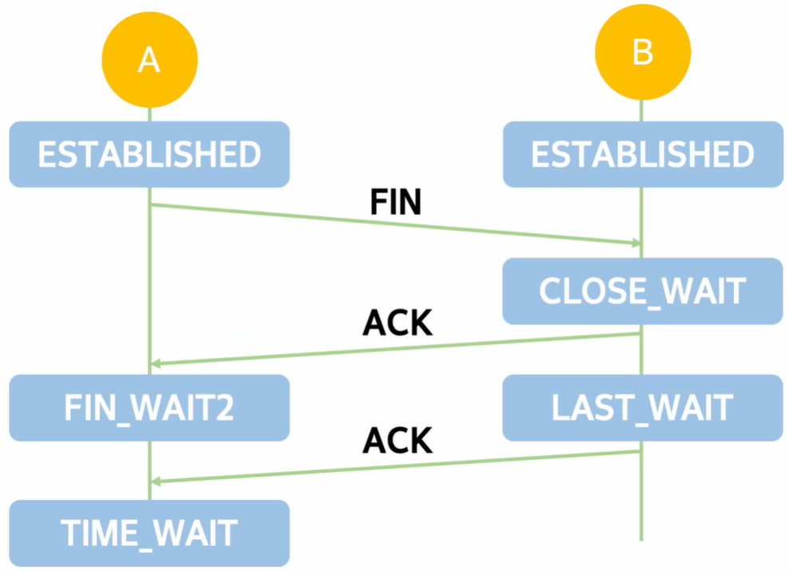

# 리눅스 성능분석 - 2

## top 명령어

- 프로세스들의 상태와 CPU, 메모리 사용률을 확인한다.
    
    
    
- top 명령어를 모든 정보를 볼 시 조금 느릴 수 있다?
- **hot key** : 숫자 키패드 1을 누르면 Cpu(s)에서 각각의 Cpu 정보를 보여주는 것으로 변환
    
    
    
- hot key 키패드 1을 사용해서 변환해서 보는 이유는 무엇일까?
    - 평균적으로 CPU가 50%를 사용하고 있다고 해도, 각각의 CPU가 균형 있게 사용하고 있는가를 확인
        - **CPU의 사용량이 불균형이 있을 수 있기 때문에 구체적 파악 가능**
- **hot key** : 영어 d → CPU의 초당 사용률을 바꿀 수 있다.
    
    
    
    - delay를 3초에서 원하는 시간으로 바꿀 수 있다.

### top 명령어를 통해 알 수 있는 정보는 무엇인가

- **CPU Usage를 확인**
    - us, wa를 확인해보자
        - us : user를 의미, 프로세스의 일반적인 CPU 사용량
        - wa : waiting을 의미, I/O 작업을 대기할 때의 CPU 사용량
    - us가 높다 == CPU를 많이 쓰고 있다. CPU 변경이 필요할 수 있다.
    - wa가 높다 == I/O가 많다. 더 좋은 블록 디바이스로 변경이 필요할 수 있다.
- **CPU가 고르게 사용되고 있는가를 확인**
- **프로세스의 상태를 확인**
    - **D : uninterruptible sleep (I/O)**
        - 이 상태는 I/O 대기 상태를 의미, vmstat으로 b 상태와 같다고 볼 수 있음
    - **R : running (CPU)**
    - **S : sleeping**
        - 작업을 하고 있지 않음 (Load average 미포함)
    - **Z : zombie**
        - 해를 끼치지 않으나 **이슈를 일으킬 가능성 존재**

### 프로세스의 실행 과정 설명

- 프로세스는 fork() 시스템 콜로 만들어진다.
    - 최초에는 waiting = cpu를 대기하는 상태
    - cpu를 할당받으면 running
    - I/O를 기다려야 한다면 D상태로
        - 다 기다리고 나면 waiting, running으로
    - running에서 할당된 CPU를 다 사용했다면 다시 waiting
    - running에서 특정한 조건에 의해 sleep 상태로 갈 수 있으며,
        - sleep에서 다시 작업을 해야하는 경우 waiting으로 갔다가..
- 위 과정의 반복, 시스템 콜 명령어를 통해 프로세스가 종료.

### 좀비 프로세스

- 부모 프로세스가 죽어있어도 살아있는 자식 프로세스
- 부모가 fork를 통해서 자식 프로세스를 만들었는데, 자식의 종료를 기다리지 않고 부모가 종료되는 경우가 있다.
- 일반적으로 커널에서 부모 프로세스를 죽이면 자식은 다 죽는다.
- 근데 특정한 상황이 있다는 것.(버그 등)
    - 자식 프로세스는 부모에게 종료했음을 알려주는데, 부모 프로세스가 없다.
- **이들은 시스템 리소스를 사용하지는 않음, PID 고갈을 일으킬 수는 있다.**

- 위 pid_max의 값은 동시에 존재 가능한 프로세스의 개수인데
    - 저 값을 넘는 경우는 문제가 발생할 수 있다.

## top 명령어 정리

- top 명령어를 통해서 프로세스, CPU, 메모리 사용량을 알 수 있다.
- 해당 명령어를 통해 us가 높다면 CPU가 많이 사용되는 것
- wa가 높다면 I/O가 많이 사용되는 것
- 모든 CPU 상태를 확인해야 한다. (불균형을 파악)

## netstat 명령어

- **네트워크 연결 정보를 확인한다.**
    
    
    
- 아래 사진의 의미를 파악해보자.
    
    
    
    - 172.25.9.166의 2번 포트와 211.192.252.107의 58812포트가 연결되어 있다.
    - 여기에는 PID/Program name이 없으나
        - PID가 있다면, PID 몇이 사용 중이며 Program name에 해당하는 프로세스가 사용중이라는 의미

### LISTEN, ESTABLISHED, TIME_WAIT

- 통신이 일어나려면 **누군가 소켓으로 듣고** 있어야 한다
- Nginx로 80포트를 개방하고 netstat -napo | grep -i nginx 명령어로 확인해보면
- **LISTEN** 소켓이 형성되어 있음.
- 해당 호스트로 텔넷 접속을 시도하면 3-way handshake가  이루어지며
- 이 LISTEN이 **ESTABLISHED**로 변경된다.
- 이후 HTTP 요청을 하면 아래와 같은 요청을 받음.
    
    
    
- 근데 일정 시간 동안 요청이 오지 않으면 **자동으로 TIME_WAIT 상태**로 돌입
- 바로 끊기지 않는 이유는 HTTP/1.1의 **keep alive 특성 때문**

### keepalive_timeout

- HTTP/1.1의 스펙 중 하나이며 연결을 유지하는 설정
- TIME_WAIT는 왜 생기며, 어떤 상황이 곤란한 상황인가?
    - **CLOSE_WAIT**

### CLOSE_WAIT

- ESATBLISHED 상태에서 FIN 사인을 받아 CLOSE_WAIT 상태로 돌입한다.
    - 그런데 CLOSE_WAIT → LAST_WAIT는 별도의 신호를 받지 않는다.
    - 저 상태는 자연스럽게 바뀌는 건데
    - **CLOSE_WAIT가 계속해서 작동한다? 문제가 발생했다는 것**.
- **애플리케이션이 이상 동작을 하고 있다고 봐야 한다.**
    - 정상적으로 소켓을 정리하지 못한다.
- 서버 행업, 포트 고갈 등의 영향을 미치는 문제이기 때문에 **반드시 해결해야함**
- 아래는 해당 문제에 대해 deep dive한 블로그 결과물입니다.
    - 이 부분은 따로 정리해보겠습니다.
    
    [CLOSE_WAIT & TIME_WAIT 최종 분석](https://tech.kakao.com/2016/04/21/closewait-timewait/)
    

## netstat 정리

- 네트워크 연결 정보를 확인한다.
- 커넥션 상태와 IP 정보를 확인할 수 있다
- LISTEN, ESTABLISHED, TIME_WAIT는 흔히 만나는 소켓 연결 상태
- CLOSE_WAIT가 발생하면 원인을 확인하고 조치해야 한다.

## 네트워크 트러블 슈팅 도구

### tcpdump

- 네트워크 패킷 수집 및 분석 = 네트워크 패킷의 흐름을 볼 수 있다.
- tcpdump 명령어 자체로는 해석이 어렵다. 옵션을 붙여서 사용하자

### -nn

- 프로토콜과 포트 번호를 숫자 그대로 표현한다.

### -vvv

- 출력 결과를 더 많이 담는다.

### -A

- 패킷의 내용을 함께 출력한다.

### 트러블 슈팅은 목적지와 포트가 존재한다.

- tcpdump -vvv -nn -A port 80

### 좀 더 편하게 분석하기

- tcpdump → pcap → wireshark

### tcpdump 명령 정리

- 네트워크 패킷을 수집하고 분석할 수 있다.
- -vvv -nn -A 옵션을 이용해서 효율적 사용
- host, port 문구를 이용해서 특정 목적지, 특정 포트로 **필터링** 할 수 있다.
    - sudo tcpdump -vvv -nn -A host 목적지 IP and port 포트번호 -w dump파일이름.pcap
- tcpdump로 pcap 파일을 생성하고 wireshark로 분석할 수 있다.
