# 리눅스 성능분석

# 성능 분석의 기본 명령어

## uptime

- 시스템의 가동시간과 로그인한 사용자 수, Load Average 확인
    
    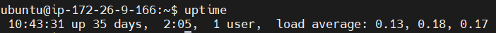
    
    - load average의 3가지를 순서대로
        - 1분 평균, 5분 평균, 15분 평균

### load average란 무엇인가?

- 서버가 받고 있는 **부하 평균**
    - 얼마나 일을 하고 있느냐?
    - 단위 시간(1분, 5분, 15분) 동안의 R과 D 상태의 프로세스 개수

### 프로세스의 개수가 왜 중요할까?

- 하나의CPU에 하나의 프로세스인 상황을 가정하면 **Load average는 1**
- 하나의 CPU에 두 개의 프로세스인 상황을 가정하면 **Load average는 2**
- 두 개의 CPU에 하나의 프로세스인 상황을 가정하면  **Load average는 1**
    - 어느 하나의 프로세스에 바인딩되었다고 가정하면, 여전히 1
- 두 개의 CPU에 두 개의 프로세스인 상황을 가정하면 **Load average는 2**
    - CPU가 1개에 두 개의 프로세스인 상황도 Load average는 2다.
    - CPU가 4개여도 Load average는 2다.

### load average는 상대적인 값이다.

- 두 서버가 똑같이 Load average가 1이라 해도, **CPU가 한 개일 때와 두 개일 때의 의미가 다르다.**
    - 프로세스 2개가 CPU를 1개 공유하는 것이랑, 각각의 CPU를 가지고 있는 것이랑.
- 결론적으로
    - **Load average > CPU 개수** 인 경우
    
    <aside>
    💡 처리 가능한 수준에 비해 많은 프로세스가 존재한다.
    
    </aside>
    

### CPU의 개수는 어떻게 알 수 있는가?

- **lscpu -e**
    
    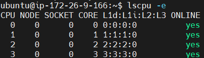
    
- uptime 명령어를 통해 Load average값을 확인해보자.
    
    
    
- **CPU가 4개**이기 때문에 **Load average가 4보다 작으면** 괜찮은 수준이라고 판단해도 된다.

### 항상 괜찮은가?

- load average가 높은 이유는 무엇인가
- load average는 **R과 D 상태의 프로세스 개수**라고 하였다.
- R은 **CPU 위주**의 작업, D는 **I/O 위주**의 작업이다.
- R 상태의 프로세스가 많다
    - CPU 개수를 늘리거나, 스레드 개수를 조절해야 한다.
- D 상태의 프로세스가 많다
    - IOPS가 높은 디바이스로 변경하거나 처리량을 줄인다.

### R이 많은지, D가 많은지 판단해보자

- vmstat 1
    
    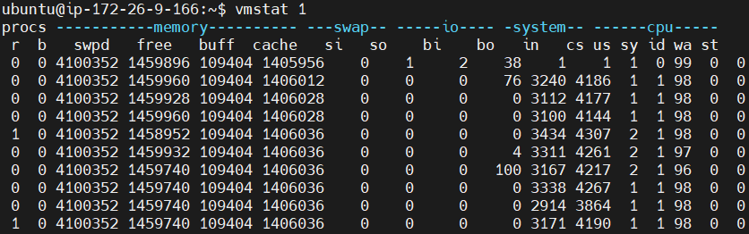
    
    - cpu를 필요로하는 프로세스가 상대적으로 많다
- b가 상대적으로 많은 경우
    - I/O에서 성능 문제가 발생되고 있기 때문에, CPU를 늘리는 것이 아닌 IOPS 디바이스를 변경해주는 것이 더 낫다고 판단할 수 있다.

### uptime 정리

- uptime 명령어로 얼마나 많은 부하를 받고 있는지 확인한다.
- cpu 개수보다 많은 부하를 받고 있다면 어떤 종류의 프로세스 때문인지 확인한다.
- vmstat 명령의 procs column을 확인한다.

## dmesg 명령어

- 커널에서 발생하는 다양한 메시지를 출력
    
    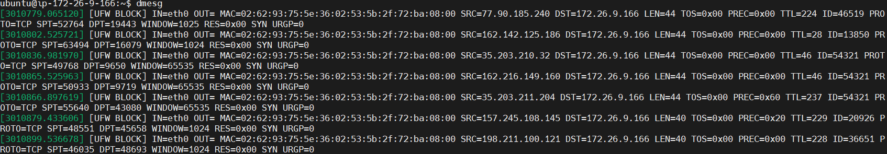
    
    - 무언가 엄청 많이 나온다..!
    - -T 옵션을 붙여서 **시간순 정렬**이 가능 → dmesg -T

### 어떤 메시지를 봐야 할까?

- 성능 분석, 트러블 슈팅에 관련된 요소를 보고 싶다.
- OOME (Out Of Memory Error)
- SYN Flooding

### OOME

- 가용한 메모리가 부족해서 더이상 프로세스에게 할당해 줄 메모리가 없는 상황
- OOME 상황이 되면 커널은 내부적으로 **OOM Killer**를 동작시킨다.
    - OOM Killer
        - 누군가의 메모리를 회수해야 한다는 건데, **결국 종료한다는 것**
- OOM 상황이 발생하면
    - 프로세스를 선택 : 누군가를 죽여야 한다!
    - 프로세스를 종료
    - 메모리를 회수해서 시스템을 안정화

### 종료시킬 프로세스는 어떻게 선택하는가

- **oom_score**
    - OOM Killer가 종료시킬 프로세스를 선택하는 기준
    - **스코어가 더 높은 프로세스**가 먼저 종료된다
- **/proc**이라는 디렉토리에서 확인할 수 있다.
    - 프로세스들의 메타 데이터를 볼 수 있는 디렉토리
    
    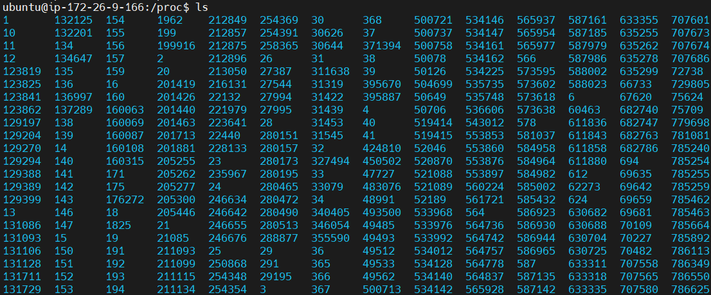
    
    - 무한 루프로 메모리 할당하는 while문을 계속해서 작성했다고 한다면
        - 로그에서 OOM Killer가 동작하는 것을 확인할 수 있다.
        
        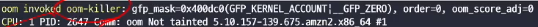
        
    - oom이 발생했음을 확인하는 명령어를 잡아서 찾아내기
    - **dmesg -TL | grep -i oom**

## SYN Flooding

- 공격자가 대량의 SYN 패킷만 보내서 소켓을 고갈시키는 공격
- TCP 3-way Handshake 과정을 생각해보자
    - 클라이언트가 서버에게 Syn 패킷을 보낸다
    - 서버에서 listen()을 하고 있다가
    - 서버에서 Syn Backlog에 이것을 집어넣는다.
    - 서버에서는 **Syn + Ack**를 보내고
    - 클라이언트에서 Ack사인을 보낸다.
    - 이를 서버에서는 Listen Backlog에 가져오고, accept()를 통해 **application에 처리권**을 넘김
- 악의적인 상황을 가정하자
    - 클라이언트가 서버에게 Syn을 보내고, **Ack를 보내지 않는다**
    - Syn Backlog에 정보가 넘어가지 않고 계속해서 쌓이면, 결국 Drop되고 새로운 요청을 처리하지 못한다

### Syn Flooding을 방지하기 위해, SYN Cookie

- SYN 패킷의 정보들을 바탕으로 쿠키를 만든다.
- 그 값을 SYN + ACK의 시퀀스 번호로 만들어서 응답한다.
    - 서버가 SYN과 ACK 사인과 함께 **쿠키를 보낸다**
    - 클라이언트에서 서버에 ACK 사인을 보낼 때 **쿠키 + 1을 보낸다.**
    - 이 쿠키는 계산이 가능한 값(Timestamp, Ip)로 있기 때문에 서버에서 저장하지 않아도 된다.
- SYN Cookie가 동작하면 Syn Backlog에 쌓지 않아서 자원 고갈 현상 발생하지 않음.
    - 그러나 TCP Option 헤더를 무시한다
    - Window Scaling 등 성능 향상을 위한 옵션이 동작하지 않는다.
- SYN Cookie는 항상 동작하는 것이 아니라, **`SYN Flooding이 발생하는 것 같을 때`** 동작한다
- 로그 확인 명령어
    - dmesg -TL | grep -i “syn flooding”

## dmseg 정리

- OOME 에러 혹은 SYN Flooding이 발생하지 않는지 확인한다
- **메모리 확보와, 방화벽을 확인할 수 있다.**

## free 명령어

- 시스템의 메모리 정보를 출력
    
    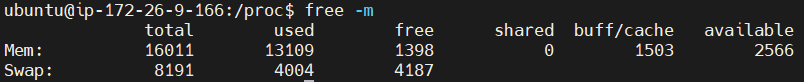
    
    - free -m : 단위를 메가바이트로 표시

### free와 available의 차이점

- free : 어느 누구도 사용하고 있지 않은 메모리
- available : 애플리케이션에 실질적으로 할당 가능한 메모리

### buff/cache

- buff : 블록 디바이스가 가지고 있는 블록 자체에 대한 캐시
- cache : I/O 성능 향상을 위해 사용하는 **페이지 캐시**

### 페이지 캐시

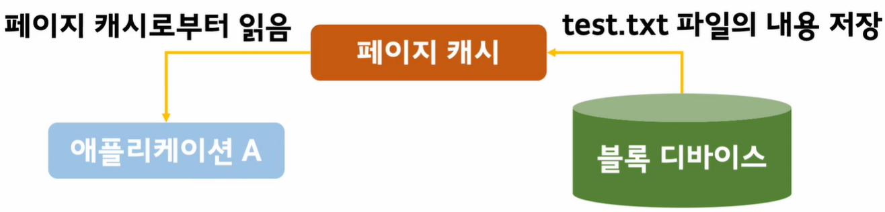

- I/O 성능 향상이 목적
- 번외 (예시)
    - Elastic search
        - Give memory to the filesystem cache
            - 충분한 양의 메모리를 확보해달라.
        - 만들어지는 샤드에 인덱싱 → I/O 작업.. 이를 메모리로 변환하여 성능 향상을 꾀할 수 있다.
    
    [5. Tune for search speed](https://drscg.tistory.com/480)
    
    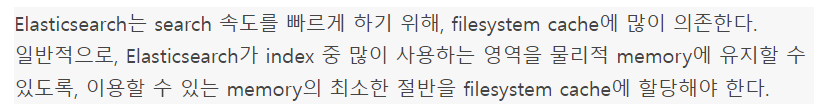
    

### buff/cache는 I/O 향상을 위해 존재한다.

- 근데 애플리케이션이 메모리를 필요로 하는 상황이 온다?
- buff/cache 영역을 해제하고 애플리케이션이 사용할 수 있는 영역으로 바꾼다.
- 예를 들어서 OOM이 발생했다고 하면, 프로세스 죽이기보다 buff/cache가 낫다

<aside>
💡 애플리케이션이 메모리 걱정 없이 구동되는 것이 우선이다.

</aside>

- buff/cache가 많이 일어나는 환경 == I/O가 많이 일어나는 환경

### available

- available = free + buff/cache
    - 어플리케이션 메모리 = 누구도 사용하지 않는 메모리 + buff/cache

### swap 영역

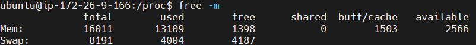

- 메모리가 부족한 상황에서 사용되는 가상 메모리 공간
    - **메모리가 부족하기 때문에, 메모리가 아니다**.
- 주로 블록 디바이스의 일부 영역을 사용한다.
- OOM이 일어난다
    - 처음으로 buff/cache 영역을 쳐다본다.
    - buff/cache도 부족하다면 swap 영역을 쳐다본다.
    - 다 부족하면 OOM이 일어나는 것
- 메모리가 꽉 찬 상태에서 프로세스가 커널에게 메모리를 요청
    - 꽉 차 있는 메모리중 일부를 swap 영역으로 옮긴다 → **swap out**
    - 이후 비어있는 메모리에 프로세스를 할당

### 프로세스가 특정 영역을 원한다면

- swap 영역에 0번 영역이 있는 상황이라고 했을 때
- swap 영역으로부터 0번을 가져와서 프로세스에 할당한다.
- 그럼 swap 영역에 있는 0번 영역이 다시 메모리로 올라오는 것 → **swap in** 발생
- 이 때, swap in이 발생해도 **swap 영역에서 지워지지 않음 == swap cached**

### swap 영역이 사용되면 성능 저하 발생

- 메모리 참조에 I/O가 빈번하게 발생
- swap 영역은 메모리가 아닌 **블록 디바이스 영역**
- OOM Killer가 서버 죽이기 vs 못 죽이게 하고 성능 저하를 하기?
- 최근 트렌드는 swap 영역의 비활성화
    - k8s 환경에서는 컨테이너를 빠르게 띄울 수 있어서 비활성화

### free 정리

- 시스템의 **메모리 사용 현황**을 볼 수 있다.
- available은 **실질적으로 프로세스에게 할당할 수 있는 메모리 양**
- buff/cache가 높다면 **I/O가 빈번하게 발생**한다는 의미
- swap 영역을 사용한다는 것은 **메모리가 부족하다는 신호**

## df 명령어

- 디스크 여유 공간 및 inode 공간 확인
    
    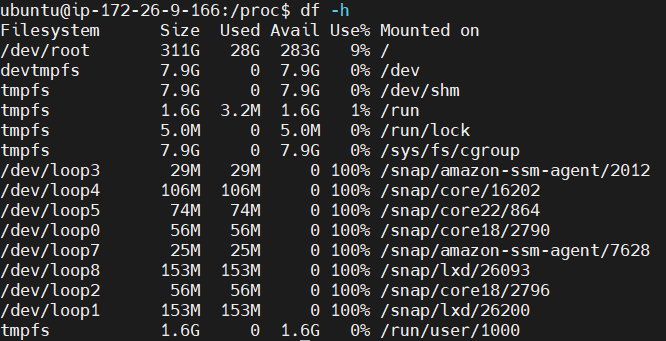
    

### 파일 시스템이 100%가 된다면?

- 명령어가 동작되지 않고.. 기타 행위들이 되지 않음

### 디렉터리 별 사용량 측정

- du -sh ./*
    
    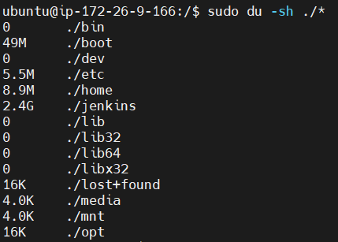
    

### 파일을 지웠는데 용량이 늘어나지 않는 경우

- 파일 핸들
    - lsof | grep 파일명
    - 실제로 파일을 지웠어도, **이 파일을 참조하고 있는 프로세스가 있어서 안지워진 것**
    - 위 명령어로 파일 핸들을 확인하자.

### inode 사용률

- inode : 파일 또는 디렉터리에 대한 메타데이터를 저장하는 구조체
    - 파일과 디렉터리의 개수
    - 파일이 10개면 inode도 10개
- 파일과 디렉토리가 얼마나 많은가를 확인한다
    
    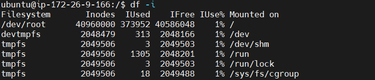
    

## df 명령어 정리

- 디스크 여유 공간 및 inode 공간을 확인할 수 있다.
- 파일 핸들이 남아있어서 파일이 지워지지 않는 경우, lsof 명령어로 확인
- inode는 파일과 디렉터리의 개수, 최대값이 있으며 이상으로 만들 수 없다.

## 강의 출처 : 하단

[리눅스 성능 분석 시작하기 - 인프런 | 강의
리눅스 서버의 성능 분석을 위해 필요한 기본 명령어들에 대한 이해, 네트워크 문제 해결을 위한 tcpdump 명령어의 사용 방법, 사례를 기반으로 한 트러블 슈팅 방법을 알려주는 강의 입니다. 이
www.inflearn.com](https://www.inflearn.com/course/%EB%A6%AC%EB%88%85%EC%8A%A4-%EC%84%B1%EB%8A%A5-%EB%B6%84%EC%84%9D-%EC%8B%9C%EC%9E%91%ED%95%98%EA%B8%B0/dashboard)
