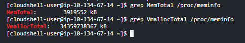

# 리눅스 커널

### 프로세스 그룹(미완)

- 어떤 프로세스가 이 프로세스 그룹에 같이 할당되는지?
- foreground, background 언제?
    - 뒷단에서 돌아가는 프로세스 그룹은 뭐가있지?
- a process group is used to control the distribution of a [signal](https://www.wikiwand.com/en/articles/Signal_(computing));
    - process group에 signal이 전달되면, 각 프로세스에 동일한 signal을 분배하게 된다.
    - 예를들면 keyboard interrupt 발생했을 때 → ctrl+C 누르면 프로세스 종료되는데, 이때 프로세스 그룹에 있는 모든 프로세스가 같이 종료된다.
    - The system call `setpgid` is used to set the process group ID of a process, thereby either joining the process to an existing process group, or creating a new process group within the session of the process with the process becoming the process group leader of the newly created group
        - 마음대로 그룹 설정이 가능함.
        - 언제 같은 그룹 설정해?
            - signal을 동일하게 분배. 즉 동시에 제어하고싶을 때
        - 커스텀해서 그룹을 만드는 케이스가 실제로 있는지 찾아봐도
- 우선 자식프로세스를 생성할 때 자동으로 동일한 process group에 위치시키는 것으로 보인다.

- https://www.wikiwand.com/en/articles/Process_group

## 메모리 관리

- 가상 메모리의 사이즈가 물리 메모리 사이즈와 엄청나게 차이를 보이는 경우가 많은데 이게 어떻게 가능한가?(미완)
    - 페이지 테이블 개념.
    - Linux에서는 어떤 페이지 테이블 전략을 사용하는가?
        - multi-level page table?? 이런거

## 페이지 테이블(page table)

프로세스가 메모리에 불연속적으로 배치되어 있다면 CPU는 이들을 순차적으로 처리할 수 없다. CPU는 모든 주소를 알고 있기가 어렵기 때문이다. 즉, 다음에 실행할 명령어의 위치를 찾기가 어렵다.

페이징 시스템은 프로세스들이 물리 주소에는 불연속적으로 배치되어 있더라도, 논리 주소는 연속적으로 배치되도록 한다. 이를 페이지 테이블을 이용한다.

페이지 테이블은 페이지 번호와 프레임 번호를 짝지어준다. 페이지 번호만 보고, 해당 페이지가 적재된 프레임을 찾을 수 있게 하는 것이다. 하여 CPU 입장에서 바라보는 논리주소는 계속해서 연속적으로 볼 수 있다.

프로세스마다 페이지 테이블을 가지고 있으며, 페이지 테이블들은 메모리에 적재되어 있다. CPU 내의 페이지 테이블 베이스 레지스터(PTBR)은 각 프로세스의 페이지 테이블이 적재된 주소를 가지고 있다.

그런데 컴퓨터 구조 관점에서 CPU와 Memory가 계속해서 접근하는 것은 그닥 효율적이지 못하다. 페이지 테이블이 메모리에 적재되어 있다면, CPU는 메모리에 한 번 접근하여 페이지 테이블을 알아내고 페이지 테이블에 있는 프레임을 접근하기 위해 한 번, 총 2번 접근하게 된다. 

이런 문제를 해결하기 위해 CPU 곁에 캐시 메모리를 두는데, TLB(Translation Lookaside Buffer)라고 한다. 캐시 메모리이기 때문에 페이지 테이블의 일부 내용을 저장하며, 참조 지역성에 근거해 페이지를 저장한다.

## 페이징에서 주소 변환

페이징 시스템에서는 모든 논리 주소가 페이지 번호와 변위로 이루어져 있다. 페이지 번호는 접근하고자 하는 페이지 번호를 의미하며, 변위는 접근하려는 주소가 프레임의 시작 번지로부터 얼마만큼 떨어져 있는 지를 의미한다. 

<페이지 번호, 변위> → <프레임 번호, 변위>와 같은 형태로 변환되게 된다.

## Wrapper library란

- 시스템 콜 여러개 묶어서 유저들이 사용하는 기능을 편하게 쓸 수 있게 만들어놓은 라이브러리(병선정리)

### melt down, spectre(39페이지)

1. https://medium.com/@kjhcloud/%EC%9D%B8%ED%85%94-cpu-%EC%B7%A8%EC%95%BD%EC%A0%90-%EC%9D%B4%ED%95%B4%ED%95%98%EA%B8%B0-9ddab8d502b7
