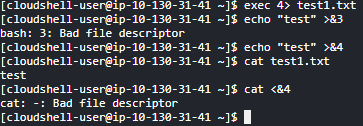
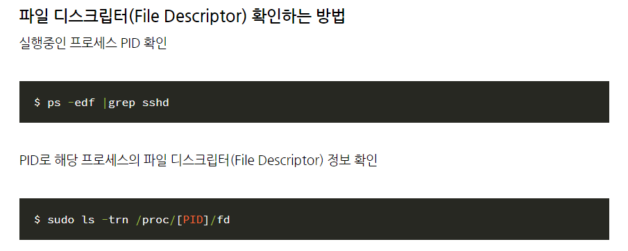
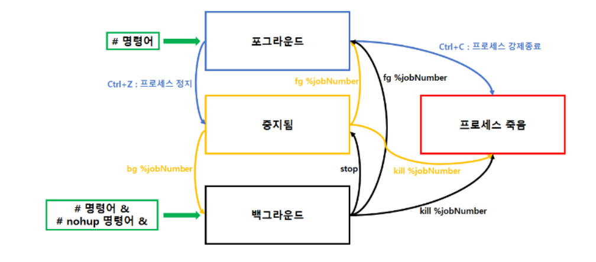

# 셸과 스크립팅

# File Descriptor

- 번호붙여서 추적하는 애?
- 기본이 0,1,2고 그 이상은 우리가 할당해서 쓴다.
    - 그러면 번호를 커스텀해서 할당하는 방법을 언제 어떻게 활용하냐..

- bad file descriptor 원인을 모름.

## 도커 컨테이너가 백그라운드 / 포그라운드로 돌 때의 차이

- 도커 컨테이너를 bash에서 볼때는 백그라운드로 도는게 맞다. 우리가 명령어를 수행할 수 있으니까.
- 컨테이너 내부에서 동작하는 애플리케이션은 우리가 백그라운드로 설정해줬으면 백그라운드, 포그라운드로 설정했으면 포그라운드로 돌 것
    - 단 exec 명령어를 사용해 컨테이너에 접근하면 해당 애플리케이션이 동작하는 것이 안보일 것이다. 백그라운드라고 착각할 수 있는데 그게 아니고 세션을 새로 열어서 그런거다..(뇌피셜 아마 맞을듯)

## 모던 리눅스

https://the.exa.website/
