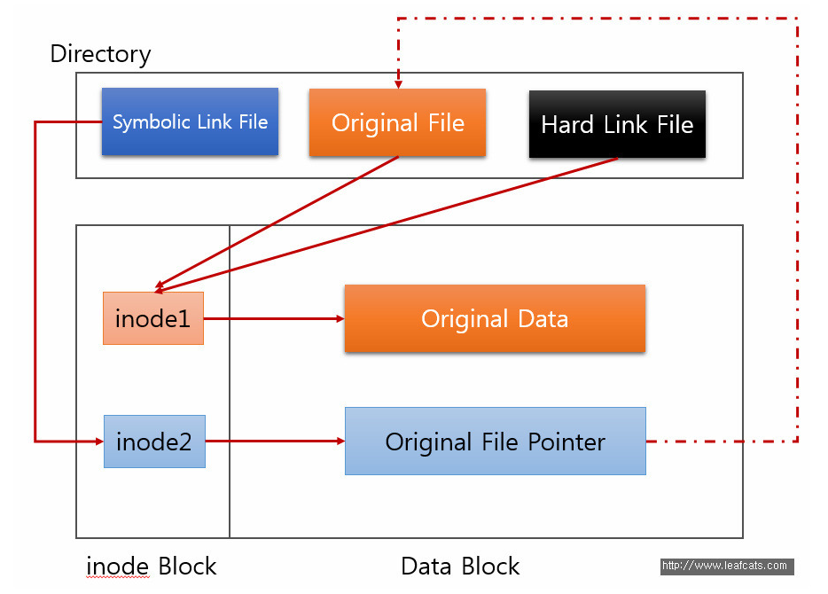
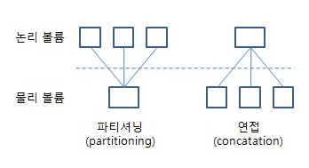

# 파일시스템

# 1. 하드 링크, 심볼릭 링크 비교

[https://inpa.tistory.com/entry/LINUX-📚-하드-링크hard-link-심볼릭-링크symbolic-link-아이노드inode](https://inpa.tistory.com/entry/LINUX-%F0%9F%93%9A-%ED%95%98%EB%93%9C-%EB%A7%81%ED%81%AChard-link-%EC%8B%AC%EB%B3%BC%EB%A6%AD-%EB%A7%81%ED%81%ACsymbolic-link-%EC%95%84%EC%9D%B4%EB%85%B8%EB%93%9Cinode)



### 추가 질문. Original file을 삭제하더라도 Original Data는 남아있나요?

https://nullbyte.tistory.com/113

> inode의 reference count가 0이 아니라면 완전히 삭제되지 않고, reference count가 0에 도달해야만 해당 inode와 original data의 연결을 해제한다(일반적인 삭제의 의미)
> 
- Hard link 파일이 있어 inode를 두 파일이 가리키고 있다면, 원본파일을 삭제해도 reference count가 0이되지 않으므로 Original Data와 inode의 연결이 남아있다.

### 추가 질문 2. 삭제가 완전히 된다는게 뭐죠? link와 연결이 끊어지는게 삭제가 아닌가요?

- 컴퓨터에서 파일이나 디렉터리를 삭제한다고 해서 반드시 데이터가 영원히 사라진 것은 아닙니다. 대부분의 경우 데이터는 하드 드라이브나 저장 장치에 여전히 존재하지만 **새 데이터로 덮어쓸 수 있는 "여유 공간"으로 표시**됩니다. 즉, 누군가가 귀하의 컴퓨터에 액세스하면 삭제된 파일을 복구하고 중요한 정보를 볼 수 있다는 의미입니다.

https://ko.linux-terminal.com/?p=5349

https://ko.linux-console.net/?p=23429

- `SRM(Secure Remove)`
    - inode와 data의 연결 끊기 전에 데이터 파일을 덮어쓰기한다?(어떤 무작위 값으로)
    - 다른 사용자가 컴퓨터 액세스해서 정보를 뜯어볼 가능성을 완전히 제거
- `dd` 명령어
    - 'dd' 명령은 Linux에서 파일과 디렉터리를 안전하게 삭제하는 것을 포함하여 다양한 작업에 사용할 수 있는 다목적 도구입니다. 이 명령은 **파일이나 디렉터리의 데이터를 0으로 덮어쓰는 방식으로 작동하므로** 원본 데이터를 복구하는 것이 거의 불가능합니다.
    - 'dd' 명령을 사용하려면 터미널 창을 열고 삭제하려는 파일이나 디렉터리의 위치로 이동해야 합니다. 올바른 디렉토리에 있으면 다음 명령을 사용할 수 있습니다.
        
        ```
        dd if=/dev/zero of=file.txt bs=1M count=10
        
        ```
        
        이 예에서는 'file.txt'라는 파일을 삭제합니다. 'if=/dev/zero' 옵션은 'dd' 명령에 끝없는 0 스트림을 생성하는 특수 파일인 'zero' 장치에서 0을 읽도록 지시합니다. 'of=file.txt' 옵션은 삭제하려는 파일에 0을 쓰도록 'dd'에 지시합니다.
        
        'bs=1M' 옵션은 'dd'에게 1MB의 블록 크기를 사용하도록 지시하여 프로세스 속도를 높입니다. 'count=10' 옵션은 'dd'에게 10개의 데이터 블록을 파일에 쓰도록 지시하여 파일의 데이터를 효과적으로 덮어씁니다.
        

# 2. 파일시스템을 커널에서 구현하지 않는 경우

- FUSE (Filesystem in Userspace)
    - 모듈은 커널에 위치하지만 구현 자체는 사용자 영역에서 직접 편집이 가능하기 때문에 커널에서 구현한 것이 아님.
- 그렇다고 해서 시스템 콜을 안치는 것은 아니다. **`시스템 콜은 친다.`**

# 3. 파일과 디렉토리의 관계성

- 126페이지 - 파일, 디렉토리 두가지 객체로 나눈다.
- 127페이지 - 디렉토리는 특별한 종류의 파일(아이노드 설명)
- 결론. 디렉토리도 파일의 한 종류다(모든 것은 파일)

# `4. 논리볼륨과 파티션의 차이`

- 볼륨의 정의
    - In computer data storage, a volume or logical drive is **a single accessible storage area with a single file system, typically (though not necessarily) resident on a single partition of a hard disk**.
    - 하나의 파일 시스템으로 접근 가능한 하나의 저장소
        - 저장소는 파티션일수도 있고, 디스크 드라이브일수도 있고.
        - 저장소라는 개념은 추상적인데 중요한 건 단일 파일시스템으로 접근가능하다는 것인듯.
- 파티션의 정의
    - 디스크를 [논리](http://www.ktword.co.kr/test/view/view.php?m_temp1=4965&id=573)적으로 **`분할, 통합`**하기 위한 것
    - HDD,SSD와 같은 저장 장치를 여러 개의 논리적 구획으로 나누는 것. 디스크 여러개를 하나의 파티션으로 만들 수도 있다.
- 파티션은 물리볼륨(physical volume)에 속한다.
- 논리 볼륨은 여러 개의 물리 볼륨 사이에 거쳐 있을 수도, 하나의 물리 볼륨일 수도(사이즈에 따라)
    
    
    

```
  ㅇ 파티션, 볼륨 비교
     - 파티션  :  고정적이고, 보다 물리적인 개념이 강함
     - 볼륨    :  유동적이고, 보다 논리적인 개념이 강함
```

3가지 층에서 말하는 볼륨이 LVM에서만 통용되는 이야기인지..

- 개념이 잘 안이어진다.
- https://hyd3.tistory.com/122
- http://www.ktword.co.kr/test/view/view.php?m_temp1=3670&id=867
- http://www.ktword.co.kr/test/view/view.php?no=4856

# `5. 인메모리 파일시스템`

- 이게 정확히 뭐냐?

# 6. Union mount

https://blog.naver.com/alice_k106/221530340759

- 여기서 whiteout

# `7. 그래서 파일시스템이 뭔데`

- 모든 디렉토리, 파일을 관리하는 어떤 시스템
    - 각각의 디렉토리는 파일시스템을 가진다.
- 파일 시스템 최상위 → root
- 디렉토리, 파일이 여러개의 파일 시스템을 가질 수 있을까?
    - 유니온 파일시스템을 구축하면 여러 개의 디렉토리가 가진 각각의 파일 시스템을 하나로 모은다.
    - 이렇게 보면 여러개의 파일 시스템을 가질 수 있는 것으로 보임

- 성민 작업
    
    ## 1. **`sysfs`**
    
    - **설명**:
        - Linux 커널 2.6부터 도입된 파일시스템으로, 커널과 디바이스 모델 정보를 제공.
        - `sysfs`는 주로 `/sys`에 마운트되며, 커널 객체 모델의 계층 구조를 표현.
        - 디바이스와 드라이버, 그리고 그들의 상호작용을 추적하는 데 사용.
    - **주요 용도**:
        - 하드웨어 장치 및 드라이버 상태 확인.
        - 장치 속성 읽기 및 쓰기.
        - 시스템에서 사용 가능한 CPU, 메모리, 네트워크 인터페이스, 전원 관리 등을 모니터링.
    - **예시**:
        - CPU 정보 확인: `/sys/devices/system/cpu/`
        - 장치 블록 정보: `/sys/block/`
    - **특징**:
        - 계층적이고 잘 조직된 디렉토리 구조.
        - 파일마다 특정 속성 또는 값을 나타냄.
        - 읽기/쓰기 가능하여 시스템 동작 제어 가능.
    
    ---
    
    ## 2. **`devfs`**
    
    - **설명**:
        - 장치 파일을 동적으로 관리하는 가상 파일시스템.
        - 사용 가능한 모든 디바이스 노드(`/dev/`)를 관리.
        - 현대 Linux 배포판에서는 주로 `udev`로 대체됨.
    - **역할**:
        - 디바이스 드라이버가 로드되면 자동으로 장치 파일 생성.
        - 동적으로 생성된 디바이스 파일을 제공하여 사용자의 설정을 간소화.
    - **주요 특징**:
        - 디바이스 파일은 `/dev/` 디렉토리 아래에 위치.
        - 시스템 부팅 시 커널이 디바이스 정보를 확인하여 장치 파일을 생성.
    - **현대 Linux에서의 상황**:
        - `udev`가 `devfs`의 역할을 대부분 대체.
        - `devfs`는 Linux 커널 2.6 이후 더 이상 기본으로 사용되지 않음.
    
    ---
    
    ## 3. **`procfs`**
    
    - **설명**:
        - `/proc` 디렉토리에 마운트되는 가상 파일시스템.
        - 시스템과 프로세스 정보를 파일 형태로 제공.
        - 운영체제의 상태를 모니터링하고 프로세스 정보를 읽거나 제어 가능.
    - **주요 용도**:
        - 커널 및 시스템 정보 확인.
        - 각 프로세스의 상태, 메모리 사용량, 파일 핸들 등 확인 가능.
        - 시스템 파라미터를 동적으로 설정 (예: `/proc/sys/`).
    - **주요 파일/디렉토리**:
        - `/proc/cpuinfo`: CPU 정보.
        - `/proc/meminfo`: 메모리 상태.
        - `/proc/<PID>/`: 특정 프로세스의 정보(PID는 프로세스 ID).
        - `/proc/sys/`: 커널 매개변수 변경.
    - **특징**:
        - 파일 내용은 커널에서 실시간 생성.
        - 쓰기를 통해 커널 설정 변경 가능.
        - 프로세스 중심 구조.
    
    ---
    
    ## 비교 요약
    
    | **파일시스템** | **역할** | **마운트 위치** | **주요 특징** |
    | --- | --- | --- | --- |
    | `sysfs` | 커널 및 하드웨어 장치 정보 제공 | `/sys` | 계층적 디렉토리 구조, 디바이스 관리 |
    | `devfs` | 장치 파일 동적 관리 | `/dev` | 현대 Linux에서는 `udev`로 대체 |
    | `procfs` | 시스템 및 프로세스 정보 제공 | `/proc` | 실시간 정보 생성, 프로세스 중심 |
    
    ---
    
    ### 추가 참고
    
    - `sysfs`와 `procfs`는 모두 시스템 정보를 제공하지만, `sysfs`는 하드웨어 중심이고, `procfs`는 프로세스 중심입니다.
    - `devfs`는 역사적으로 중요한 역할을 했지만, `udev`가 이를 대체하여 현대 시스템에서는 거의 사용되지 않습니다.
    
    유니온 마운트(Union Mount)가 **Copy-On-Write(COW)** 파일시스템과 연관이 있는 이유는, 유니온 마운트가 **Lower Layer를 읽기 전용으로 유지**하면서 **Upper Layer에 변경 사항을 저장**하는 방식 때문입니다. 이 동작 원리가 COW의 핵심 개념과 일치하기 때문입니다. 아래에서 더 구체적으로 설명하겠습니다.
    
    ---
    
    ### **Copy-On-Write(COW)란?**
    
    COW는 파일이나 데이터를 복사하지 않고, 원본을 공유하다가 **변경이 발생할 때만 복사**를 수행하는 방식입니다.
    
    - **기본 아이디어**:
        - 변경이 없을 때는 원본 데이터를 그대로 사용.
        - 변경이 발생하면 복사본을 생성하여 변경된 데이터만 따로 저장.
    
    ---
    
    ### **유니온 마운트와 COW의 연결점**
    
    유니온 마운트는 **Lower Layer**를 읽기 전용으로 유지하며, Upper Layer를 통해 변경 사항을 기록합니다.
    
    이 과정에서 **Copy-Up**이라는 COW 방식이 작동합니다.
    
    1. **Lower Layer**는 변경이 불가능합니다.
        - 파일 수정 요청이 들어오면 원본 데이터를 Upper Layer로 "복사(Copy-Up)"합니다.
    2. **Upper Layer**에 복사된 파일을 수정합니다.
        - 이렇게 하면 Lower Layer는 손상되지 않고, Upper Layer에만 변경 사항이 기록됩니다.
    
    ---
    
    ### **작동 과정 예시**
    
    ### **1. 초기 상태**
    
    - Lower Layer: `file1` (읽기 전용)
    - Upper Layer: 비어 있음
    
    ### **2. 읽기 요청 (`file1` 읽기)**
    
    - Lower Layer에서 `file1`이 반환됩니다.
    
    ### **3. 쓰기 요청 (`file1` 수정)**
    
    - Lower Layer는 읽기 전용이므로 파일을 Upper Layer로 복사합니다.
    - Upper Layer에 복사된 `file1`이 수정됩니다.
    
    ### **4. 최종 상태**
    
    - Lower Layer: 변경 없음 (원본 유지)
    - Upper Layer: 수정된 `file1` 저장
    
    ---
    
    ### **COW의 장점이 유니온 마운트에서 활용되는 이유**
    
    1. **효율성**:
        - 변경된 파일만 Upper Layer에 저장되므로 전체 파일시스템 복사보다 저장 공간이 절약됩니다.
    2. **안정성**:
        - Lower Layer의 읽기 전용 속성 덕분에 원본 데이터가 보호됩니다.
    3. **유연성**:
        - 읽기 전용 데이터(Lower Layer)와 변경 가능한 데이터(Upper Layer)를 조합하여 여러 시나리오에서 재사용 가능.
    
    ---
    
    ### **COW 파일시스템의 대표 사례: OverlayFS**
    
    유니온 마운트는 OverlayFS와 같은 파일시스템에서 활용됩니다.
    
    OverlayFS는 COW의 작동 원리를 적극적으로 활용하며, 다음과 같은 구조를 갖습니다:
    
    1. **Lower Layer**: 읽기 전용 베이스 이미지 (예: 컨테이너 OS 이미지).
    2. **Upper Layer**: 쓰기 가능한 레이어 (예: 컨테이너의 실행 중 변화 기록).
    3. **Merged View**: 사용자에게는 두 레이어가 하나의 파일시스템처럼 보임.
    
    ---
    
    ### **결론**
    
    유니온 마운트는 Copy-On-Write(COW)의 핵심 아이디어인 "변경 시 복사"를 활용하여 Lower Layer의 원본 데이터를 보존하면서 Upper Layer에 변경 사항을 저장합니다. 이 메커니즘 덕분에 유니온 마운트는 효율적이고 안전하게 파일시스템을 결합할 수 있습니다.
    
    COW와 유니온 마운트는 이런 점에서 자연스럽게 연관될 수밖에 없습니다!
    
    ### **유니온 마운트란?**
    
    유니온 마운트(Union Mount)는 두 개 이상의 디렉토리(파일시스템)를 "결합"하여 하나의 통합된 디렉토리 구조로 보이도록 만드는 기술입니다. 주로 읽기 전용 데이터와 쓰기 가능 데이터를 결합할 때 유용합니다.
    
    ---
    
    ### **구성 요소**
    
    1. **Lower Layer (읽기 전용)**
        - 기존 데이터가 저장된 디렉토리/레이어입니다.
        - 읽기 전용으로 접근되며, 수정할 수 없습니다.
    2. **Upper Layer (읽기/쓰기 가능)**
        - 새로운 데이터를 저장하거나 기존 데이터를 덮어쓸 수 있는 레이어입니다.
        - Lower Layer에 있는 파일과 이름이 동일한 파일이 Upper Layer에 있으면, Upper Layer의 파일이 우선됩니다.
    3. **Merged View (통합 뷰)**
        - 사용자가 실제로 보게 되는 디렉토리 구조입니다.
        - Lower Layer와 Upper Layer를 합쳐서 보여줍니다.
        - 파일의 우선 순위는 Upper Layer → Lower Layer 순서입니다.
    
    ---
    
    ### **작동 방식**
    
    1. **파일 읽기**
        - 통합 뷰에서 요청된 파일이 Upper Layer에 있으면 Upper Layer의 파일을 반환합니다.
        - Upper Layer에 없으면 Lower Layer에서 파일을 반환합니다.
    2. **파일 쓰기**
        - 통합 뷰에 파일을 쓰면 Upper Layer에 새로 작성됩니다. Lower Layer는 변경되지 않습니다.
    3. **파일 수정**
        - Lower Layer의 파일을 수정하려고 하면, 해당 파일이 Upper Layer로 복사된 뒤 수정됩니다(이를 *copy-up*이라고 함).
    
    ---
    
    ### **사용 사례**
    
    - **오버레이 파일시스템(OverlayFS):**
        - 컨테이너 환경에서 이미지 파일(읽기 전용)과 컨테이너의 변경 사항(읽기/쓰기 가능)을 결합하여 사용.
    - **라이브 CD/DVD:**
        - 읽기 전용 미디어에 사용자 데이터를 저장하기 위해 사용.
    
    ---
    
    ### **비유로 설명**
    
    유니온 마운트를 서랍으로 비유하면:
    
    1. **Lower Layer**: 이미 잠겨 있는 서랍(읽기 전용).
    2. **Upper Layer**: 자유롭게 물건을 넣을 수 있는 서랍(읽기/쓰기 가능).
    3. **Merged View**: 두 서랍을 합쳐 하나의 서랍처럼 보이는 구조. Upper Layer에 있는 물건이 우선적으로 보임.

##
