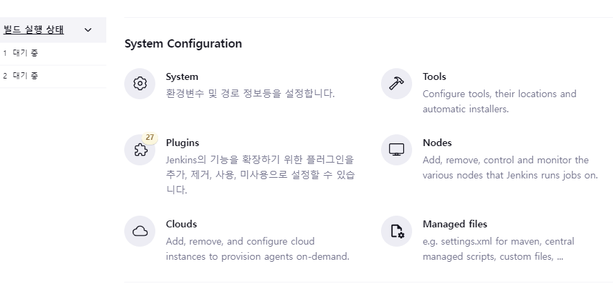
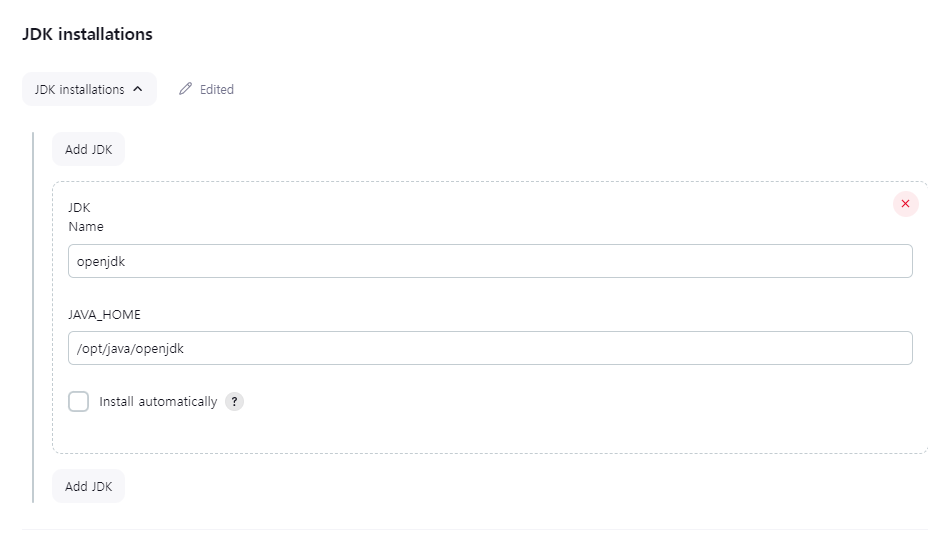
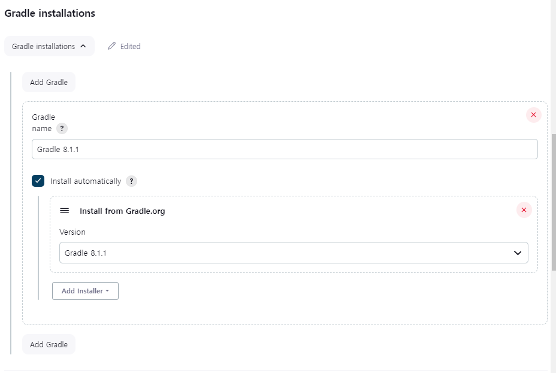
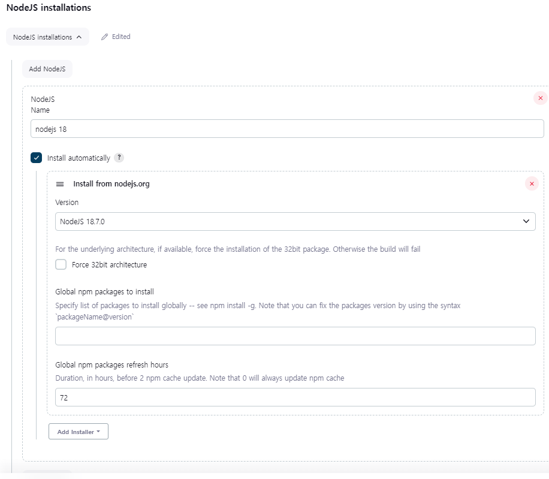
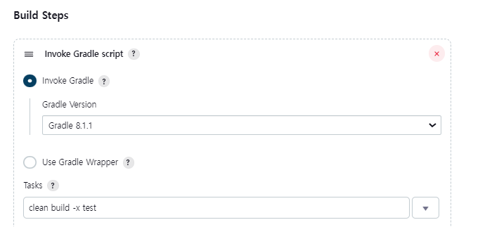
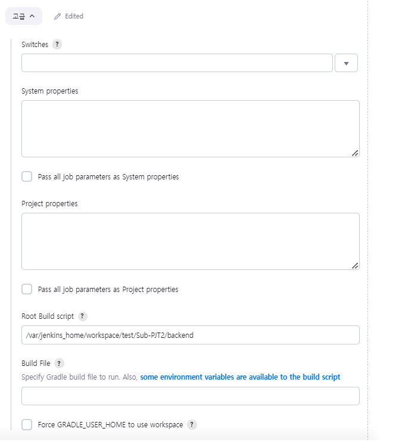
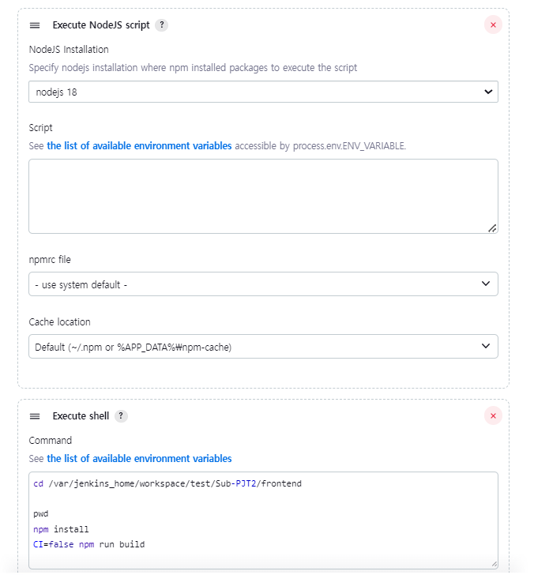

# 2. Jenkins (빌드)

태그: 적용 기록

# 빌드를 위한 준비물

- 본인이 빌드할 환경에 맞는 Tool을 설정해야한다.
- SpringBoot를 gradle 형식으로 했다면 gradle이 필요하고,
- Maven으로 했다면 Maven이 필요하다.
- Front-end 관련 node 역시 필요하다.
- 현재 환경
    - SpringBoot gradle 8.1.1
    - nodeJs 18.17.0

## Tools로 들어가서 설치한다.

### JDK

- jenkins에서 이미 jdk-17 버전을 가지고 있는 컨테이너를 만들었기 때문에 생략해도 무방하다.
- 그러나 jdk를 미리 깔지 않았다면 Jenkins에서 별도의 설치 작업을 해야한다.
- Jenkins에서 jdk가 필요한 이유는 Jenkins는 Java 기반이기 때문.
- 참고로 자동 설치의 경우 (install automatically)
    - Oracle JDK만 제공, 11이상 버전은 라이센스가 있어야 받을 수 있음.

### Gradle, NodeJS

- 본인이 Build할 프로젝트와 맞게 설정한다.
- 내가 진행한 환경은 Springboot Gradle 8.1.1과 Nodejs 18.7.0

## 생성해둔 Freestyle 프로젝트 → 구성으로 들어간다.

### Build steps

- Gradle 프로젝트를 빌드할 것이기 때문에 설정해준다.
- Tasks에 clean build -x test를 입력한다.
    - 본인이 원하는 방식으로 바꿔도 무방하다.
    
    <aside>
    💡
    
    1. **`clean`**: 이는 Gradle 빌드 프로세스에서 이전 빌드에서 생성된 모든 빌드 출력을 제거하고 "클린(clean)"한 상태로 시작하라는 것을 의미합니다. 이는 불필요한 파일이나 디렉토리가 남지 않도록 하기 위해 사용됩니다.
    2. **`build`**: 이는 실제 빌드 작업을 수행하라는 것을 나타냅니다. 프로젝트 소스 코드를 컴파일하고 라이브러리를 생성하며 실행 가능한 파일을 생성하는 등의 작업이 이 단계에서 수행됩니다.
    3. **`x test`**: 이는 빌드 작업을 수행할 때 "test" 태스크를 제외하라는 것을 의미합니다. "test" 태스크는 유닛 테스트를 실행하는데 사용되므로, 이 옵션을 사용하면 빌드 중에 테스트가 실행되지 않습니다. 이를 통해 빌드 시간을 단축할 수 있습니다. 만약에 빌드 이후에 테스트를 별도로 실행하려면 이 옵션을 사용할 수 있습니다.
    
    따라서, "clean build -x test"는 Gradle을 사용하여 프로젝트를 클린(clean)하게 빌드(build)하되, 테스트는 실행하지 않는다는 것을 나타냅니다.
    
    </aside>
    

- 바로 아래 고급을 누르면 아래와 같은 화면이 보인다.

- 위의 화면에서 Root Build script의 위치는,
    - Jenkins 내부에서 빌드할 프로젝트가 위치하는 곳.
    - 기본적으로 /var/jenkins_home/workspace가 잡힌다.

- React

## 이렇게 Build의 스텝을 마침.
