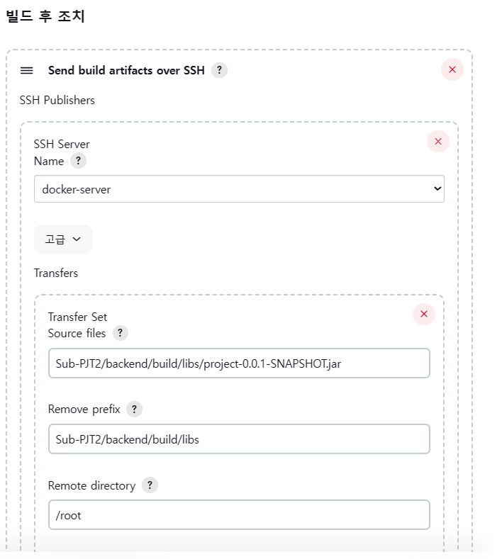
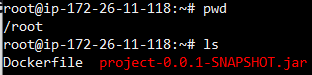
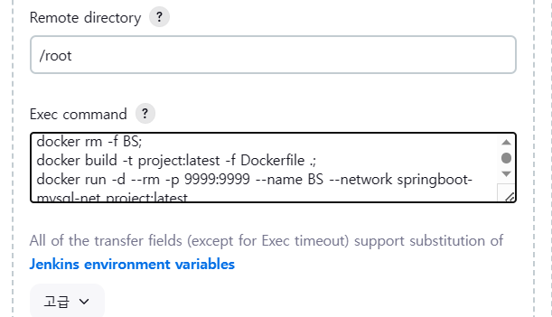
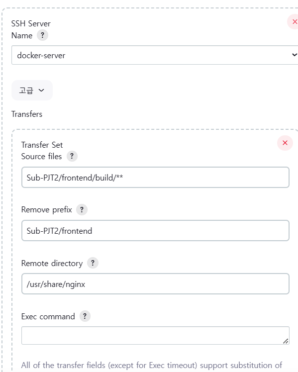

# 4. CD(배포)

태그: 적용 기록

# 1, 2, 3의 과정을 모두 마쳤다면, 이제 배포를 해야한다.

## 생성해둔 Freestyle Project에서 빌드 후 조치

- Publish over SSH 플러그인을
- tools에서 install해주어야 한다.
    - **Gitlab 플러그인을 설치한 과정을 그대로 따라가서** Publish over SSH 플러그인을 설치해주면 된다.
    
- 설치했다면 생성한 Freestyle Project로 들어간다.

## 백엔드 관련 배포



- 위와 같이 설정할 것인데, 아래 설명을 보며 설정하면 된다.
- SSH Server : 실제로 전송이 될 EC2 이름을 설정한다. 위의 Name은 그냥 예시일 뿐이다.
- Source files는 jar파일만 서버에 보낼것이다.
- Remove prefix에서 jar파일 이전 경로를 다 지워준다.
- Remote directory는 실제로 서버에 전송했을 때 저장이 되는 경로이다.
- 필자같은 경우는 /root에 jar파일이 저장된다.
    
    
    



- Exec command는 전송 후 실행하는 명령어라고 생각하면 된다.

```bash
docker rm -f BS;
docker build -t project:latest -f Dockerfile .;
docker run -d --rm -p 9999:9999 --name BS --network springboot-mysql-net project:latest

# 존재하는 BS (백엔드 서버)를 지우고
# root 경로에 있는 Dockerfile에서 project 이미지를 최신화하고
# BS 서버를 다시 로드한다.

# 계속해서 BS 서버를 지워주는 것은 최신으로 바꾸고 다시 구동시키기 위함.

```

## 프론트 관련 배포

- 빌드 후 조치 추가를 눌러 아래와 같이 작성



- 이 경우는 별도로 Exec command 하지 않았다.
- 프론트 파일 역시 별도의 컨테이너화 해서 관리하고 싶다면
    - Exec command가 백엔드처럼 진행이 되어야하고
    - Dockerfile을 본인이 원하는 위치에서 설정해주어야 한다.
- 현재 본인 서버에는 nginX가 컨테이너화 되어있지 않고 바로 존재함.
    - 이 nginX가 바라보고 있는 정적 파일의 경로가
    - /usr/share/nginx임.
- 그래서 react 파일을 바로 /usr/share/nginx에 전송시켜준다.
- 이후의 프록시 설정은 nginX에서 한다.

## nginX 설정 파일의 모습은 다음 장에서.
