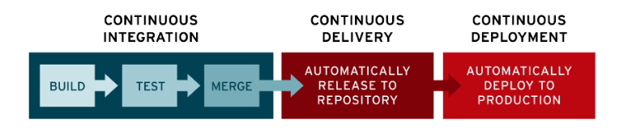

# CI / CD 개념

태그: RedHat

[CI/CD(CI CD, 지속적 통합/지속적 배포): 개념, 툴, 구축, 차이](https://www.redhat.com/ko/topics/devops/what-is-ci-cd)

# 개념

- Continuos Integration / Continuous Delivery
- 애플리케이션 개발 단계를 자동화하여 애플리케이션을 더욱 짧은 주기로 제공하는 방법
- 지속적 통합, 지속적인 서비스 제공, 지속적인 배포
    - **`통합 지옥(integration hell)`**을 해결하기 위한 솔루션
- 애플리케이션의 라이프사이클 전체에 걸쳐 지속적인 자동화, 지속적 모니터링 제공
    - **`CI/CD 파이프라인`**
    - 개발 및 운영팀의 애자일 방식 협력을 통해
        - DevOps, SRE 방식으로 지원

# CI/CD 차이

- CI
    - For Devloper
    - 여러 명의 개발자가 동시에 애플리케이션 개발과 관련된 코드 작업
        - 서로 충돌하는 문제를 해결한다.
        - 개발자 각각이 로컬 IDE를 커스터마이징하는 경우 복합적인 문제 발생
- CD
    - D → Delivery, Deployment
    - Delivery
        - 변경사항 → 리포지토리 자동 업로드
        - 최소한의 노력으로 새로운 코드를 배포하는 것을 목표
    - Deployment
        - 개발자의 변경 사항을 리포지토리에서, **`고객이 사용 가능한 프로덕션 환경까지`** 자동으로 릴리스
        - 수동 프로세스로 인한 운영팀의 프로세스 과부하 문제 해결
- 사진이 이해하기 좋다.

<aside>
💡 파이프라인으로 표현되는 실제 프로세스이자, 애플리케이션 개발에 지속적인 자동화 및 지속적인 모니터링을 추가하는 것

</aside>
