# CI / CD 연동 2차

태그: SSAFY 설명

- gitlab pesonal access token
    - 6KzT3ouyqVxzzp_X_gzd

- gitlab에서 webhook을 보내서 success를 받으면,
- jenkins 안에서 저장되있는 파일을 확인해본다.
- /var/jenkins_home/workspace/test
    - test는 내 freestyle 프로젝트 이름임.
- 아래 경로에 Sub-PJT2가 저장되있음을 확인한다.

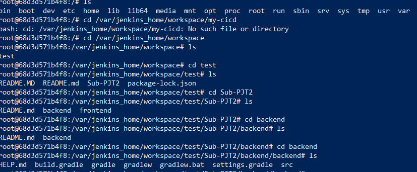

- ec2에 도커에 mysql 설치 후
- test connection에 host 부분에 현재 ec2 인스턴스의 ip를 입력하여 test connection 한다.
    - 아래는 테스트 성공하여 정상적으로 빌드되있고
    
    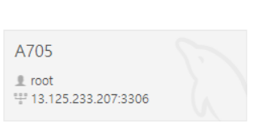
    

# SSAFY

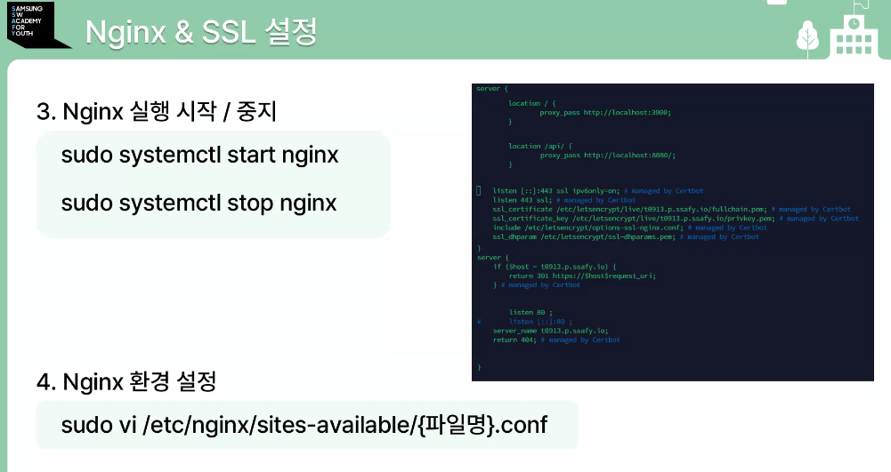

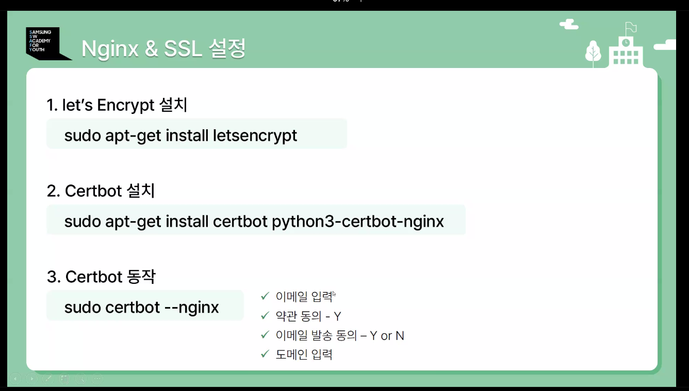

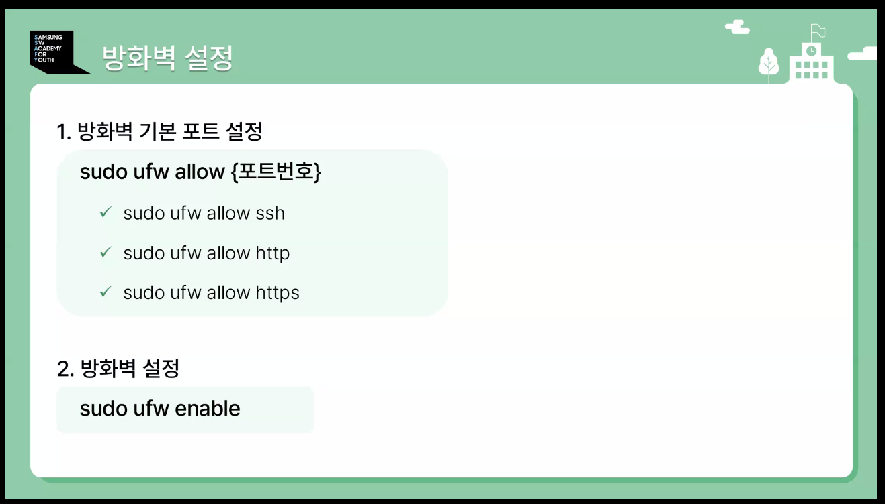

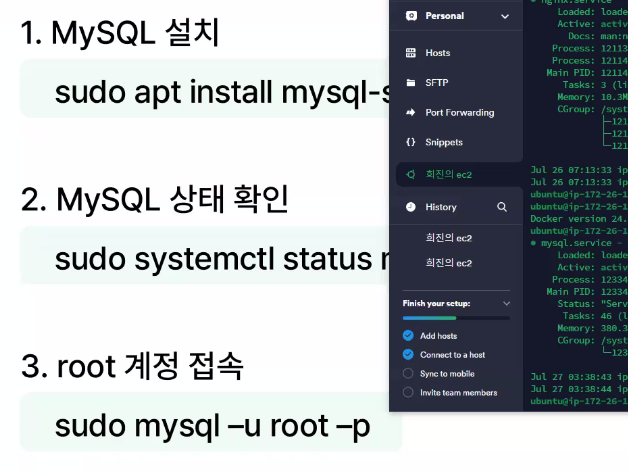

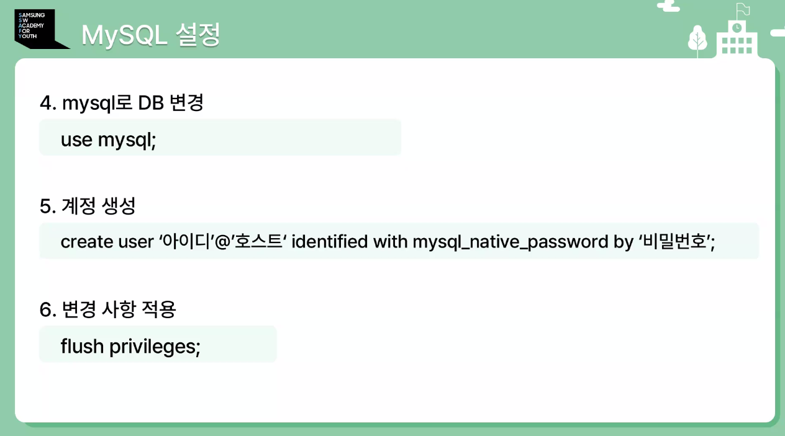

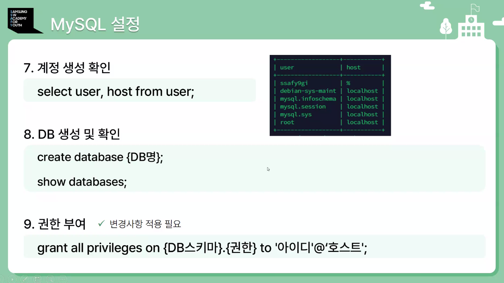

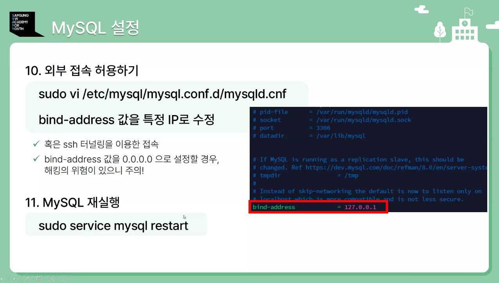

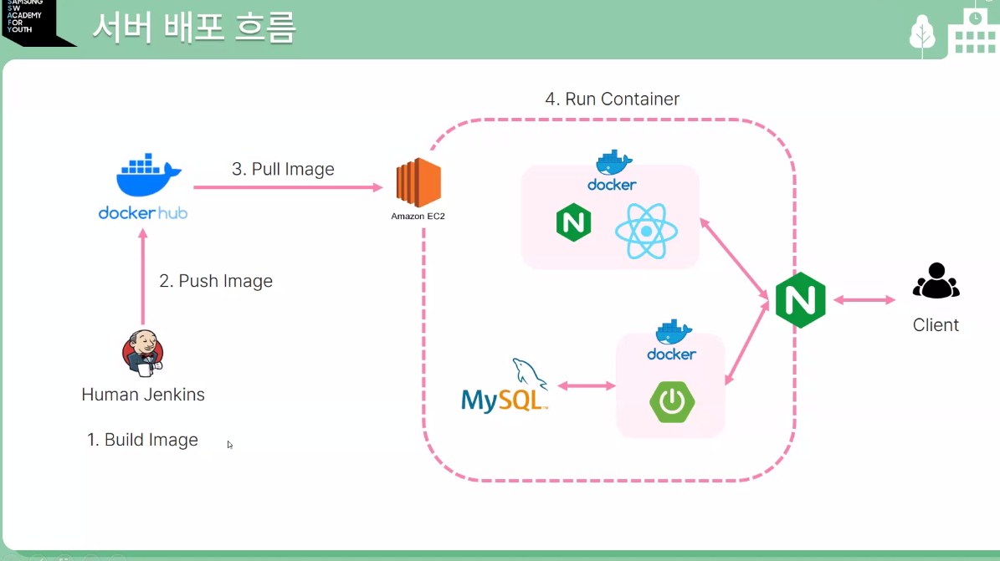

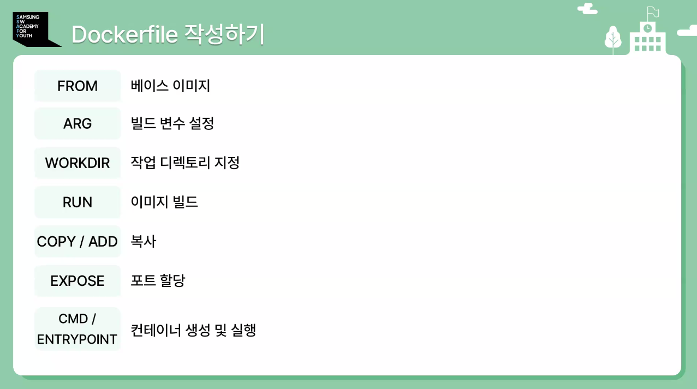

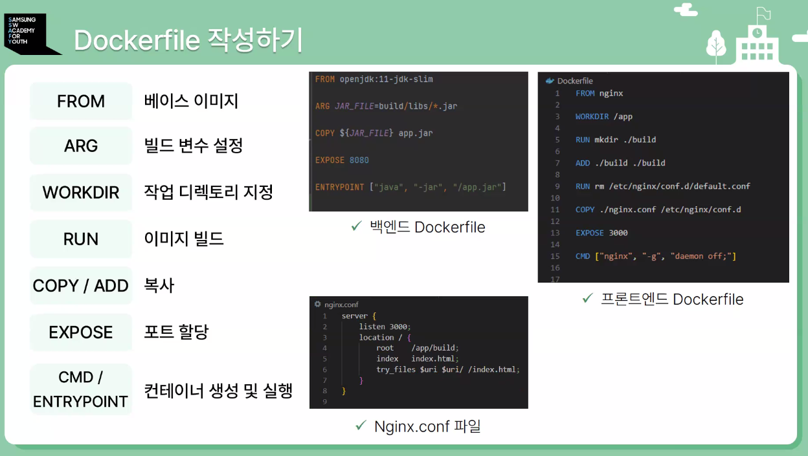

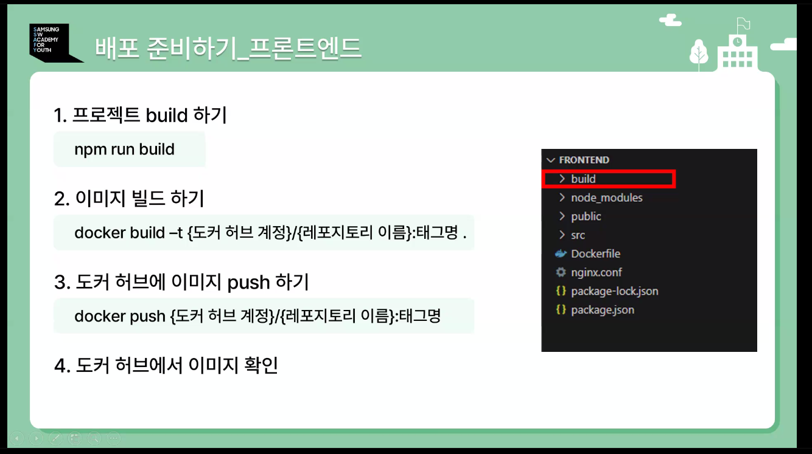

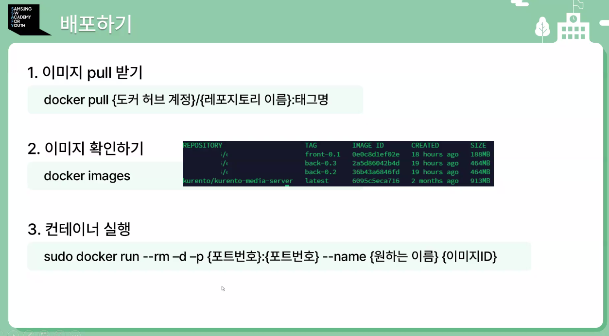

- ec2 내부에서 springboot가 mysql과 통신해야 할 때 설정

```powershell
spring.datasource.url=jdbc:mysql://<mysql_container_internal_ip>:3306/<database_name>
spring.datasource.username=<db_username>
spring.datasource.password=<db_password>
```

# 로그 트러블슈팅

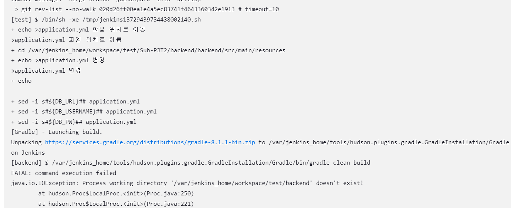

- 잠시 아래 설정 삭제 (jenkins)

```powershell
echo ">application.yml 파일 위치로 이동"
cd /var/jenkins_home/workspace/test/Sub-PJT2/backend/backend/src/main/resources

echo ">application.yml 변경"
echo $DEV_DB_URL
sed -i "s#\${DB_URL}#$DB_URL#" application.yml
sed -i "s#\${DB_USERNAME}#$DB_USER#" application.yml
sed -i "s#\${DB_PW}#$DB_PASSWOR#" application.yml
```
