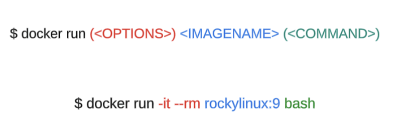

# 1. 개념

출처

[따라하면서 배우는 Docker 입문 튜토리얼](https://www.lainyzine.com/ko/article/docker-tutorial/)

- 인프라의 구성을 코드로 관리
    - Infrastructure as Code
    - Docker에서는 **`Dockerfile`**에 인프라의 구성 정보를 기술.
    - 이를 통해 컨테이너의 바탕이 되는 Docker 이미지를 생성한다.

- 에자일형 개발 스타일
    - 기능을 추가할 때마다 애플리케이션을 제품 환경에 배포
    - 시스템 이용자의 피드백에 기초하여 그 다음에 개발할 기능을 결정한다.

## 컨테이너

- 호스트 OS 상에 논리적인 구획(컨테이너)를 만들고, 애플리케이션을 작동시키기 위해 필요한 라이브러리나 애플리케이션 등을 모아, **`별도의 서버인 것처럼`** 사용할 수 있게 만든 것.
- 여러 개의 컨테이너를 조합하여 하나의 애플리케이션을 구축 → MSA
    - MSA와 친화성이 높다.

### 호스트형 서버 가상화

- 하드웨어 상에 베이스가 되는 호스트 OS 설치, 호스트 OS에 가상화 소프트웨어를 설치 후, 가상화 소프트웨어 상에서 게스트 OS를 작동시킨다.
    - Oracle VM VirtualBox, VMware Workstation Player 등.
    - 호스트 OS상에서 게스트 OS 작동 → **`오버헤드`** 크다.

### 하이퍼바이저형 서버 가상화

- 호스트 OS 없이 하드웨어를 제어
- 가상 환경마다 별도의 OS가 작동 → 가상 환경의 시작에 걸리는 오버헤드 커진다.

<aside>
💡 컨테이너 기술은 이식성, 확장성이 좋은 환경에서 작동하는 것을 지향
가상화 기술은 서로 다른 환경을 어떻게 효율적으로 에뮬레이트하는지.

</aside>

# 도커

- 애플리케이션의 실행에 필요한 환경을 하나의 이미지로
- 다양한 환경에서 애플리케이션 실행 환경을 구축 및 운용하기 위함
- 도커는 인프라 환경을 컨테이너로 관리한다.
    - 이미지는 Docker Hub와 같은 리포지토리에서 공유한다.
        - 이미지가 컨테이너의 바탕이 된다.
- 애플리케이션의 **`이식성`**이 높다

## Docker

- 컨테이너형 가상화 기술을 구현하기 위한 상주 애플리케이션
- 애플리케이션을 조작하기 위한 명령행 도구
- 로컬 환경에 도커만 설치하면 가상환경 빠르게 구축 가능

### 컨테이너형 가상화 기술

- 가상화 소프트웨어 없이 운영 체제의 리소스를 격리해 가상 운영체제로 만듬
    - **`컨테이너`**
- 운영체제 위에서 가상화 소프트웨어를 사용해 게스트 운영체제를 만드는 방식
    - 호스트 운영 체제 가상화

## 명령어 정리

- docker ps
    - 실행되고 있는 컨테이너 목록
    
    <aside>
    💡
    
    1. CONTAINER ID: 컨테이너의 고유한 식별자인 컨테이너 ID
    2. IMAGE: 컨테이너가 실행되기 위해 사용된 Docker 이미지의 이름
    3. COMMAND: 컨테이너가 실행될 때 실행된 명령어 또는 프로세스
    4. CREATED: 컨테이너가 생성된 시간입니다. 날짜와 시간 형식으로 표시
    5. STATUS: 컨테이너의 상태를 나타냅니다. 예를 들어, "Up"은 컨테이너가 실행 중임을 나타냅니다. "Exited"는 이미 실행이 완료되어 종료된 상태
    6. PORTS: 호스트와 컨테이너 간의 포트 매핑 정보를 나타냅니다. 호스트의 포트와 컨테이너의 포트를 콜론(:)으로 구분하여 표시
    7. NAMES: 컨테이너에 지정된 이름을 나타냅니다. **`docker run`** 명령어에서 **`-name`** 옵션을 사용하여 이름을 지정, 이름이 지정되지 않은 경우에는 Docker가 자동으로 이름을 생성
    </aside>
    
- docker run
    - 위의 명령어로 실행된 것이 **`컨테이너`**
- docker run -it —rm 이미지네임 bash
    - 해당 버전으로 컨테이너 시작
    - rm이 붙으면 컨테이너가 종료될 때 컨테이너를 삭제함
        - 실제 환경에서는 rm 붙이면 박살날 듯한..
    
    
    
- 처음 실행하면 **`Unable to find image`**
    - 로컬에 지정한 이미지가 있는지 우선 확인
    - 없으면 searchDocker Hub (외부 이미지 저장소)에서 다운로드
        - **`이미지를 풀(pull) 받는다`**고 표현
    - 받은 이미지를 기반으로 bash 명령어 실행
    - 처음 실행한 이후에는 이미지가 있기 때문에 바로 컨테이너 실행 가능
    

## 컨테이너 생애주기

- 기본적으로
    - 생성 → 실행 → 종료 → 삭제

- 종료
    - 셸은 명시적으로 종료할 때까지 명령어를 기다린다.
    - docker stop
        - 컨테이너의 ID나 이름을 지정해주면 된다.
        - docker stop **`(NAMES OR ID)`**
    - exit
    - **`docker kill`**
        - 컨테이너 강제종료 가능
- 삭제
    - 종료 상태의 컨테이너를
        - **`docker rm`**

## Docker 이미지와 컨테이너

- 도커 이미지 하나로 여러 개의 컨테이너를 생성할 수 있다.
- docker run -it rockylinux:9 uname -a
    - 마지막 인자만 바꿔주기만 하면 다른 명령어도 실행 가능
    - whoami, locale, date ……
- docker run으로 실행한 명령어 하나가 하나의 컨테이너
    - 각각 독립적

- 이미지 다운
    - docker pull
    - docker impage pull (같은 명령어)

- 이미지 삭제
    - docker rmi
    - docker image rm

## Docker 이미지와 Docker Hub

- docker images
    - 현재 로컬에 저장된 이미지들 확인

- 유니온 마운트(Union mount)
    - 파일을 계층으로 나눠서 저장
- 도커 허브 (Docker Hub)
    - 원격 저장소

<아래 내용 참고>

[만들면서 이해하는 도커(Docker) 이미지: 도커 이미지 빌드 원리와 OverlayFS](https://www.44bits.io/ko/post/how-docker-image-work)

- 도커 허브를 기준으로 도커 이미지 이름은 <NAMESPACE>/<IMAGE_NAME>:<TAG> 형식
- docker pull nginx:latest
- nginx:latest의 정확한 이름 → library/nginx:latest
    - library가 도커 허브의 공식 이미지가 저장되어 있는 특별한 네임스페이스
    - 보통 이 자리에 사용자의 이름이 온다.
    - 네임스페이스 앞에는 슬래시로 구분된 도메인이 들어갈 수 있는데, 이 경우 도커 이미지 저장소(레지스트리의 주소)
        - `docker.io/library/nginx:latest`
            - 그럼 어떻게 이미지를 받아오는거냐..?
            - 도커 클라이언트의 **`기본 도커 레지스트리가 도커 허브(docker.io)`**

- 도커 이미지는 레이어들로 구성된다.
    - 이미지를 pull 받으면 레이어들은 독립적으로 저장.
    - 컨테이너 실행 시 레이어들을 올려 특정 위치에 마운트
    - 이미지에 속하는 레이어 → **`읽기 전용` (불변)**
    - 마지막에 컨테이너 전용 쓰기 가능한 레이어를 한층 더 쌓고
    - 컨테이너에서 일어나는 모든 변경사항을 레이어에 저장.

<aside>
💡 이미지는 불변이고 실제 컨테이너의 **`최상위 레이어에`** 컨테이너 쓰기 전용 레이어가 따로 생긴다.
각각의 컨테이너는 독립적이기 때문에,
고유한 쓰기 영역을 가지고 다른 컨테이너들끼리 서로 영향을 주지 않음

</aside>
