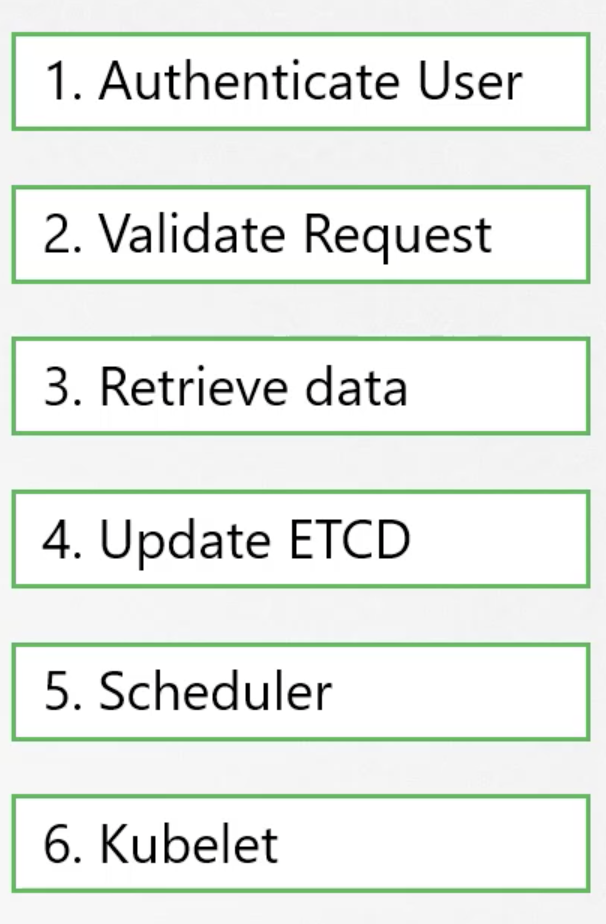
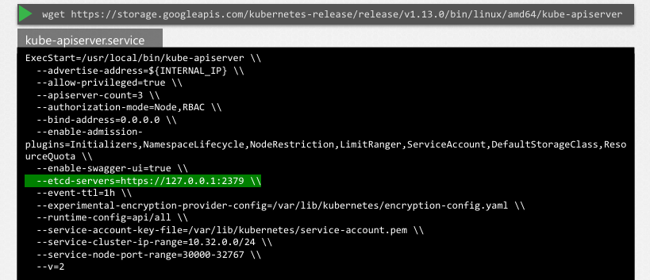
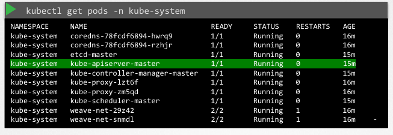

# kube-api

# 쿠버네티스 kube-apiserver 상세 정리

쿠버네티스의 가장 핵심적인 관리 구성 요소인 kube-apiserver에 대한 상세 내용

## 기본 역할 및 통신 방식

- 쿠버네티스의 주된 관리 구성 요소
- `kubectl` 명령어를 실행하면 해당 유틸리티는 실제로 kube-apiserver에 도달
- **요청 처리 순서:**
    1. **인증(Authentication):** 요청자를 확인
    2. **유효성 검사(Validation):** 요청 내용의 적절성을 검토
    3. **데이터 처리:** etcd 클러스터에서 데이터를 검색하거나 업데이트
    4. **응답:** 요청한 정보를 사용자에게 반환
- `kubectl` 없이 POST 요청을 통해 API를 직접 호출하는 방식도 가능
    - curl -X POST ….

---

## 포드(Pod) 생성 시나리오를 통한 동작 이해

- 포드 생성 요청 시 각 구성 요소가 API 서버를 중심으로 상호작용하는 구체적 과정
- 포인트는 **모든 요청이 kube-apiserver를 거쳐서 간다는 것**

1. **요청 접수:** API 서버가 요청을 받고 인증 및 유효성 검사 수행
2. **객체 생성:** 노드가 할당되지 않은 포드 객체를 생성
3. **etcd 기록:** 관련 정보를 etcd 서버에 업데이트
4. **사용자 통보:** 포드가 생성되었음을 사용자에게 알림
5. **스케줄러 감시:** **Scheduler**는 API 서버를 모니터링하다 노드가 없는 새 포드를 포착
6. **노드 배정:** 스케줄러가 적절한 노드를 식별하여 API 서버에 전달
7. **정보 갱신:** API 서버는 배정된 노드 정보를 etcd 클러스터에 업데이트
8. **Kubelet 지시:** API 서버는 해당 워커 노드의 **Kubelet**에 정보를 전달
9. **런타임 실행:** Kubelet은 컨테이너 런타임 엔진을 통해 이미지를 배포하고 포드를 생성
10. **상태 보고:** 생성 완료 후 Kubelet은 상태를 API 서버에 업데이트
11. **최종 반영:** API 서버는 최종 데이터를 다시 etcd 클러스터에 기록

---

## 핵심 특징 요약

- 클러스터 내 모든 변경 작업의 중심축 역할 수행
- **데이터베이스 독점권:** **etcd 데이터 저장소와 직접 상호작용하는 유일한 구성 요소**
- **중개 역할:** 스케줄러, 컨트롤러 매니저, 쿠블릿 등은 직접 etcd를 건드리지 않고 **반드시 API 서버**를 거쳐 업데이트를 수행

---

### 설치 및 설정 파라미터 (The Hard Way)

- **바이너리 운영:** 쿠버네티스 릴리스 페이지에서 다운로드하여 마스터 노드에 서비스 형태로 실행 가능
- **옵션:** 인증, 권한 부여, 암호화 등을 위해 다양한 파라미터를 사용
    - 각 구성 요소의 위치 파악 및 보안 모드 설정을 위해 옵션이 복잡함
    - **인증서(Certificates):** 구성 요소 간 보안 연결에 사용되며, 모든 컴포넌트는 관련 인증서를 보유함
    - **etcd-servers:** kube-apiserver가 접속할 etcd 서버의 위치를 명시하는 필수 옵션

---

### 기존 클러스터 설정 확인 방법

- 클러스터 구축 방식에 따라 확인 경로가 다름
- **kubeadm 사용 시:**
    - 마스터 노드의 kube-system 네임스페이스 내에 포드로 존재
    - 설정 파일 경로: /etc/kubernetes/manifests/kube-apiserver.yaml
- **직접 설치(Non-kubeadm) 시:**
    - 서비스 설정 파일 확인: /etc/systemd/system/kube-apiserver.service
- **프로세스 확인:**
    - 실행 중인 프로세스 목록 검색: ps -aux | grep kube-apiserver 명령어로 적용된 모든 옵션 실시간 확인 가능

