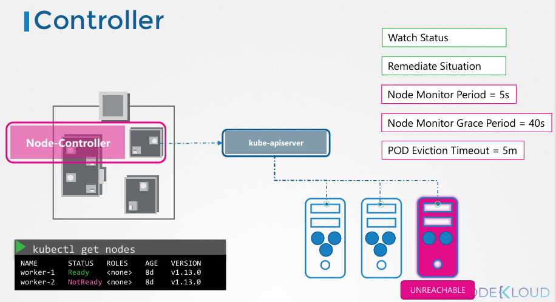

# kube-controller manager

## 컨트롤러의 기본 개념 및 비유

- **정의:** 시스템 내 다양한 구성 요소의 상태를 지속적으로 모니터링하고, 전체 시스템을 **원하는 작동 상태(Desired State)**로 유지하기 위해 필요한 조치를 취하는 프로세스
- **비유:** 마스터 선박(Master Ship) 내의 여러 부서나 사무실과 같음
    - **선박 관리 부서:** 새로운 배의 도착, 기존 배의 이탈 또는 파손 등을 모니터링하고 조치함
    - **컨테이너 관리 부서:** 손상되거나 배에서 떨어진 컨테이너를 처리함
- **작동 원리:** 지속적으로 상태를 감시하고 상황을 개선하기 위한 조치를 수행

---

## 주요 컨트롤러 예시

### **노드 컨트롤러 (Node Controller)**

- 노드의 상태를 모니터링하고 애플리케이션이 계속 실행되도록 조치
- **작동 메커니즘 (kube-apiserver를 통해 수행):**
    1. **상태 확인 주기:** 5초마다 노드의 상태를 체크함
    2. **접근 불가 판정 (Grace Period):** 노드로부터 하트비트(Heartbeat)가 중단되면 40초 동안 대기 후 '접근 불가(Unreachable)' 상태로 표시함
    3. **제거 및 재배치 (Eviction):** 접근 불가 표시 후 다시 돌아오도록 5분(Eviction Timeout)을 기다림. 복구되지 않을 경우 해당 노드에 할당된 포드를 제거하고 건강한 노드에 다시 프로비저닝함

### **B. 복제 컨트롤러 (Replication Controller)**

- 레플리카셋(Replica Set)의 상태를 모니터링
- 설정된 포드의 개수가 항상 유지되도록 보장함
- 포드가 죽을 경우 새로운 포드를 생성함

### **C. 기타 컨트롤러**

- Deployment, Service, Namespace, Persistent Volume 등 쿠버네티스의 거의 모든 지능형 구조는 개별 컨트롤러를 통해 구현됨
- 사실상 쿠버네티스의 수많은 기능을 수행하는 **두뇌** 역할

---

### 3. 패키징 및 설치 방식

- **통합 프로세스:** 수많은 컨트롤러는 **Kube Controller Manager**라는 단일 프로세스 내에 패키징되어 있음
- **설치:** 쿠버네티스 릴리스 페이지에서 바이너리를 다운로드하여 마스터 노드에서 서비스 형태로 실행

### **주요 실행 옵션**

- **사용자 정의 설정:** 앞서 언급한 노드 컨트롤러의 기본 설정값들을 옵션으로 전달 가능
    - `-node-monitor-period=5s`
    - `-node-monitor-grace-period=40s`
    - `-pod-eviction-timeout=5m0s`
- **컨트롤러 선택:** `-controllers` 옵션을 사용해 활성화할 컨트롤러를 지정할 수 있음 (기본값은 전체 활성화)

---

### 4. 기존 클러스터 설정 확인 방법

구축 방식에 따라 설정 확인 경로가 상이함

- **kubeadm 사용 시:**
    - 마스터 노드의 `kube-system` 네임스페이스 내에 포드로 실행
    - 설정 파일 경로: `/etc/kubernetes/manifests/kube-controller-manager.yaml`
- **직접 설치(Non-kubeadm) 시:**
    - 서비스 디렉터리 내의 `kube-controller-manager.service` 파일 확인
- **공통 확인:**
    - 실행 중인 프로세스 목록 확인: `ps -aux | grep kube-controller-manager` 명령어로 현재 적용된 모든 옵션 확인 가능
