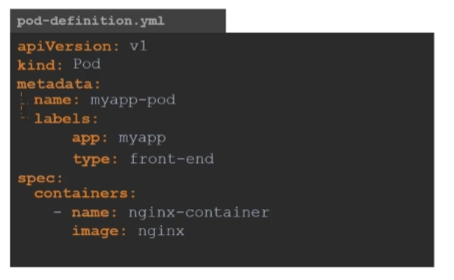

# Pods with YAML

- 루트 노드에 대한것
- 구성 파일에 반드시 있어야 한다.

## 정의 파일

- yaml파일 답게 들여쓰기가 중요
- apiVersion
- kind
    - Pod, ReplicaSet, Deployment, Service 등
- metadata
    - name과 labels가 자식 요소
    - labels 아래에는 키-값 쌍 자유롭게 추가 가능
- spec
    - 여러 개의 파드가 있을 수 있기 때문에 container가 아닌 containers
    - 객체마다(Pod, Service …) 형식이 달라서 공식 문서를 참조하라
    -
