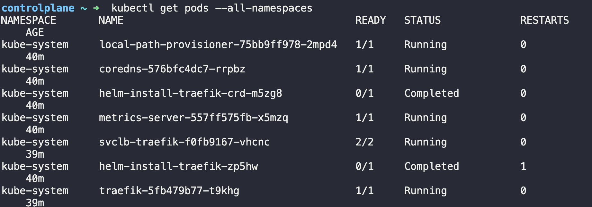

# Namespaces

태그: 2-42

- Create a POD in the `finance` namespace.
    
    ```yaml
    kubectl run redis --image=redis -n finance
    ```
    

- Which namespace has the `blue` pod in it?
    
    
    

- What DNS name should the `Blue` application use to access the database `db-service` in the `dev` namespace?
    - 다른 네임스페이스에 있는 경우 FQDN 사용해야함
    - (공식문서)
        - If you want to reach across namespaces, you need to use the fully qualified domain name (FQDN).
            - <service-name>.<namespace-name>.svc.cluster.local
