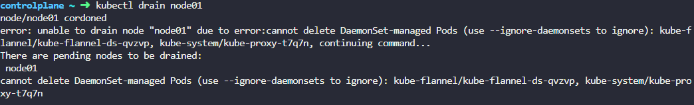
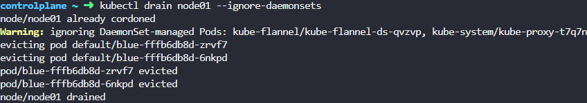

# OS Upgrades

- We need to take `node01` out for maintenance. Empty the node of all applications and mark it unschedulable.
    
    
    
    - 그냥 drain 명령어를 쳤을 때 daemonset을 지우지 못한다고 명령어가 발생
    - 설명에 따라서 코드를 수정
    
    ```bash
    kubectl drain node01 --ignore-daemonsets
    ```
    
    
    
    - pod가 evicted 되는 것까지 확인

- The maintenance tasks have been completed. Configure the node `node01` to be schedulable again.
    
    ```bash
    kubectl uncordon node01
    ```
