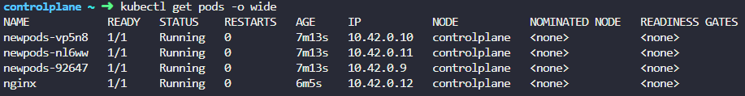

# Pods

태그: 2-27

- How many pods exist on the system
    
    ```bash
    kubectl get pod
    ```
    
- Create a new pod with the nginx image
    
    ```bash
    kubectl run nginx --image=nginx
    # run : 새로운 리소스를 생성하는 명령어
    ```
    

- What is the image used to create the new pods?
    
    ```bash
    kubectl describe pod <pod name>
    ```
    

- Which nodes are these pods placed on?
    
    ```bash
    kubectl get pods -o wide
    ```
    
    
    
    - NOMINATED NODE : 스케줄링 관련 정보
        - Pod가 스케줄링 되기를 대기하는 노드
            - 자원이 부족해서 즈깃 스케줄링 되지 못한 pod들의 경우.
    - READINESS GATES : Readiness Probe와 관련된 기능?
        - 이건 아직 잘 모르겠어서 skip

- Delete the `webapp` Pod.
    
    ```bash
    kubectl delete pod webapp
    ```
    

### —dry-run=client는 익혀두기

- Create a new pod with the name `redis` and the image `redis123`.
    
    Use a pod-definition YAML file.
    
    ```bash
    kubectl run redis --image=redis123 -o yaml --dry-run=client > pod-definition.yaml
    # -o yaml : YAML 형식으로 출력
    # --dry-run=client : 실제 리소스를 생성하지 않고 클라이언트 측에서 명령어만 실행, 리소스 정의 출력
    
    kubectl apply -f pod-definition.yaml
    ```
    

- Now change the image on this pod to `redis`.
    
    ```bash
    kubectl edis pod redis # 이후 바꾸던지.
    
    kubectl set image pod/redis redis=redis # redis컨테이너의 image를 redis로 바꾼다.
    ```
