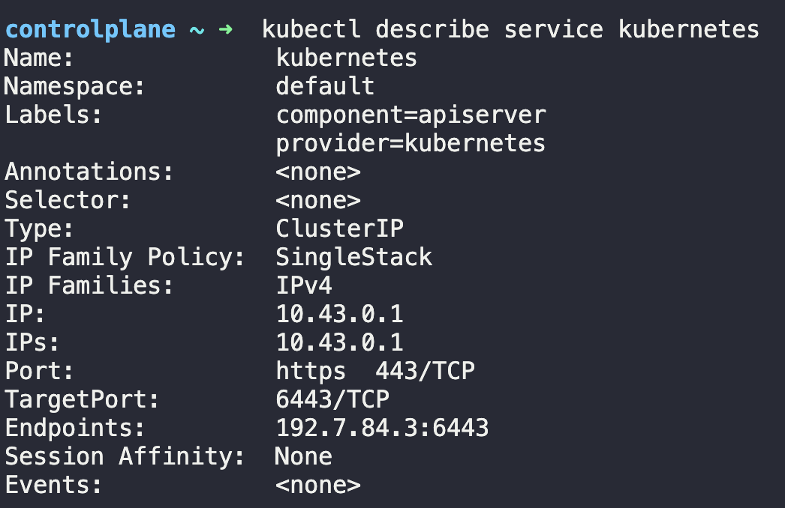

# Service

태그: 2-39

- What is the `targetPort` configured on the `kubernetes` service?
    
    
    

- Create a new service to access the web application using the `service-definition-1.yaml` file.
    
    ```yaml
    apiVersion: v1
    kind: Service
    metadata:
      name: webapp-service
      namespace: default
    spec:
      ports:
      - nodePort: 30080
        port: 8080
        targetPort: 8080
      selector:
        name: simple-webapp
      type: NodePort
    ```
