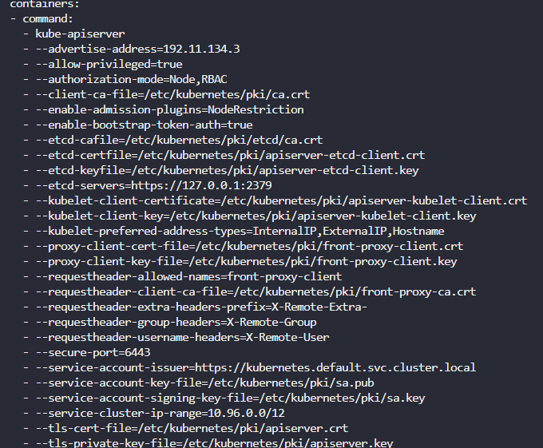
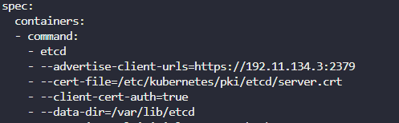

# View Certificates

- Identify the certificate file used for the `kube-api server`.
    - `Kube API` 서버에 사용되는 인증서 파일을 확인하려면, `kube-apiserver`의 구성 파일을 확인 일반적으로 `/etc/kubernetes/manifests/` 디렉터리에 있는 `kube-apiserver.yaml` 매니페스트 파일에 지정, 이 파일에는 인증서와 키 파일의 경로가 포함
    
    ```bash
    cat /etc/kubernetes/manifests/kube-apiserver.yaml
    ```
    
    
    

- Identify the Certificate file used to authenticate `kube-apiserver` as a client to `ETCD` Server.
    - 위의 정보에서 확인 가능

- Identify the key used to authenticate `kubeapi-server` to the `kubelet` server.
    - 위의 정보에서 확인 가능

- Identify the ETCD Server Certificate used to host ETCD server.
    
    ```bash
    cat /etc/kubernetes/manifests/etcd.yaml
    ```
    
    
    

- Identify the ETCD Server CA Root Certificate used to serve ETCD Server. ETCD can have its own CA. So this may be a different CA certificate than the one used by kube-api server.
    
    
    
- What is the Common Name (CN) configured on the Kube API Server Certificate?
    
    ```bash
    openssl x509 -in /etc/kubernetes/pki/apiserver.crt -text -noout
    ```
    
    - x.509 형식의 인증서 처리
    - -in으로 파일명 지정하고
    - -text로 사람이 읽을 수 있는 형식으로 변환하고
    - -noout은 인증서 자체는 출력하지 않도록
