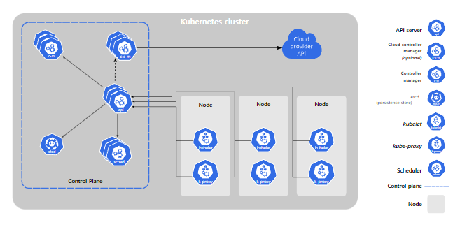

# Component

- 쿠버네티스 배포 → **`Cluster`**

## 쿠버네티스 구성요소

- worker machines 세트들로 이루어진다 → **`Node`**
- 모든 클러스터는 at least one worker node.
- worker node는 pod를 호스팅한다.
    - pod는 application workload의 구성요소.
- controle plane이 worker node와 pods를 관리한다.
- production 환경에서는 control plane이 여러 개의 node를 관리하고, 고가용성 / 내결함성을 제공

## Control Plane 구성 요소

- control plane의 구성 요소들은 클러스터에 대해서 global decision을 한다.
    - scheduling, detecting, responding
    - 새로운 pod를 실행하는 등.
- **단순성을 위해 user container와 같은 머신에서 동작하지 않는다는 것 같다.**

## kube-apiserver

- Kubernetes API를 노출하는 역할
- Kubernetes API server의 메인은 kube-apiserver
- 수평 확장되게 설계되었다 → balance traffic.

## etcd

- key value store
- 백업 저장소
    - 백업 저장소로 etcd를 사용하는 경우 백업 계획을 확인하라.

## kube-scheduler

- pod 중 node에 할당되지 않은 놈을 지켜보고 있다.

## kube-controller-manager

- 논리적으로 각각의 controller는 분리된 프로세스이지만, 복잡성을 줄이기 위해 컴파일은 single binary에서 되고 single process에서 실행된다.
    - 아직 잘 모르는 것들
        - Node controller
        - Job controller
        - EndpointSlice controller
        - ServiceAccount controller

## cloud-controller-manager

- cloud에 구체적인 control logic을 담았음
- 클러스터를 cloud provider’s api에 연결할 수 있고, cloud platform과 cluster와 상호작용하는 컴포넌트를 분리할 수 있음.
    - 아직 모르는 것들
        - Node controller
        - Route controller
        - Service controller

# Node Components

## kublets

- 각각의 node에서 실행된다
- container들이 pod에서 실행되는 것을 보장
- 다양한 메카니즘을 통해 PodSpec을 가져오며, 잘 실행되는지 확인
    - kubernetes에 의해 생성되지 않은 컨테이너는 관리하지 않음.

## kube-proxy

- 각 네트워크에서 실행되는 프록시
- 노드에서 네트워크 규칙을 유지
    - 클러스터 내부, 외부의 네트워크 세션에서 Pod로의 네트워크 통신을 허용

## Container Runtime

- 실행 및 수명 주기 관리
