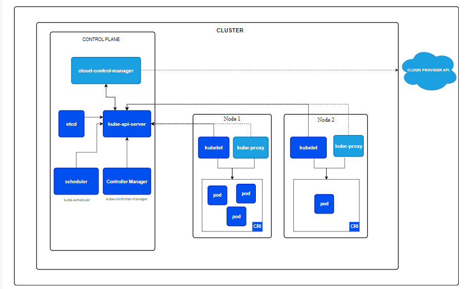
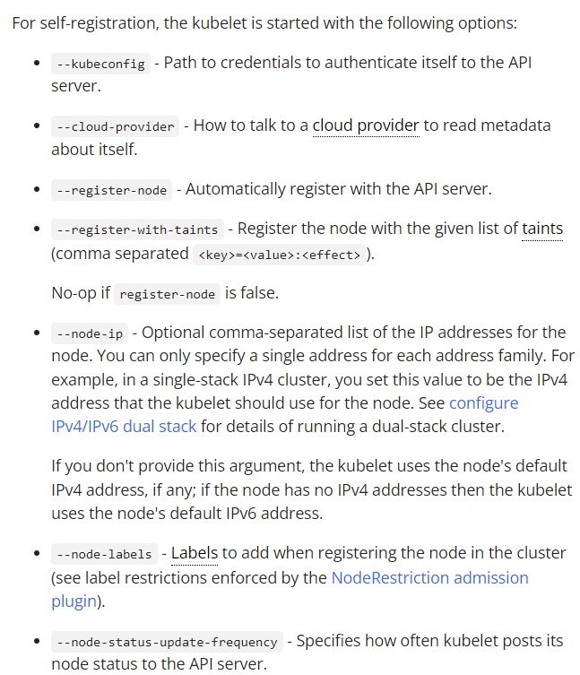
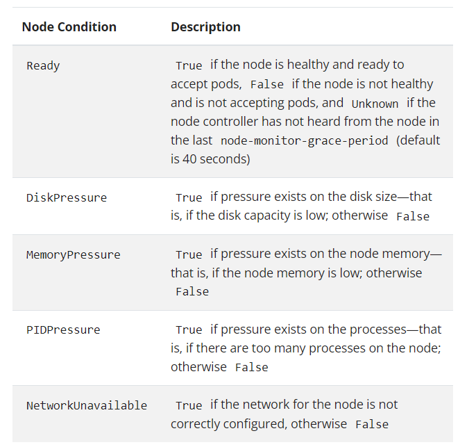

# Nodes

# Nodes

- k8s는 workload를 실행하기 위해 컨테이너를 Pod에 배치하고 이를 Node에서 실행
- 노드는 클러스터에 따라 virtual, physical일 수 있다.
- 각각 노드는 control plane이 관리하고 pod가 실행되기 위한 필수적인 서비스를 가지고 있음
- components
    - kublet
    - container runtime
    - kube-proxy
- Node를 API Server에 등록하는 방법
    - 노드의 kubelet이 스스로 컨트롤 플레인에 등록
    - 수동으로 Node 객체를 추가
- 등록하고 나면 control plane이 Node object가 유효한지 지속적 체크.
    - kublet이 API서버에 등록되었는지 확인하며, 정상적인지 아닌지에 따라 클러스터 활동에서 제외되거나, 포함되거나.

### name uniqueness

- 유일성 때문에 노드를 대체하거나 업데이트해야 할 경우, 기존 노드 객체를 API 서버에서 먼저 제거한 후 업데이트를 완료한 다음 다시 추가한다.

### self-registration of Nodes

- kubelet 플래그 `--register-node`가 true로 설정되어 있을 때(기본값), kubelet은 스스로를 API 서버에 등록하려고 시도. 대부분의 배포판에서 사용하는 권장 패턴.
    - 아래는 옵션 설명 참고.

### Address

- hostname : 노드의 커널로부터 report된 이름. kublet —hostname-override를 통해 재정의 가능
- ExternalIP : 클러스터 외부에서 접근 가능한 주소
- InternalIP : 클러스터 내부에서만.

### Conditions

- command-line tools을 사용하면 SchedulingDisabled도 포함된다.
- node에 문제가 생기면 controle plane이 자동으로 taints를 만든다.. 오?

### Heartbeat

- 노드의 heartbeat는 2가지
    - .status 업데이트
    - kube-node-lease 네임스페이스 내에 있는 Lease 객체
        - 이게 뭐지?
        - Lease는 .status에 비해 가벼운 리소스인데, 대규모 클러스터에서 업데이트가 성능에 미치는 영향을 줄일 수 있다고 한다.
- kublet이 노드의 .status를 생성, 업데이트하고 관련된 Lease를 업데이트 담당
    - 상태에 변화가 있거나, 일정 시간 동안 업데이트가 없는 노드의 .status를 업데이트
    - 업데이트 기본 간격 : **`5분`**
    - Lease 객체는 10초마다 업데이트되며 Node의 .status와는 독립적으로 움직인다.
        - Lease update가 실패하면 exponential backoff를 이용해 최대 7초 까지 재시도
- status는 노드의 종합적인 상태
- lease는 노드의 실시간 상태 확인 용도 정도인 듯
