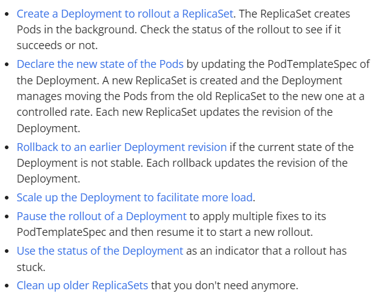
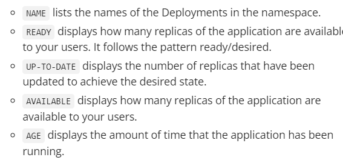
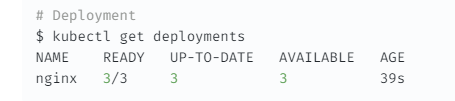
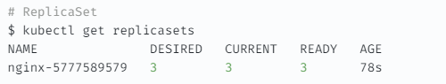
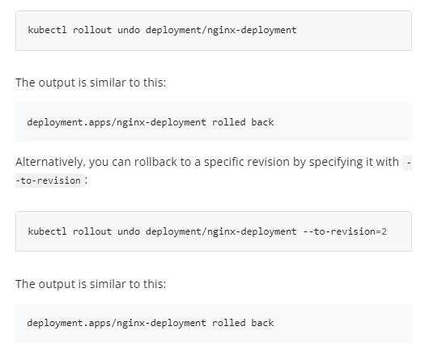
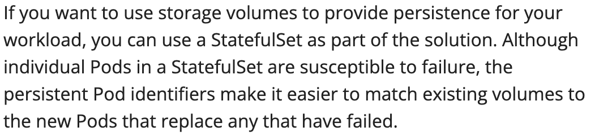
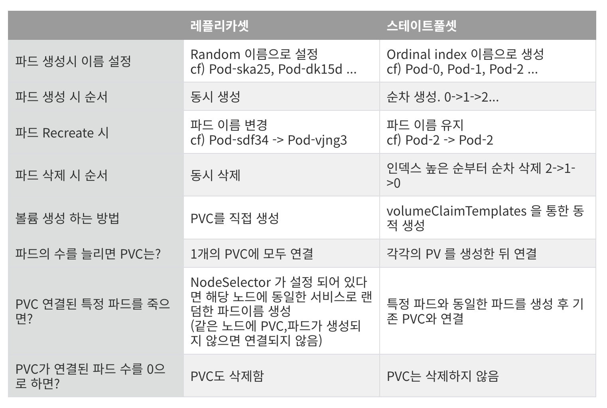
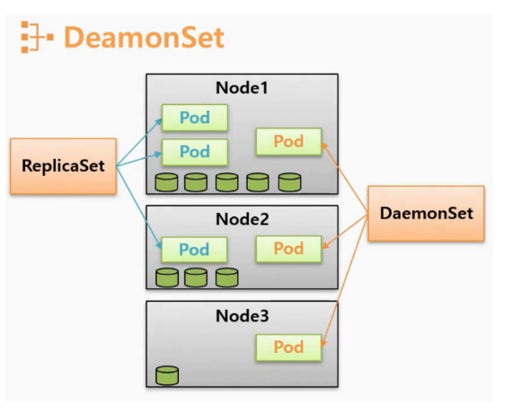
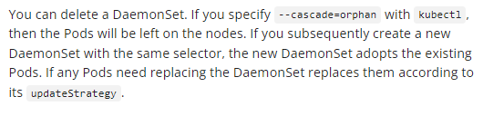

# Pod

태그: DaemonSet, Deployment, StatefulSet

https://kubernetes.io/docs/concepts/workloads/pods/

- Kubernetes에서 생성하고 관리할 수 있는 가장 작은 배포 가능한 컴퓨팅 단위
- 하나의 **`컨테이너 그룹`**
    - 즉, 하나의 Pod에 여러 개의 컨테이너가 위치할 수 있다.
        - 쉽게 말해 WAS와 DB를 묶은 하나의 POD가 존재할 수 있다는 것.
        - 만약 WAS, DB 중 어떤 것이 죽어버린다면?
            - Pod 내의 컨테이너가 개별적으로 관리되어 자동 재시작
        - 하나의 Pod에 여러 개의 컨테이너를 세팅하는 경우가 꽤 빈번하다고 한다.

- Pod의 공유 컨텍스트는 linux namespace, cgroups, 다른 격리 측면들로 구성.
- Pod는 두 가지 방식으로 이용
    - Pod당 하나의 컨테이너 → **일반적인 사용 사례**
    - Pod당 여러 개의 컨테이너
        - 컨테이너가 밀접하게 결합되는 특정 인스턴스에서만 사용

```yaml
apiVersion: v1
kind: Pod
metadata:
  name: nginx
spec:
  containers:
  - name: nginx
    image: nginx:1.14.2
    ports:
    - containerPort: 80
```

# Deployments

- 파드와 레플리카셋(ReplicaSets)에 대한 선언적 업데이트를 제공
- 원하는 상태를 정의하면, 디플로이먼트 컨트롤러(Deployment Controller)가 실제 상태를 원하는 상태로 변경

## 쓰임

- 별다른 설명이어서 이중에 의문점이 있는 경우를 찾아야 할 듯.



## 코드

- 참고할만한 블로그
    
    https://velog.io/@gentledev10/kubernetes-deployment
    
- deployment에 상태 확인
    
    
    



- 관리되는 replicaSet



```yaml
apiVersion: apps/v1
kind: Deployment
metadata:
  name: nginx-deployment
  labels:
    app: nginx
spec:
  replicas: 3 # 복제할 replica pod를 3개 배포
  selector: # 관리할 파드를 찾는다 : 파드 템플릿에 정의된 라벨(app: nginx) 선택.
    matchLabels:
      app: nginx
  template:
    metadata:
      labels:
        app: nginx
    spec:
      containers:
      - name: nginx
        image: nginx:1.14.2
        ports:
        - containerPort: 80
```

- 만들어지는 ReplicaSet의 네임은 **`[DEPLOYMENT_NAME]-[HASH]`**의 형태를 띄운다.

## Update

- 업데이트 중에 일정 수 이상의 파드가 다운되지 않도록 보장한다.
    - 기본적으로 75%가 가동되며, 최대 25%의 파드만 unavailable 상태.
    - 또한 desired number의 최대 125%까지만 pod를 생성하기도 한다.
    - if you look at the above Deployment closely, you will see that it **`first creates a new Pod, then deletes an old Pod, and creates another new one**.` It does not kill old Pods until a sufficient number of new Pods have come up, and does not create new Pods **`until a sufficient number of old Pods have been killed.`** It makes sure that at least 3 Pods are available and that at max 4 Pods in total are available. In case of a Deployment with 4 replicas, the number of Pods would be between 3 and 5.
    - update 값을 별도로 설정하지 않으면 rolling update 방식.

## Rollover

- 쉽게 말해 롤아웃이 진행되는 동안 디플로이먼트 업데이트하면, **[롤아웃 진행중이던]** 파드 싹 다 죽이고 새로운 버전 시작한다.

## RollBack

- Deployment의 Roll-out 기록을 확인할 수 있다.
    - 참고로 이 기록이 결국 kubernetes api 서버에 저장되어 롤아웃을 할 수 있다고 한다..
        - **`revisionHistoryLimit`** 설정 가능
    - `kubectl rollout history deployment/{Deployment 명}`
    
    
    

# ReplicaSet

- 항상 일정 수의 복제된 파드가 실행되도록 유지하는 것.
    - 가용성, 로드 밸런싱, 자동 복구, 스케일링
- Deployment와 사용되는 경우가 많으며, Deployment가 ReplicaSet을 생성하고 관리하게 된다.
    - Selector → 레플리카셋이 관리할 파드를 식별하는 기준
    - Number of Replicas
    - Pod Template
- 파드를 생성할 때, 라벨 관리에 주의해야한다.
    - 기본 파드를 만들 때 레플리카셋의 선택자와 일치하지 않는 라벨을 가지지 않도록 주의
        - 왜? 의도하지 않게 레플리카 셋이 해당 파드를 관리할 수도 있기 때문.
        - 의도하게 관리하도록 하자.
            - 레플리카셋이 자신의 템플릿에 명시된 파드만을 소유하도록.

### 코드

```yaml
apiVersion: apps/v1
kind: ReplicaSet
metadata:
  name: frontend
  labels:
    app: guestbook
    tier: frontend
spec:
  # modify replicas according to your case
  replicas: 3
  selector:
    matchLabels:
      tier: frontend
  template:
    metadata:
      labels:
        tier: frontend
    spec:
      containers:
      - name: php-redis
        image: us-docker.pkg.dev/google-samples/containers/gke/gb-frontend:v5
```

# StatefulSet

- 파드마다 각각 다른 스토리지를 사용해 각각 다른 상태를 유지하기 위해서는 **스테이트풀셋 (StatefulSet)** 리소스를 사용
- Deployment와 비교
    - Deployment는 고유 식별자가 없고, StatefulSet은 존재
        - 아래 이미지와 같이 Pod-해시, Pod-해시.. 인 반면 StatefulSet은 Pod-0, Pod-1과같이 된다.
        - Deployment에서 새로운 Pod를 생성한다 하면 **무작위 해시값이 들어가기 때문에 PV에 대한 지속성을 유지하지 못함**
        - 그런데 StatefulSet은 -0, -1.. 등 새로 생성되더라도 전용 PVC를 그대로 이용할 수 있음.
        - DB같은 서비스에 적합
        
        
        
    - 순서 유지, 영구적인 스토리지 필요 여부에 따라 Deployment와 StatefulSet 사용 고려
        - 대체 가능, 빠른 확장 → Deployment
        - 대체 불가능, 영구적, 순서 유지 → StatefulSet
    
    https://nearhome.tistory.com/107
    
    
    

- **스토리지 프로비저닝**: 특정 Pod의 스토리지는 요청된 스토리지 클래스에 따라 **PersistentVolume Provisioner**에 의해 프로비저닝되거나, 관리자가 미리 프로비저닝해야 함
- **볼륨의 유지**: StatefulSet을 삭제하거나 크기를 줄여도, StatefulSet과 연관된 볼륨은 삭제되지 않음. 이는 데이터 안전성을 보장하기 위한 조치이며, 일반적으로 모든 관련 StatefulSet 리소스를 자동으로 삭제하는 것보다 더 중요한 일
- **헤드리스 서비스 요구**: StatefulSet은 Pod의 네트워크 식별을 담당하는 헤드리스 서비스**`(Headless Service)`**가 필요, 이 서비스를 만드는 것은 사용자의 책임
    - **헤드리스 서비스 사용 시**: 각 Pod에 대한 개별 DNS 레코드를 제공하여, Pod 간의 직접 통신과 상태 유지 애플리케이션에서의 개별 Pod 접근하기 용이하게 한다.
        - Q. master-replica 같은 곳에 사용한다는 건가?
    - 헤드리스를 사용하지 않으면 cluster-ip를 통해 개별 파드에 접근하게 되고 개별 파드끼리의 통신을 원활하게 보장하지 못한다는거 같음.
- **Pod 종료 보장 없음**: StatefulSet이 삭제될 때 Pod의 종료에 대한 보장을 안함
    - StatefulSet 내의 Pod를 순서대로 안정적이고 우아하게 종료하려면 삭제 전에 StatefulSet의 크기를 0으로 줄이는 것이 좋다.
- **롤링 업데이트 중 문제 발생 가능성**: 기본 Pod 관리 정책(Pod Management Policy)으로 **OrderedReady**를 사용할 때, 수동 개입이 필요한 깨진 상태에 빠질 수 있다.
    - 이거는 순서를 유지하는 업데이트를 했을 때, 1번이 업데이트가 다 안되는 경우 뒤에거는 못한다는 거다. 그래서 별도의 방안이 필요하다는 것.
        - Partitioned Rolling Update : 부분적 업데이트 가능.

### Stable Stroage

- Pod는 하나의 PVC를 받는다.
- 어떤 Pod가 스케줄링될 때 volumeMount는 해당 Pod의 PVC와 연결된 PV와 마운트.
- Pod Or StatefulSet이 삭제될 때, PVC와 연관된 PV는 삭제되지 않는다.
    - PV는 수동 삭제해야함

### Parallel Pod Managemnt

- Pod 병렬 생성, 종료 가능.
    - 이 경우는 **`스케일링에만.`** 업데이트는 x
    - StatefulSet의 순서 보장이 필요하지 않은 경우에만 사용 선호

## 코드

```yaml
apiVersion: v1
kind: Service
metadata:
  name: nginx
  labels:
    app: nginx
spec:
  ports:
  - port: 80
    name: web
  clusterIP: None
  selector:
    app: nginx
---
apiVersion: apps/v1
kind: StatefulSet
metadata:
  name: web
spec:
  selector:
    matchLabels:
      app: nginx # has to match .spec.template.metadata.labels
  serviceName: "nginx"
  replicas: 3 # by default is 1
  minReadySeconds: 10 # by default is 0
  template:
    metadata:
      labels:
        app: nginx # has to match .spec.selector.matchLabels
    spec:
      terminationGracePeriodSeconds: 10
      containers:
      - name: nginx
        image: registry.k8s.io/nginx-slim:0.24
        ports:
        - containerPort: 80
          name: web
        volumeMounts:
        - name: www
          mountPath: /usr/share/nginx/html
  volumeClaimTemplates:
  - metadata:
      name: www
    spec:
      accessModes: [ "ReadWriteOnce" ]
      storageClassName: "my-storage-class"
      resources:
        requests:
          storage: 1Gi
```

## **Volume Claim Templates**

- `.spec.volumeClaimTemplates` 필드를 설정하여 PersistentVolumeClaim을 생성할 수 있다.
- 다음 두 가지 조건이 충족될 때 가능
    1. **지정된 StorageClass**가 동적 프로비저닝(Dynamic Provisioning)을 사용하도록 설정된 경우
    2. **클러스터에 올바른 StorageClass와 충분한 사용 가능한 스토리지 공간이 있는 PersistentVolume**이 이미 존재하는 경우

# DaemonSet

- 클러스터의 노드에서 Pod의 복사본이 실행되도록 보장
- 특정 노드 또는 모든 노드에 항상 실행되어야 할 특정 파드를 관리한다.
    - 예를 들면 모니터링 툴.



- 그림과 같이 Pod를 Node에 하나씩 배포하는 개념.
- (DaemonSet) 삭제에 관하여
    - DaemonSet을 삭제 시, 기존 Pod들은 DamonSet의 소유자 레이블을 잃는다.
        - 근데 DamonSet을 삭제한다고 해서 DaemonSet안에 있는 Pod들이 삭제되는 것은 아니다. (kubectl delete pod)를 이용해서 직접 삭제해야 한다고 한다.
            
            
            
        - 교체 시에는 기존 Pod가 삭제된다고 하긴 함.
    - 삭제만 하는 경우는 사실상 DaemonSet 삭제 후 pod를 삭제해야 한다는 거처럼 들리는데, 궁극적으로 DaemonSet 삭제를 하는 이유가 무엇일까
