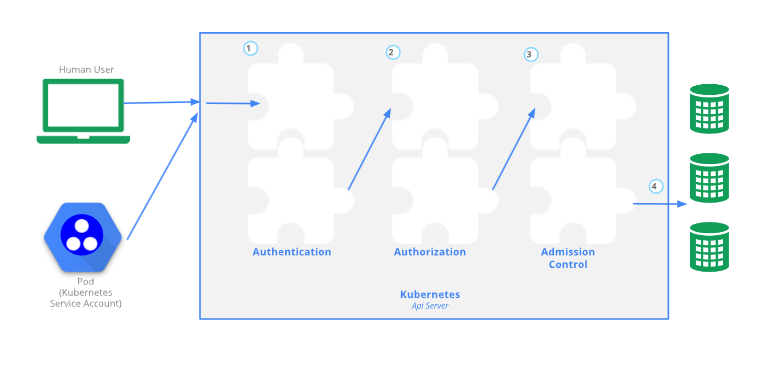

# Security

https://kubernetes.io/docs/concepts/security/controlling-access/



- 기본적으로 Kubernetes API 서버는 첫 번째 non-localhost 네트워크 인터페이스에서 TLS로 보호된 포트 6443에서 수신 대기
- 포트는 `--secure-port` 플래그로 변경할 수 있으며, 수신 대기하는 IP 주소는 `--bind-address` 플래그로 변경
- API 서버는 인증서를 제공
- 사설 인증 기관(CA)으로 서명되거나 일반적으로 인정된 CA와 연결된 공개 키 인프라를 기반
- 인증서와 해당 개인 키는 `--tls-cert-file` 및 `--tls-private-key-file` 플래그를 사용하여 설정
- 클러스터에서 **사설 인증 기관을 사용하는 경우,** 해당 CA 인증서의 사본을 클라이언트의 `~/.kube/config` 파일에 구성

- TLS가 설정되면 HTTP 요청은 인증 단계로 이동 (다이어그램 상 1단계)
- 클러스터 생성 스크립트 또는 클러스터 관리자는 API 서버에 하나 이상의 인증 모듈(Authenticator)을 실행하도록 설정
- 인증 모듈은 알아서 선택해서 사용가능

## Authentication

- 모든 Kubernetes 클러스터에는 두 가지 범주의 사용자
    - Kubernetes가 관리하는 서비스 계정
    - 일반 사용자

일반 사용자는 클러스터와 독립된 서비스가 다음과 같은 방식으로 관리하는 것으로 가정

- 관리자가 개인 키를 배포
- Keystone이나 Google 계정과 같은 사용자 저장소
- 사용자 이름과 비밀번호 목록이 포함된 파일

### 일반 사용자

- CA에서 서명된 유효한 인증서를 제시하는 모든 사용자는 인증된 것으로 간주
- Kubernetes가 인증서의 'subject' 필드에서 공통 이름(CN)을 사용하여 사용자 이름을 결정
    - 그 후 역할 기반 접근 제어(RBAC) 하위 시스템이 사용자가 특정 리소스에 대해 특정 작업을 수행할 수 있는 권한이 있는지 여부를 결정

### 서비스 계정

- Kubernetes API에서 관리되는 사용자
- 특정 네임스페이스에 바인딩되며, API 서버에 의해 자동 또는 수동(api 호출) 생성

### 대충 정리

- API 요청은 일반 사용자나 서비스 계정과 연결되거나, 익명 요청으로 처리
- 워크스테이션에서 `kubectl`을 입력하는 사람 사용자부터 노드에서 실행되는 kubelet, 컨트롤 플레인의 구성원에 이르기까지 클러스터 안팎의 모든 프로세스는 API 서버에 요청할 때 인증을 받아야 하며, 그렇지 않으면 익명 사용자로 취급
    - 익명 사용자는 HTTPS와는 별개 개념
    - 익명 사용자가 뭔가 매우 접근 제한이 되는 것은 맞는데 어느 경우에 익명인지는 모르겠네.

## 인증 방식

- static token file
    - API 서버가 커맨드 라인에서 `--token-auth-file=SOMEFILE` 옵션을 제공받으면, 이 파일에서 토큰을 읽어들인다
    - 토큰 파일은 최소 3개의 열로 구성된 CSV 파일이어야 함
        - 토큰 / 사용자이름 /사용자 UID / (선택) 그룹 ID.

- Bearer token
    - Authorization: Baerer ~

## RBAC

- 조직 내 개별 사용자의 역할에 따라 컴퓨터 또는 네트워크 리소스에 대한 접근을 규제
- `rbac.authorization.k8s.io` API 그룹을 사용하여 권한 부여 결정

```bash
kube-apiserver --authorization-mode=Example,RBAC --other-options --more-options
```

- 네 가지 종류의 Kubernetes 객체를 선언
- **Role**, **ClusterRole**, **RoleBinding**, **ClusterRoleBinding**
- 이 객체들은 `kubectl`과 같은 도구를 사용하여 설명하거나 수정할 수 있다.

### Role

- **Role**은 항상 특정 네임스페이스 내에서 권한을 설정
- Role을 생성할 때는 반드시 해당 Role이 속할 네임스페이스를 지정

### ClusterRole

- 네임스페이스가 없는 리소스
- Kubernetes object always has to be either namespaced or not namespaced; **`it can't be both.`**
