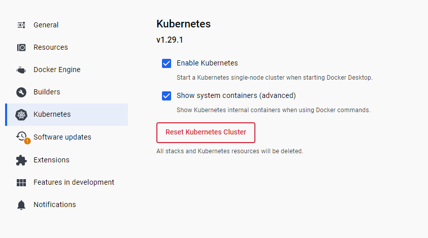

# 3장

# 로컬 쿠버네티스

## 미니큐브

- 물리 머신에 로컬 쿠버네티스를 쉽게 구축하고 실행할 수 있는 도구
- 하이퍼바이저가 필요함
    - 윈도우, 맥, 리눅스에 따라 다 다른 소프트웨어가 사전에 필요
    - 사내에서는 불가해서 쓸 일 없을 듯

## Docker Desktop (집에서)

- Kubernetes 활성화하는 칸 있음

- 컨텍스트 변경
    - kubectl config use-context docker-desktop
- 이하의 얘기는 모두 설정에 대한 내용이라 ㅓㄹ명 x

# 퍼블릭 클라우드 관리형 쿠버네티스 서비스

## GKE

- Google K8s Engine
    - 쿠버네티스 노드로 GCE(Google Computer Engine) 사용
-
