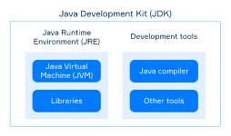

# JVM,JRE,JDK

# JVM

- javac
- Java Virtual Machine
- JVM은 물리 컴퓨터의 virtual simulation으로 Java 또는 java compatible한 bytecode를 실행시킨다.
- JVM은 코드와 real machine의 중재 역할을 한다고 보면 된다.
- 거의 모든 하드웨어와 소프트웨어 플랫폼에서 사용될 수 있기 때문에 platform-independent하다.

[JVM 자세한 설명 (1)](JVM%20%EC%9E%90%EC%84%B8%ED%95%9C%20%EC%84%A4%EB%AA%85%20(1)%20a31a1c2f272d4303a715724b6a74ab7b.md)

# JRE

- Java Runtime Environment
- 자바 실행환경이다.
- 컴파일된 JVM 프로그램들을 실행시키기 위해 반드시 필요한 컴포넌트들을 가지고 있음
    
    JVM자신과 Java Class Library(JCL), bytecode verifier, machine code generator, rt.jar
    
    *rt.jar : runtime library
    
    java class loader도 가지고 있음.
    
- JCL은 fundamental class, input/output, math package, collections, security, UI toolkit 등등의 중요 기능들을 제공한다.
    
    이 library들을 사용할 수 있음.
    
- 그리고 compile된 프로그램을 실행하면, JRE는 bytecode를 필요한 library와 연결하여 JVM에서 실행시킨다.

# JDK

- java development kit
- 자바 플랫폼에서 프로그램을 개발하기 위한 패키지
- 개발자들을 위한 툴과 프로그램 실행을 위한 JRE를 포함한다.
    
    Java compiler, debugger, archiver, documentation generator 등등
    
- 컴파일하고 실행하는 과정을 다시 보면 컴파일러는 소스코드를 `.class` 파일에 번역해서 집어넣고(bytecode), 그 컴파일된 프로그램을 JVM에서 실행을 시킨다.
- 만약 자바가 아닌 다른 JVM language를 사용한다고하면, JDK에 없는 다른 컴파일러를 다운로드 받아야한다.

<aside>
💡 Java 11전에는 자바 프로그램 구동시 JRE만 있어도 충분했다. 하지만 Java 11이 생기고나서는 대부분의  JVM 구현에서 JRE는 더이상 별도의 구성요소로 다운로드 받을 수 없게 되었음. JVM 11이상에서 프로그램을 실행하려면 JDK를 설치해야함.

</aside>

# 관계 요약



Hello.java → javac → Hello.class → java Hello.class → 실행

- 자바 보안 애초에 매우 강함
    - javac로 컴파일 시에 magic code 첫 코드에 삽입
        - class 코드 유효성 검증
    - class loader → bytecode verifier(여기서 매직코드 검사) → machine code generator → JVM
- JVM load 순서
    
    코드 예시
    
    ```java
    class Hello {
    	public static void main(String[] args) {
    		System.out.println("Hello world");
    	}
    }
    ```
    
    1. load
    2. static 멤버 초기화(main 제외한)
    3. 클래스 상속 관계 파악
        1. 맨위에 Object 있음. (`class Hello extends Object` 가 생략된 상태)
    4. 이후 JVM이 main 초기화해서 수행 - 당연히 static 쓰려면 걔네 먼저 초기화 되어있어야겠지..?
        1. System 클래스 체크
            1. 다시 rt.jar 체크
            2. System class확인 > 3가지 있음. out,in,error 
            3. 모든 메소드가 다 static임 → 다 가져옴(초기화)
            4. method area의 static에 올라감.
                1. out, in, error 각각 4바이트씩 할당(일단 null).
                    
                    이름, 주소값, 리턴타입의 정보가 있음.
                    
                2. Super class들의 생성자 호출하면서 eden 영역에 눈사람처럼 이어 붙이면서 공간 할당 받고 등록.
                    1. 여기서 중요한 건 부모 클래스까지 객체 이어붙여주지만 정체성은 맨처음 호출된 자식 클래스( 위 예시에서는 `PrintStream` class)
                    2. 또한 System class는 객체 생성한게 아님. 
        
        main 끝나면 내린다.
        
    
    이거 무한 반복
    
    - 처음 java Hello.class라고 하면 얘랑 관련된 라이브러리 쭉 다 가져온다.
    - 그다음 메인 실행되면서 필요한 녀석들 또 위 작업 반복하면서 다 가져옴.
    
    온갖 시스템이 연결되어 있어 항상 안전함을 보장하기 위해 계속함.
    
    단, 상속관계를 계속 파악하진 않는다. 한번 로드해온 클래스는 다시 로드하지 않음.
    
    ## 추가 질문
    
    - asterisk import(`import java.util.*`)를 사용하면 속도 저하가 생기느냐?
        - 아니다. 어차피 필요한 녀석만 동적으로 챙겨오니까 상관없다.
        - 그러면 왜 asterisk보다 import 각각 해주는 것을 추천할까
            - import만 보고도 클래스의 성격을 드러내주는 것을 권고하기 때문.
    
    ### 머신코드 - 질문. 아직 모름
    
    - JRE에서 MG로 machine code 생성해서 하는것 → JIT Compiler?
        - 인터프리터가 처음에는 생성하다가 MG가 자동으로 생성하나?
    - JVM은 binary code를 로드
