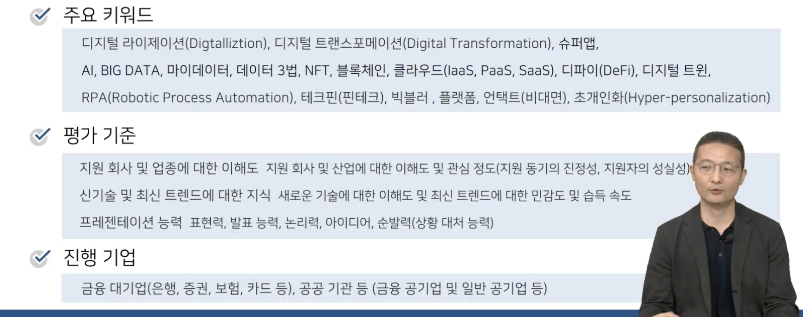
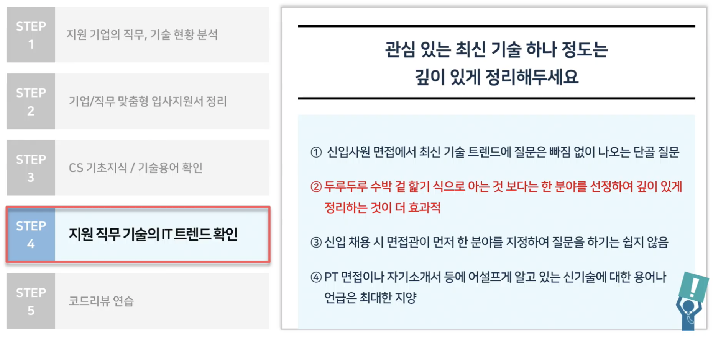
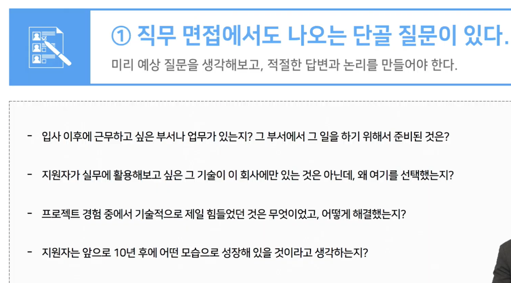
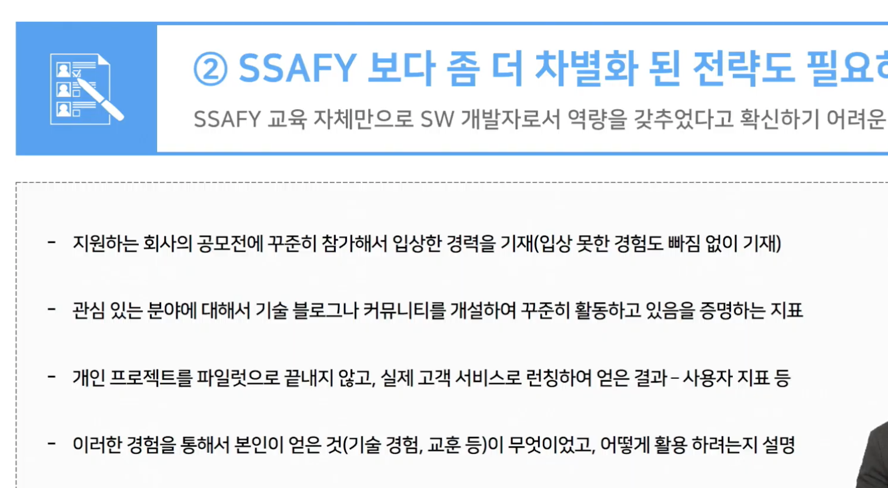
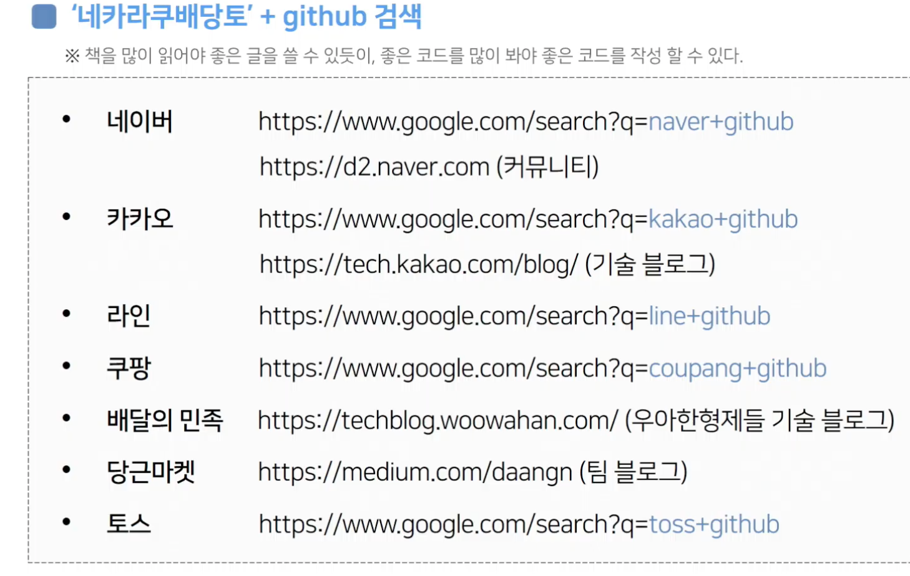
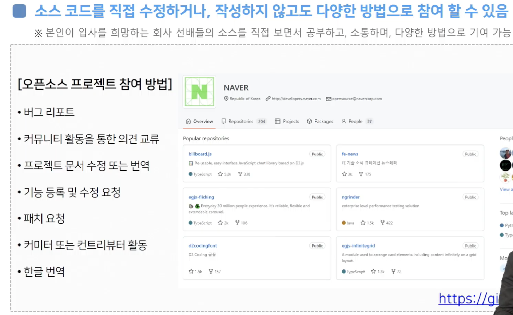
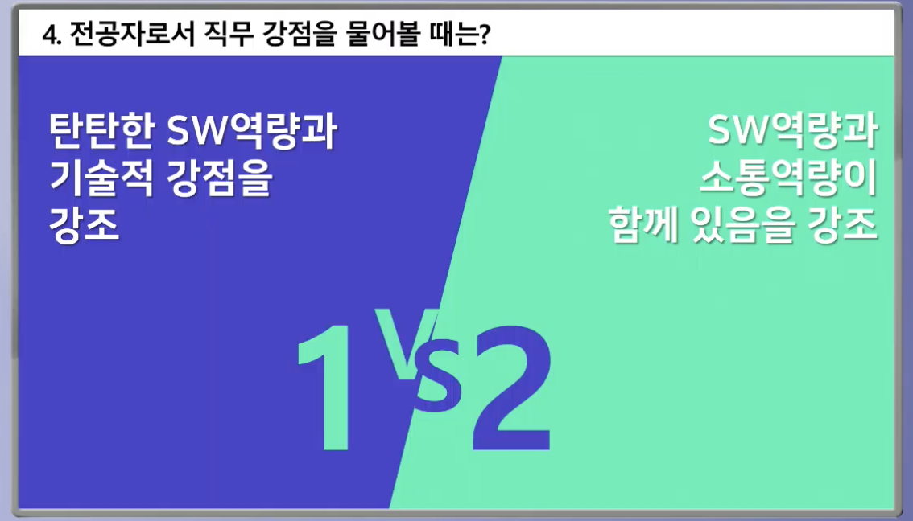

# 특강

태그: 직무면접

- 구체적인 목표와 방향 설정

- 기업의 입장에서 내가 이 사람과 오래 일할 수 있을까?
- 회사와 연관되있는 키워드들에 대한 이해 및 PT 연습

- 기술기업은 기술을 구현하는 것이 중요
    - 프로젝트에서 본인이 어느정도까지 구현했고 뭘 했는지?
    - 어떠한 노력을 했는지?

- 핀테크 기업은 기술을 융합하는 것이 중요하다
    - 그러니 기술을 구현하는 곳과 준비가 다르다

- 자소서에 쓴 프로젝트 흐름을 정리하고 각 과정에서 왜 그런식으로 했는지, 어떤 기술과 툴을 사용했고 왜 그렇게 했는지 정리했습니다.
    - 실제로 칭찬하셨다.

- 한 분야만큼은 깊이 있는 지식을 갖도록

- 둘다 양립의 관계임
