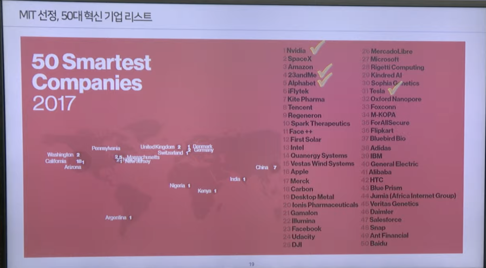
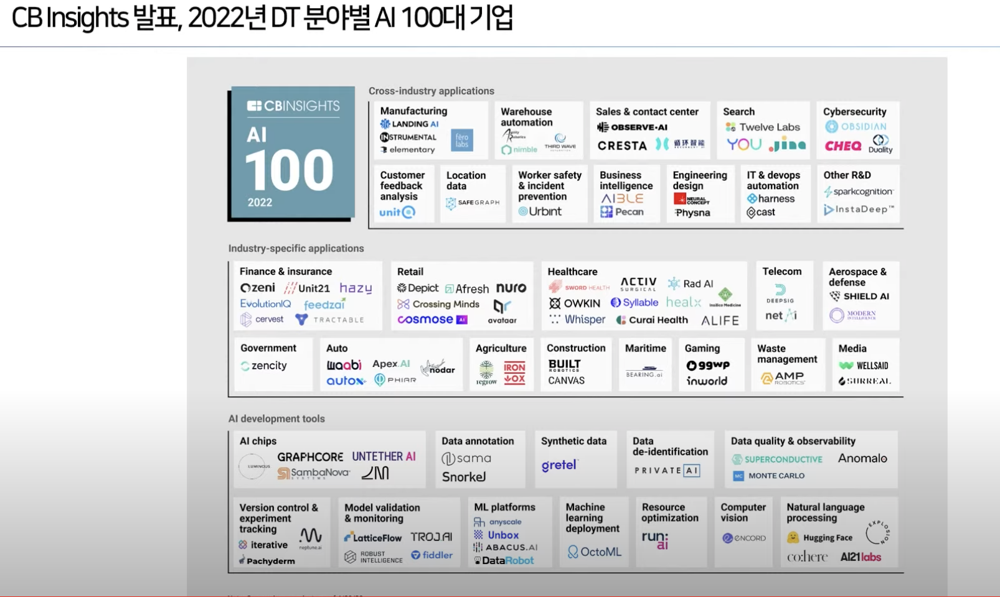

# 특강

태그: 인공지능, 직무면접

## 세계 100대 시가총액 기업 리스트

- NVIDIA가 AI 모두를 서포트한다
    - **`GPU`**때문에
    - 그래서 인텔이 시가총액 기업에 없다
        - 얘들은 CPU니까.

- 아이러니하게 시가총액 상위 기업들은 모두 **`SW`**
    - AI 측면에서 보면 AI 기술을 잘 보장하고 있는 회사들의 시총은 엄청나게 높다

## 1. AI가 가려고하는 방향성

- Neuromorphic computing에서
- Quantum computing으로
    - Q-bit (0과 1의 공존)

- Chat-gpt
    - 가지고 있는 기술들의 조합이다
        - 자연어 처리
        - 가상 어쩌고저쩌고..

### 2. 왜 이러한 것(뉴런 컴퓨팅, 양자….)이 등장했는지 이해해보자.

- 인공지능으로 인간이 최종적으로 해결하려는 것?
    - 결국 **`인류 미해결 과제`**
    - 인공지능이 해결해줄 수 있을 거다. 아래의 문제들에 대해서…
        - **`Life Scienece`**
            - 왜 늙지?
            - 노화의 원인?
            - 인간 500세 시대?

### 미래가 가려는 사업의 방향

- Google이 Youtube를 인수할 때 이미 미래를 본 것
    - 미디어 시스템의 방향을 예측한 것
- 향후에 우리에게 필요한 것, 우리가 어떠한 미래를 마주할 지에 대해 고민하는 자세
    - 생각의 확장이 필요하다고 느꼈다.
        - 자동차가 계속 지금 모습의 자동차로 남아있을 것인가?
        - 이 외에 항상 미래를 엮고 지금 남아있는 것이 후에도 남아있을 것인지에 대한 의문 필요
        - 그러면 스타트업 회사들에 대해서 안목을 볼 때 **`‘미래 유망성’`** 판단 필요

## 테슬라 AI데이 등 잘 찾아보자

- 아주 재밌대..

## MIT 선정 50대 기업 (2017)

- 2017년은 이세돌과 알파고의 대전
- nvidia 저 때 4달러였는데 지금 420달러임..
- 이제는 MIT에서 발표하지 않음
    - 주식 투자를 하도 많이해서

## 디지털 전환

- nvidia & bmw 협업하는 동영상

## CBinsights

- 우리나라 기업 하나 있다. Tweleve Labs
