# 0416Spring Framework

[Framework VS Library]

# SpringFramework - DI

- **`(Dependency Injection, 의존성 주입): 어차피 쓸거니까 미리 주겠다.`**
    - Controller, Service, Dao, DBUtil ….. 기존의 형태를 생각하면,
        - Controller가 new Service를,
        - Service가 new Dao를,
        - Dao가 new DBUtil을…
            - 계속해서 new를 하면 무한 생성이므로 SingleTon으로 생성해두었음.
                - **`필요할 때마다`** 갖다 쓰는 형태로.
                - 근데 필요할 때마다 갖다 쓰는게 아니라 **`미리 주는 형태(주입)`**로 해주겠다.
                    
                    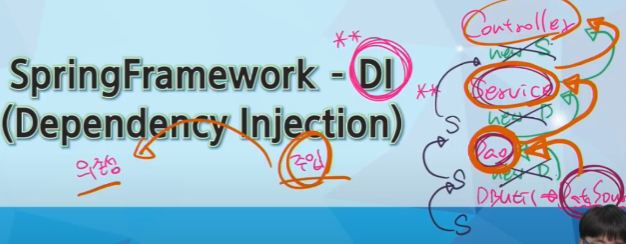
                    

# SpringFramework 등장 배경

- 자바진영에서 엔터프라이즈급 서비스가 필요해졌다.
- 점차 POJO + 경량 프레임워크
    - EJB서버와 같은 컨테이너 필요 없다.
    - 상당히 많은 라이브러리
    - 스프링 프레임워크는 모든 플랫폼에서 사용 가능 (Java라서)
    - 모든 분야에 적용이 가능한…
- EJB는 어려우니, EJB를 사용하지 않고 엔터프라이즈 어플리케이션을 개발하는 방법을 소개했다.
- POJO(Plain Old Java Object)
- 경량 프레임워크
    - EJB가 제공하는 서비스를 지원해 줄 수 있는 프레임워크 등장

# Spring Framework

- 개발자가 복잡하고 실수하기 쉬운 Low Level에 신경 쓰지 않고 **`Business Logic`** 개발에 전념할 수 있도록 해준다. (너가 만들고 싶은 기능에만 집중해라!)

- Spring Framework 구조(Spring 삼각형)
    - Enterprise Application 개발 시 복잡함을 해결하는 Spring의 핵심
        1. POJO(Plain Old Java Object)
            - **`특정 프레임워크나 기술에 의존적이지 않은`** 자바 객체
            - 특정 기술에 종속적이지 않아서 생산성, 이식성 향상
            - Plain : component interface를 상속받지 않는 특징
            - ld : EJB 이전의 java class를 의미
            - 테스트 용이, 객체지향 설계 자유롭게 적용 가능
        2. PSA(Portable Service Abstraction)
            - 환경과 세부기술의 변경과 관계없이 일관된 방식으로 기술에 접근할 수 있게 해주는 설계 원칙.
        3. IoC/DI (Inversion of Control(제어의 역전) / Dependency Injection)
            - DI는 유연하게 확장 가능한 객체를 만들어두고 객체 간의 의존관계는 외부에서 다이나믹하게 설정.
            - **`내가 미리 주겠다는 개념`**으로 생각하면 편하다
        4. AOP(Aspect Oreinted Programming)
            - 관심사의 분리를 통해서 소프트웨어의 모듈성을 향상
            - 공통 모듈을 여러 코드에 쉽게 적용가능

- Spring Framework 특징
    - 경량컨테이너
    - DI 패턴 지원
    - AOP
    - POJO
    - IoC
        - Servlet과  EJB에 대한 제어권이 Container로 넘어간다.
    - 트랜잭션 처리를 위한 일관된 방법을 제공
    - iBatis, myBatis, JPA … 많은 라이브러리

- SpringFramework Module
    
    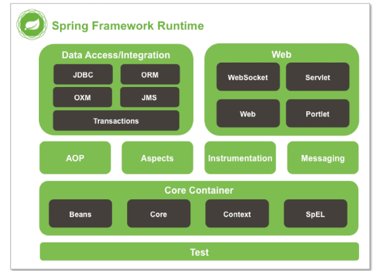
    
    
    
    - Core Container 없이는 아무것도 할 수 없다.
    - Context 쓰기 위해서는 Beans, Core, SpEL 다 필요..
    

# IoC & Container

- IoC(Inversion Of Control, 제어의 역행) : **`객체 간의 결합도를 떨어트릴 수 있다`**
    - 객체 간 강한 결합의 경우**`코드 변경의 연쇄성`**을 생각하면 될 듯
        
        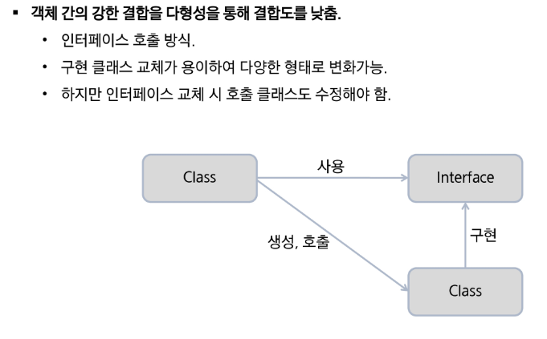
        
    - 필요할 때 만들어 쓰는게 아니라 **`만들어놓고 필요할 때 쓴다`**
    - 객체지향 언어에서 Object간의 연결 관계를 **런타임시에 결정**
    - 객체 간의 관계가 **`느슨하게 연결됨(loose coupling)`**
        - interface는 tight한 coup
        - ling을 느슨하게 연결해준다. (0417 배포 유라)
        - **`tight coupling`** : A가 바뀌면 B도 바뀐다.
    - IoC의 구현 방법 중 하나가 DI(Dependency Injection)

- 유형 : 크게 2가지로 구성
    - Dependency Lookup
        - 자바의 객체를 어디다 두었다가 필요할 때 Lookup : 찾아서 가져온다
        - JNDI Lookup
        - Connection Pooling(참고)
    - Dependency Injection : Lookup 코드도 안쓰고, 컨테이너가 설정.
        - Setter Injection
        - **`Constructor Injection`**
            - **`스프링 권장사항`**
        - Method Injection

- Container
    - 객체의 생성, 사용 소멸에 해당하는 라이프사이클을 담당
    - 라이프사이클을 기본으로 애플리케이션 사용에 필요한 주요 기능 제공
    - 기능
        - 라이프사이클 관리
        - Depndency 객체 제공
        - Thread 관리.
    
    - Container 필요성
        - 비즈니스 로직 외에 부가적인 기능들에 대해서는 독립적으로 관리되도록
        - 서비스 객체 사용 위해 **`Factory, Singleton 패턴 직접 구현 안해도 된다`**
    
- **IoC Container**
    - 오브젝트 생성, 관계설정, 사용, 제거.. **`코드 대신 컨테이너가 담당`**
    - 컨테이너가 **`코드 대신 오브젝트에 대한 제어권`** : IoC
    - BeanFactory, AplicationContext가 있다

- Spring DI Container
    
    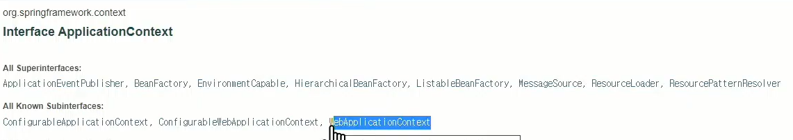
    
    위 api document 확인
    
    - Spring DI Container가 관리하는 객체를 **빈(Bean) - IoC 방식으로 관리**
        - **`스프링이 직접 생성과 제어를 담당하는 오브젝트만 빈`**이라고 부른다
        - 쉽게 말해 IoC의 범주 안에 들어와있는 애들만.
    - 빈들의 **생명주기를 관리하는 의미 : `빈팩토리(BeanFactory)`**
        - 일반적으로 얘 사용 안하고 ApplicationContext
    - 빈팩토리에 여러가지 기능들을 추가하여 **`ApplicationContext`**
        - BeanFactory 확장버전
    - 객체 생성, 주입.. 팩토리의 역할을 Spring Container가 한다.
    
- IoC 개념
    - 객체 간의 결합도를 떨어트리자 → loose coupling
        - 높으면 연쇄 변경으로 유지보수가 어려워지니까.
    - 객체 간의 강한 결합을 Assembler를 통해 결합도를 낮추자.
        - Factory 패턴이 적용된 것이 Container, 이 기능을 제공하는 것이 IoC 모듈
        - IoC 호출 방식
        - 팩토리 패턴의 장점을 더하여 어떠한 것에도 의존하지 않는 형태
        - Runtime에 클래스 간의 관계가 형성
        - **`Spring Container`**가 외부조립기
            
            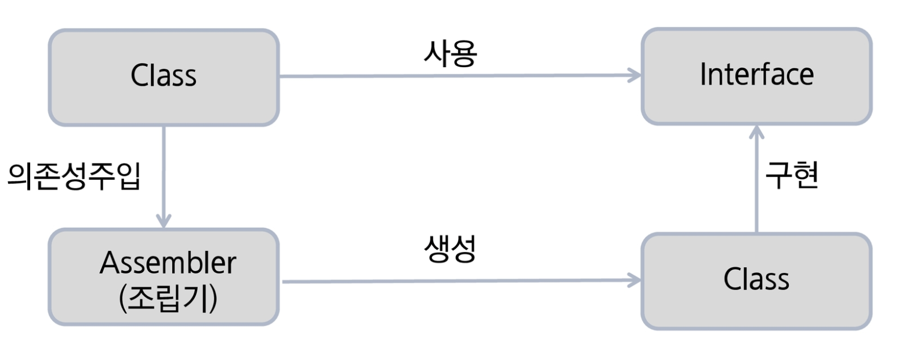
            
    - 스프링 컨테이너가 관리하고자 하는 객체가 누구니를 알려줘야 하는데
        - 관리방식 : xml, java class
    - Maven으로의 변화가 필요 : Spring으로 변화해도 jar가 없다.

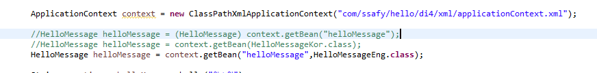

# Dependency Injection

- Singleton Bean
    - 스프링에선 **`기본적으로`** 싱글톤
    - 컨테이너가 항상 새로운 인스턴스를 반환하고 싶다? → scope를 property로 설정 =Scope(”singleton”)
        
        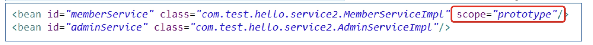
        
        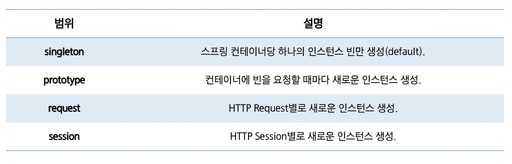
        

- 스프링 빈 설정
    - XML
    - Annotation
        - XML 규모가 커짐 → **관리 어렵다**.
        - 빈으로 사용될 클래스에 annotation하면 자동으로 빈 등록
        - **`오브젝트 빈 스캐너로 빈 스캐닝을 통해 자동 등록`**
            - 빈 스캐너 : 클래스 이름을 빈의 아이디로 사용, 클래스의 첫 이름만 소문자
            - **`component-scan`**
                - 빈으로 등록될 준비를 마친 클래스들을 스캔하여 빈으로 등록해주는 것
                
                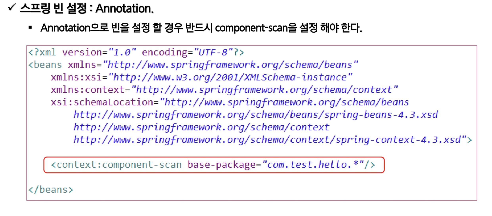
                
    
- DI - XML
    - Application에서 사용할 Spring 자원들을 설정하는 파일
    - 주입할 객체를 설정파일에 설정
        - **`<bean>`**

```xml
<bean id="memberService" class="com.test.MemberServiceImpl" scope="prototype">
	<property name="memberDao" ref="memberDao">
	</bean>
```

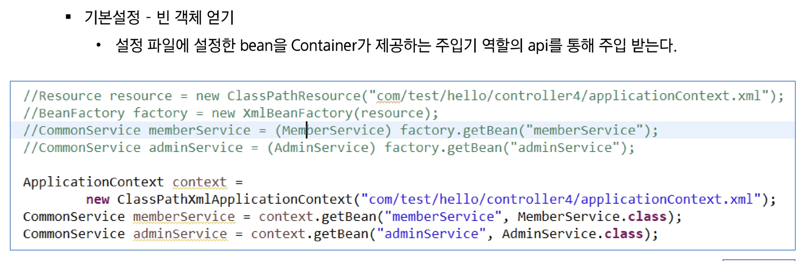

- 스프링 빈 의존관계(XML)
    - 객체 또는 값을 생성자를 통해 주입 받는다.
    - **`<construtor-arg>`**
        - 주입 받는 argument가 생성자로 접근하는 경우
            
            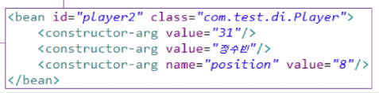
            
        - ref로 접근하는 경우
            
            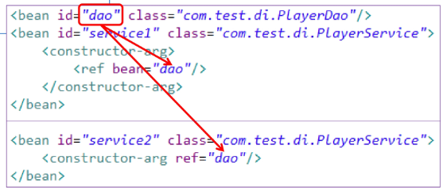
            
    
    - Property 이용 **`<property>` : set**
        - 아래와 같은 set 메서드를 가진 클래스가 있을 때
            
            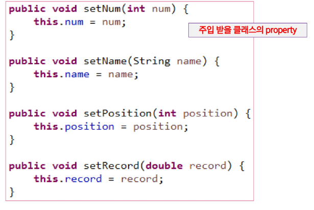
            
        - 아래와 같은 방법으로 설정한다
            
            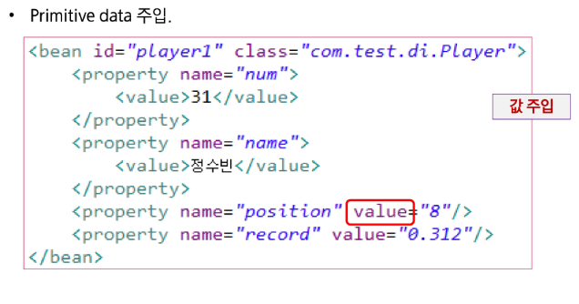
            
            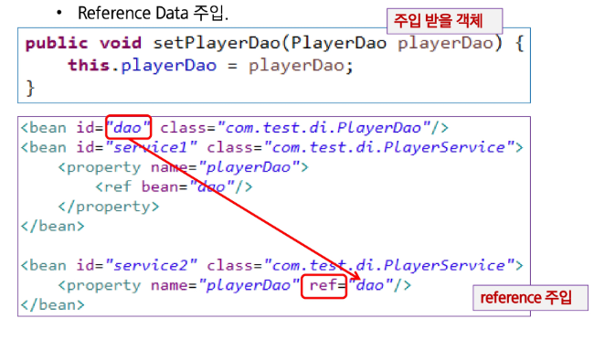
            
- 스프링 빈 의존관계(annotation)
    - 의존성을 주입받을 클래스에서 @Autowired 어노테이션을 사용
    - **`<context:component-scan>`**
        - base-package 아래에 bean이 존재할 경우
            - xml 아래에 별도의 <bean> 태그 작성 필요 x
            - 이 경우 빈의 이름이 자동으로 지정
                - @Component, @Qualifer등의 사용이 필요
                - Qualifer는 **`어느 구현체를 주입해야 할지 구분`**하기 위해
                    - Repository와 Qualifer
    - component-scan을 사용하지 않을 경우
        - xml파일에 bean의 id를 계속 설정해주어야 하는 것.
