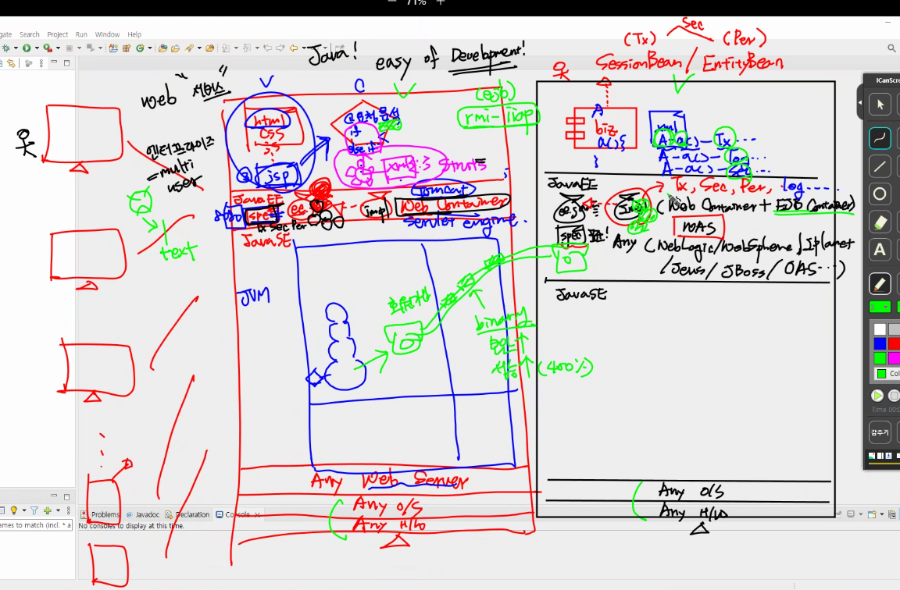
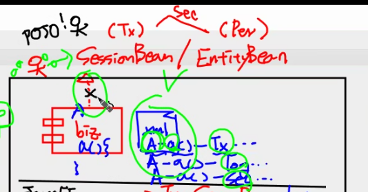

# 0418 담온

- Web Container + EJB Container = WAS
    - 근데 Tomcat은 EJB Container 없어서 was 아니다.

- 개발자 : 비즈니스 컴포넌트 집중.
    - 비즈니스 컴포넌트의 안정성은 항상 고려되어야 함
        - 여기서 안정성은 **`Tx, Security, Persistence`**
            - Java EE spec에 안정성에 대하여 어떻게 하라고 명시.
        - 개발자는 핵심가치가 아니라 안정성을 잡기 위해 고생하는데
        - 그걸 쉽게 해주겠다 (easy of development) : Java
    - 개발자가 할 일은 Biz의 interface를 지정하는 것.
        - SessionBean(Tx 중심) / EntityBean(Persistence 중심)
            - (물론 보안은 둘다 중요할 수 있음)



회원가입, 로그인 등을 핵심가치라 하고

공통가치가 뭐가 되냐? 라고하면 **`Tx, Security, Persistence`**

공통관심사 클래스를 advice, 

어디다 적용할 것인가? Target 

Class의 특정 메서드에다가 넣어주세요 : Pointcut

- Pointcut에는 before, after 개념, 즉 **`시점`**도 포함되어있다

그걸 어딘가에 쭉 설정해야 하는데 그 설정물들을 aspect

런타임시에 이제이비 컨테이너가 실제로 작업하는 과정이 Weaving

Spring에서는 aspect를 adviser라고 부르기도 함.



Spring은 이 SessionBean / EntityBean 부분 날려버린거.

개발자의 공부 요소 부담 줄이기?

- rmi-iiop

# 이해를 위한 용어정리

- @Controller
    - 스프링 MVC에서 **`컨트롤러 역할`**을 클래스에 지정
    - 요청을 받아서 처리하고, 응답을 반환
    - @RequestMapping과 함께 사용되어 해당 컨트롤러가 처리할 요청 URI를 지정할 수 있다.
        - RequestMapping
            - 클라이언트에서 들어오는 요청과 매핑되는 **`핸들러를 지정`**하는데 사용
            
            ```xml
            @RequestMapping(value="remit.jes",method= {RequestMethod.POST},
            			produces="application/text; charset=utf8") 
            
            value : URL 패턴 지정, remit.jes라고 들어오는 패턴을 처리하는 요청을 처리
            method : Http 통신 방식, 다수 방식을 배열로 처리할 수 있음
            produces : 클라이언트에게 응답을 text로 보내며, utf-8로 인코딩하겠다는 의미임.
            ```
            
- @Repository
    - **`DAO`**클래스에 지정
    - 해당 어노테이션이 붙은 클래스를 자동으로 빈으로 등록하여 관리
- @Component
    - 빈으로 관리되는 클래스에 지정
    - 객체 생성과 DI 작업을 처리할 때 사용

- @ResponseBody
    - 핸들러 메서드가 반환하는 값을 Http 응답 본문에 직접 작성하도록 지정하는 어노테이션
    - JSON,XML 등 다양한 형식의 데이터를 반환할 수 있음
    - View Resolver를 사용하지 않음 → 응답시간 단축, 서버 부하 감소

- AOP(Aspect-Oriented Programming)
    - 전체에서 **`공통으로 사용되는 기능을 분리`**하여 관리할 수 있도록 해준다.
    - 로깅, 보안, 트랜잭션, 캐싱.
    - 프로그램 코드 분리하여 모듈화 → **`재사용`**
    - AOP 구성요소
        - Join Point : 어느 시점에 Aspect를 적용할지를 결정하는 지점
            - 메서드 실행 전, 실행 후, 예외 발생 시 등 = 즉 **`특정 시점`**
        - Pointcut : Aspect가 적용될 Join Point, 즉 **`특정 시점을 선택`**하는데 사용되는 패턴
        - Advice : Aspect가 Join Point에서 실행되는 동작
        - Aspect : 위의 3가지 개념을 모두 포함하는 모듈, **`분리한 부가기능`**이 Aspect임
        - Weaving : Aspect를 프로그램 코드에 적용하는 과정

- 프록시(Proxy)기반 지원
    - 클라이언트와 타겟 객체 사이에 위치, 클라이언트의 요청을 타겟 객체에 전달하고 타겟 객체의 결과를 반환하는 중간 역할
    - 스프링에서는 타겟 객체 대신 프록시 객체가 클라이언트와 소통한다 = 타겟이 프록시가 된다?
    - 프록시 객체가 타겟 객체에 대한 호출을 가로챈다
        - 전처리 방식 :  advice의 부가기능을 수행 후  target의 핵심 로직 수행
        - 후처리 방식 :  target의 핵심 로직 수행 후  advice 수행
    

## 교수님 코드 궁금한 점이나 알아둘 점 정리

```xml
<?xml version="1.0" encoding="UTF-8"?>
<!DOCTYPE configuration
    PUBLIC "-//mybatis.org//DTD Config 3.0//EN"
    "http://mybatis.org/dtd/mybatis-3-config.dtd">

<configuration>

	<typeAliases>
		<typeAlias type="com.ssafy.cafe.vo.MemberVO" alias="memberVO"/> <!-- 얘를 줄여서 memberVO로 부를 것임 -->
		<typeAlias type="com.ssafy.cafe.vo.KB_VO" alias="KB_VO"/> <!-- 얘를 줄여서 KB_VO로 부를 것임 -->
		<typeAlias type="com.ssafy.cafe.vo.ShinHanVO" alias="ShinHanVO"/> <!-- 얘를 줄여서 ShinHanVO로 부를 것임 -->
	</typeAliases>

</configuration>
```

- typeAliases는  myBatis에서 java 객체를 사용하기 위한 별칭임.
- 간단한 별칭을 사용하여 접근한다

```xml
<mapper namespace="mapper.member"> <!-- mybatis에서 제공하는 태그 mapper -->
	<resultMap type="memberVO" id="memResult">
		<result property="id" column="memid" />
		<result property="pw" column="pw" />
		<result property="name" column="memname" />
		<result property="date" column="memdate" />
	</resultMap>
	
	<select id="selectAllMemberList" resultMap="memResult">
		<![CDATA[
			select * from member order by memdate desc
		]]>
	</select>
	
	<select id="login" resultType="String" parameterType="memberVO"> <!-- modelconfig.xml에 있는 memberVO와 동일 -->
		<![CDATA[ 
			select memname from member where memid=#{id} and pw=#{pw}
		]]>
	</select>
```

- parameterType으로 memberVO를 받아 객체를 그대로 쓸 수 있다.
- **`resultMap`**에서는 **`id`**와 **`result`** 요소를 사용하여 컬럼과 객체의 프로퍼티를 매핑?
