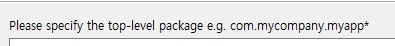
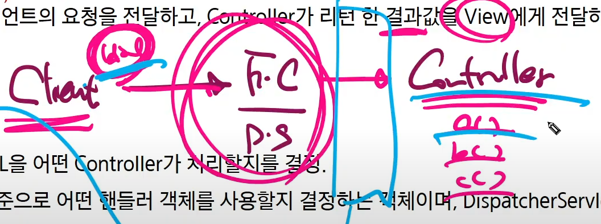
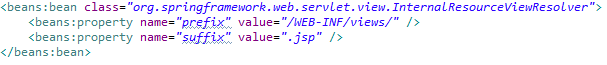
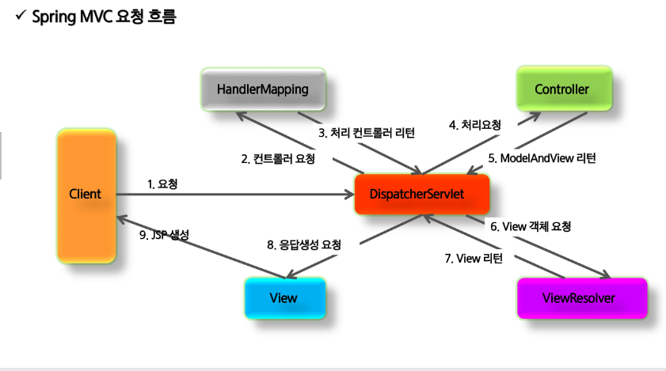
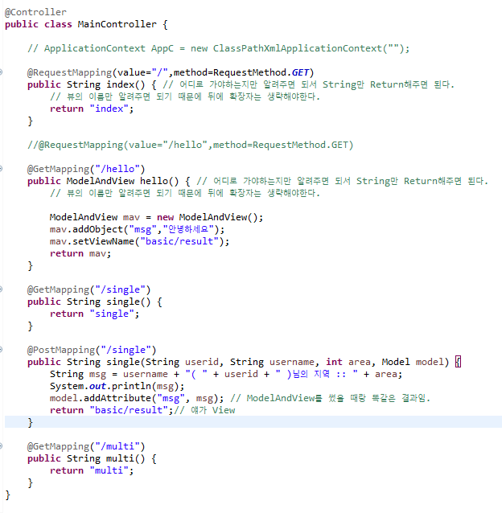
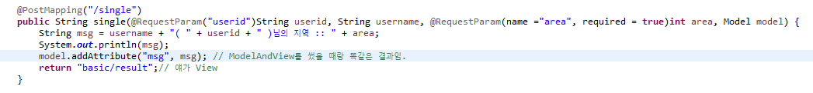
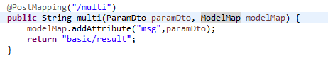
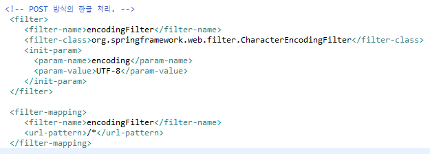

# 0419 Spring Web MVC

웹 = 필터

비 웹 = AOP?

myapp : context-root가 되고, [localhost](http://localhost) / **`[여기]`**

java는 src

resources는  xml

webapp = webcontent

web-inf 아래에 lib에 jar를 갖다놓을 수 있는데 우리는 maven을 써서 안써놓았을 뿐.

webcontent → jsp, html, js, css ….

web-inf는 web으로 접근할 수 없는 경로.

jsp로 직접 접근하는거 막기

- Model
    - 상태에 대한 캡슐화 : 데이터 처리
- View
    - 시각적 표현
- Controller
    - 
    
- Front Controller
    - action이 뭐니? action에 해당하는 곳으로 가라.
        - 자동화가 가능하다.
        - Client가 호출할 때
- Spring MVC는 Front Controller Patter을 Framework 차원에서 제공.

## Spring MVC 구성요소

- DispatcherServlet (Front Controller) (우리가 만드는거 아님)
    - 모든 클라이언트의 요청을 전달받음.
    - Controller에게 클라이언트의 요청을 전달, Controller가 리턴한 결과값을 View에게 전달하여 응답 생성
    - Controller가 POJO가 된다.
    - Client - DispatcherServlet(Front Controller) - Controller

- HandlerMapping (우리가 만드는거 아님)
    - 클라이언트의 요청 URL을 어떤 Controller가 처리할지를 결정한다.
    
    
    
    - URL과 요청 정보를 기준으로 어떤 핸들러 객체를 사용할지 결정하는 객체

- Controller
    - 클라이언트의 요청을 처리한 뒤, Model을 호출하고 그 결과를 DispatchserServlet에 넘겨줌

Spring은 Servlet에 비종속적인 프로그램을 만든다.

- ModelAndView
    - Controller가 처리한 데이터 / 화면에 대한 정보를 보유한 객체
    - hello.jsp로 가고싶다면 “hello”만 알려주고, 얘를 ViewResolver에게 준다.
- ViewResolver
    - Controller가 리턴한 뷰 이름을 기반으로 Controller의 처리 결과를 보여줄 View를 결정
    - ViewResolver는 너 어차피 jsp로 갈거잖아! 라고 하고 hello.jsp로 보내줄 것임
    - 즉, ModelAndView에서 이름만 받으면 알아서 보내준다고 생각하자.

- 요청 흐름 : Spring Web MVC 교재 14

- Application 구현 Step
    - web.xml에 DispatcherServlet**`(xml)`** 등록 및 Spring 설정파일**`(xml)`** root-context.xml등록
        - DispatcherServlet에 관련된 파일은 servlet-context.xml에 있다.
            - 얘를 DispatcherServlet이 읽는다.
    - 설정 파일에 HandlerMapping 설정
    - Controller 구현 및 Context 설정 파일(servlet-context.xml)에 등록
    - 
- web.xml - 최상위 Root ContextLoader 설정
    - Context 설정 파일들을 로드하기 위해 web.xml 파일에 리스너 설정

- 안효인 교수님 코드
    
    
    
    
    
    이렇게 할라니까 불편하다.
    
    그래서 Dto 만들어서 객체 넘겨주기
    
    - 근데 Dto는 Bean객체 아니다. 스프링이 관리하면 안되는 객체
    
    
    
    
    
    - 
    - url-pattern으로 들어오는 모든 것들을 utf-8로 처리할거다

model, modelandview, modelmap, String.. 의 차이?

---

---

---

---

---

---

---

# 담임교수님 수업

@Controller와 @ResponseBody를 합친 개념 = @RestController

쇼핑몰 튜닝전략

js에서 이벤트 집단들을 모아두었다가 줄 건지,

이벤트가 발생할 때마다 post 방식으로 계속 주던지.
