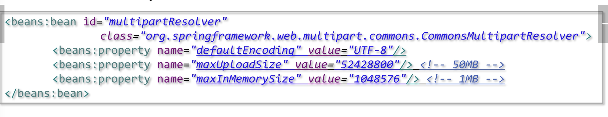
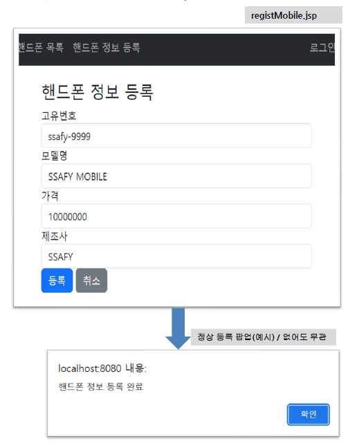
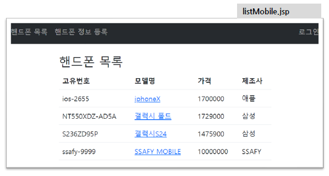
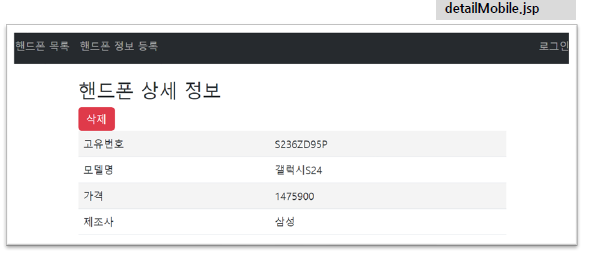
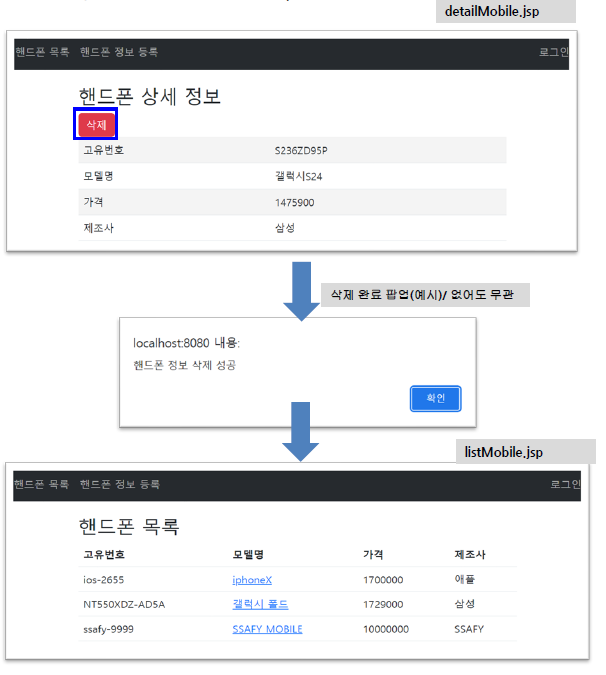
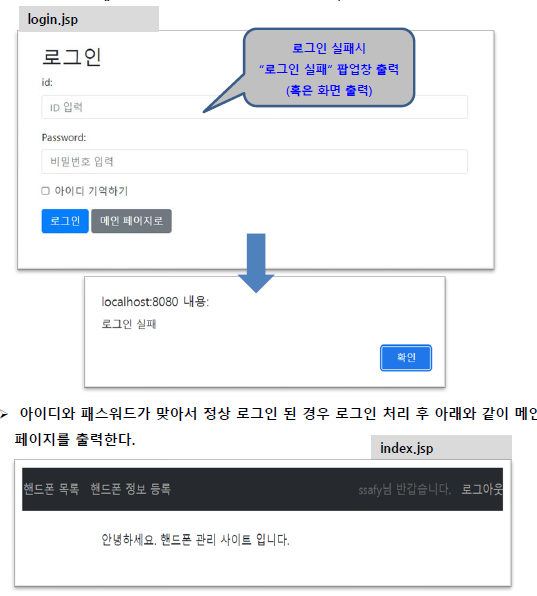

# 0421 FileUpload, FileDownload, Interceptor

session이 없는데도 불구하고 로그인 상태에서 URL을 복사하고 로그아웃 상태에서 해당 URL로 갈 때  로그인 페이지로 이동시켜줬다? —> Interceptor 발생

File Upload

- pom.xml : commons-fileupload library 추가. (maven)
- servlet-context.xml : multipartResolver 추가



http는 stateless해서 다운받다가 끊기면 처음부터 받아야 한다.

그래서 일반적으로 큰 파일들의  upload는 처리하지 않음.

servlet-context xml : web에 관련 —> file upload 관련은 여기에

- Interceptor는 여기에 설정해야함

root-context xml : 비 web

form에 enctype 설정해야 하고 post로 보내야함

 “application/download; charset=utf8” —> 페이지 이동이 아닌 다운로드를 위함

## InterCeptor

- Client에서 Server로 들어온 Request 객체를 Controller의 Handler로 도달하기 전에 가로채어서 로직을 수행한 후 Handler로 보낼 수 있도록 해주는 Module
- Controller의 Handler가 실행되기 전이나 후에 추가적인 작업이 수행되어야 할 때 사용

<aside>
💡 DispatcherServlet 요청 시 호출되는 순서

</aside>

1. DispatcherServlet이 요청을 받으면 HandlerMapping을 호출
2. HandlerMapping은 Request를 수행할 Handler를 찾기 위한 동작을 수행,
3. 이 때 요청한 컨트롤러와 인터셉터 목록을 찾기 위해 HandlerExecutrionChain 객체생성, 이와 동시에 HandlerInterCeptor 생성 
4. HandlerAdapter에 도착 후 HandlerExecutionChain 실행, interceptor 호출
5. InterCeptor는 preHandle 메소드를 통해 요청 전 처리를 수행
    - 즉, Controller 메서드를 실행하기 전에 수행.
6. Controller 도착
    
    <aside>
    💡 **`→ 모든 Controller에서 검증이 필요할 때 InterCeptor 하나 구현해두고 편하게 재사용하자`**
    
    </aside>
    

HandlerInterceptor

- Controller가 요청을 처리하기 전/후 처리
- 실제 Business Logic과는 분리되어 처리해야 하는 기능들을 넣어두기. = AOP

C L → DispatcherServlet

Servlet Context가 올라가는 순간에 DispatcherServlet이 만들어지고

Client가 view를 요청하면 HandlerMapping에 쌓이고,

D → H에게 어디로 가야되냐고 물어보고 여기서 컨트롤러를 반환받을 건데,

Handeler adapter가 (프록시)? Controller → service → dao …

viewResolver가 오고.

filter는 servlet context와 dispatcher servlet 사이 (한글처리)

service, dao 이후가 aop

aop는 시간, 로깅..

interceptor는  controller 전.

# 담온

## 파일 업로드

```java
@Controller
public class HomeController {
	
	@PostMapping("upload.test")
	@ResponseBody
	public String upload(@RequestParam("aaa") MultipartFile file) {
		//MultipartFile은 인터페이스. 
		System.out.println(file);
		try {
			file.transferTo(new File("c:\\temp\\" + file.getOriginalFilename()));
		} catch (IllegalStateException e) {
			// TODO Auto-generated catch block
			e.printStackTrace();
		} catch (IOException e) {
			// TODO Auto-generated catch block
			e.printStackTrace();
		}
		return "ok";
	}
	
}
```

```html
<!DOCTYPE html>
<html>
<head>
<meta charset="UTF-8">
<title>Insert title here</title>
</head>
<body>

	<form action="upload.test" method="post" enctype="multipart/form-data">
		업로드 파일 <input type="file" name="aaa">
		<input type="submit" value="파일 업로드">
	</form>
</body>
</html>
```

enctype은 inputstream 객체

내 파일시스템에 파일이 들어가는 거고,

db에는 메타정보만 저장되는 것임

파일업로드와 db는 전혀 상관 없음

게시판에 올리는 경우에는 이게 누가 올린 것인지를 알아야 하기 때문에 메타 정보를 저장한 것일 뿐

파일시스템에 파일을 저장할 때는 **`파일을 변경된 이름`**으로 바꿔주기**`(유추해서 해킹 방지)`**

## 보안

서버 프로그래머들은 외부에서 들어온 것으로 판단을 하면 안됌

갖고온 데이터를 가지고 판별하려 하면 어려움

**`갖고온 데이터와 서버에 저장해 놓은 데이터가 같냐`로 판단**

처음 업로드할 때는 서버에 저장한 게 없는데 어떻게?

이럴 때는 안에 있는 File의 Content, 즉 내용을 봐야 한다.

이런거 하는 회사 AhnLab

보안과 퍼포먼스는 상극이어서, 둘 과의 합의점이 필요한데 설계단계에서 하는 것이 좋다.

url로 구조가 드러나면 절대 안됌.

화이트리스트 전략 : 내가 확인된 것만 너한테 줄거야.

- 관통
    - 유저 로그인 횟수 제한
        - 유저 로그인 횟수 제한 초과시 DB에 특정 boolean false 후 로그인 불가상태 만들기
    - KISA 한국인터넷진흥원 소프트웨어_개발보안_가이드

- registMobile
    
    
    

- listMobile
    
    
    

- detailMobile
    
    
    

- deleteMobile
    
    
    

- login
    
    
    

- logout
