# 0424 SpringBoot

- STS 4.2.0버전 필요, JDK 버전 11버전 이상 필요

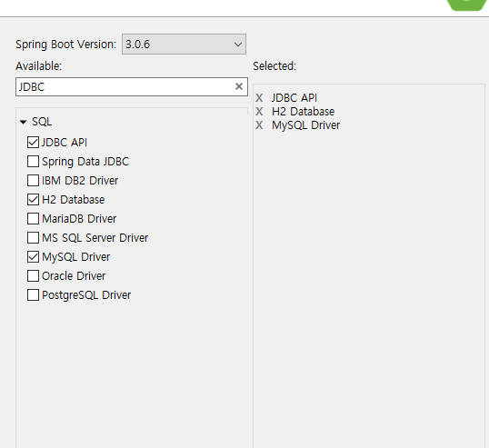

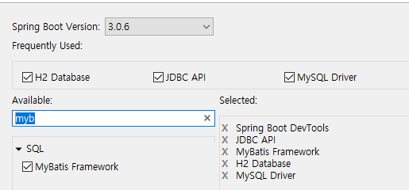

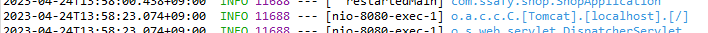

Tomcat이 8080의 /(root)

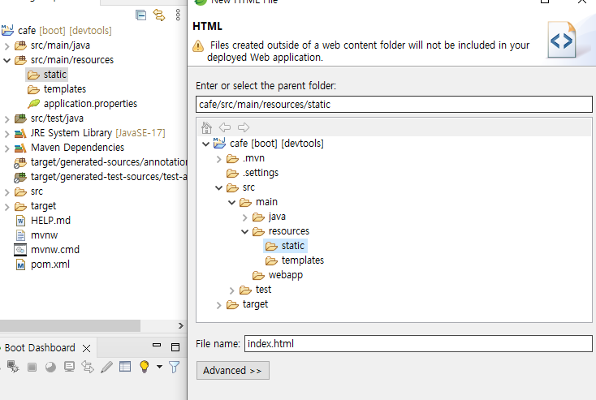

Springboot에서는 html 위치 resources 아래 static으로 들어가야 한다.

static page : 컨트롤러가 하나도 없어도 메인이 보인다?

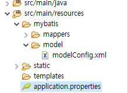

application properties

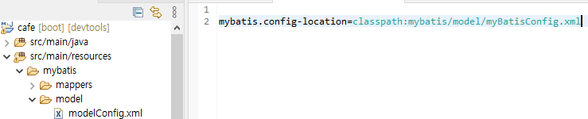

modelConfig.xml은 경로 맨 뒤에 있는 이름 myBatisConfig.xml과

이름이 같아야 한다. 즉 둘 중 하나 바꿔줘야 한다

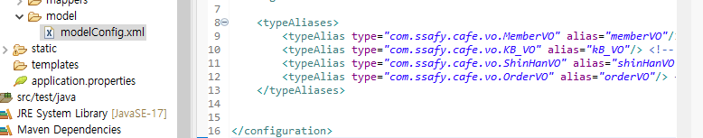

**VO가 엄청나게 많을 때의 불편성을 생각해보자.**

application.properties에 아래와 같이 두면 위에 typeAliases 다 지워도된다.

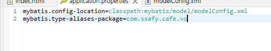

이후 modelConfig.xml에 mappers 태그 안에 아래와 같이 추가한다

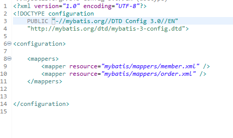

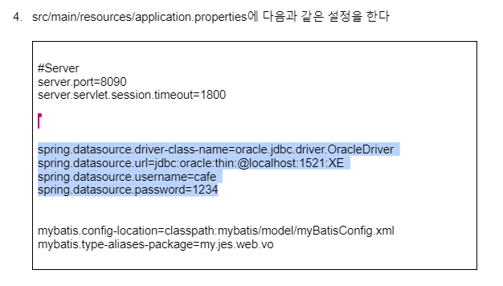

application.properties에 이렇게 다 설정할 수 있다.

이렇게 설정하면 기존에 rootContext.xml에 있는 datasource 가져온 것

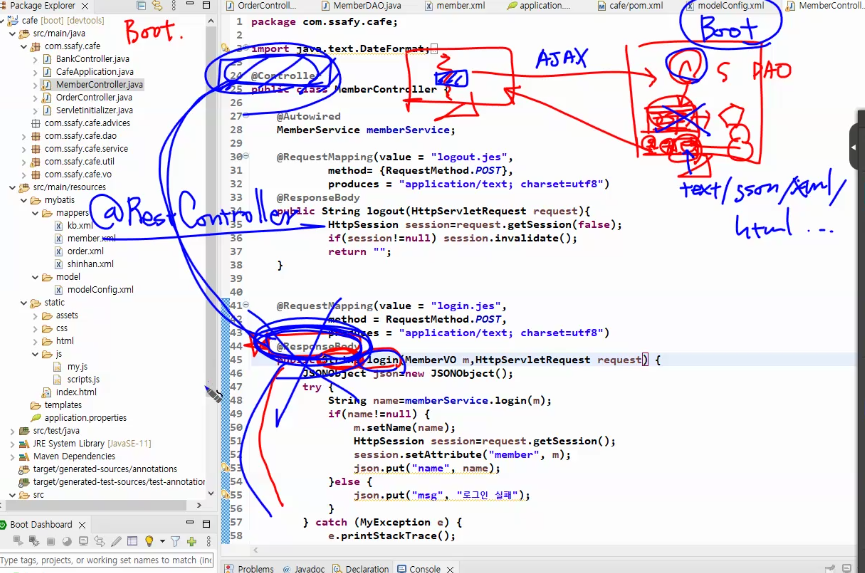

Controller와 ResponseBody를 합쳐서

@RestController로.

```xml
<?xml version="1.0" encoding="UTF-8"?>
<!DOCTYPE mapper
    PUBLIC "-//mybatis.org//DTD Mapper 3.0//EN"
    "http://mybatis.org/dtd/mybatis-3-mapper.dtd">
    
    <!-- mybatis는 단순히 sql 분리자 -->
<mapper namespace="com.ssafy.shop.dao.MemberDao"> 
<!-- dao 클래스 package 명과 인터페이스명을 붙인 것 -->

<!-- 메서드 이름과 일치하는 id, parameterType은 매개로 받는 파라미터 이름, 결과는 select로 갖고오는 타입 -->
<select id="login" parameterType="member" resultType="String"> 
	select name from member where id=? and pw=?
</select>

</mapper>
```

member.xml 안에 있는 것이 mapping된 파일임을 알려주기 위해 config 파일을 mybatis 아래에 만들어주고, 그 config 아래에 myBatisConfig.xml 만들어준다(이름은 마음대로)

```xml
<?xml version="1.0" encoding="UTF-8"?>
<!DOCTYPE configuration
  PUBLIC "-//mybatis.org//DTD Config 3.0//EN"
  "http://mybatis.org/dtd/mybatis-3-config.dtd">
  
  <configuration>
  
  	<mappers> <!-- src/main/resources에서 resources 아래에서부터 -->
  		<mapper resource="mybatis/mappers/member.xml"></mapper>
  	</mappers>
  	
  </configuration>
  
  <!-- 이렇게 하고 나면 Configuration을 등록하는데 application properties에 한다. -->
```

이렇게 하고 나면 Configuration을 등록하는데 application properties에 작성한다. 

```xml
server.port=80

mybatis.config-location=classpath:mybatis/config/myBatisConfig.xml
mybatis.type-aliases-package=com.ssafy.shop.vo
```

**`!!이름규칙`**

- js에서 넘기는 변수명은 VO의 변수명과 같아야 하고 DB table의 field의 이름과 같아야 한다

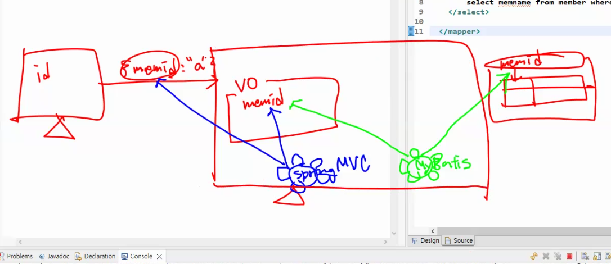
